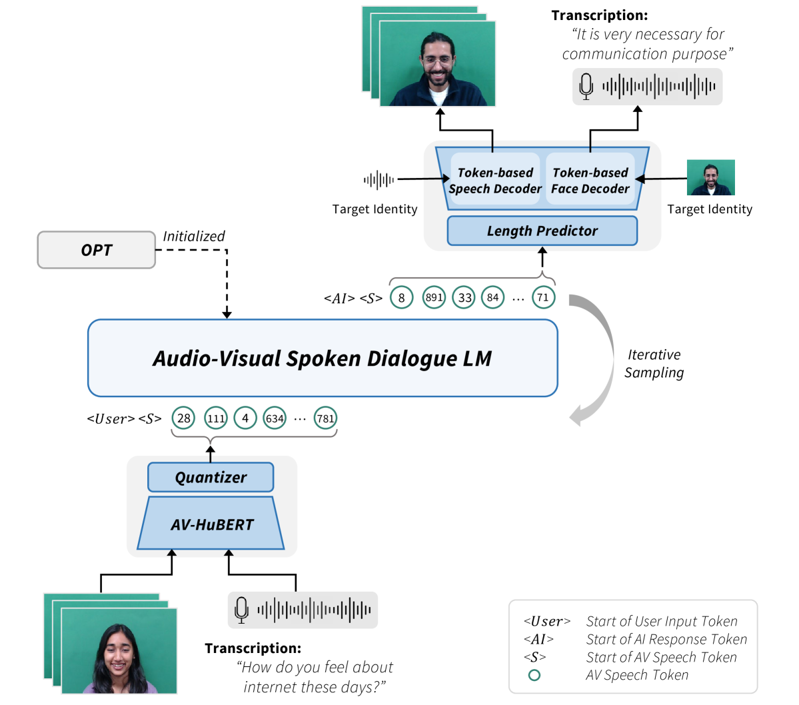
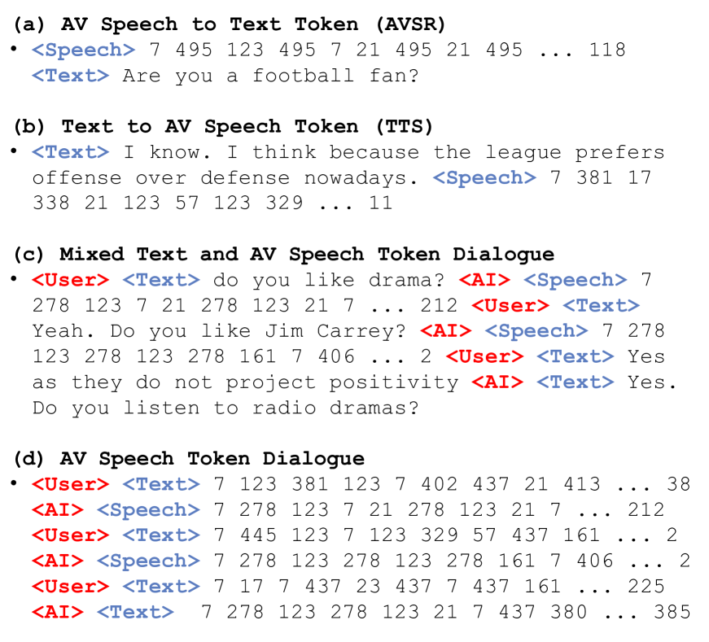
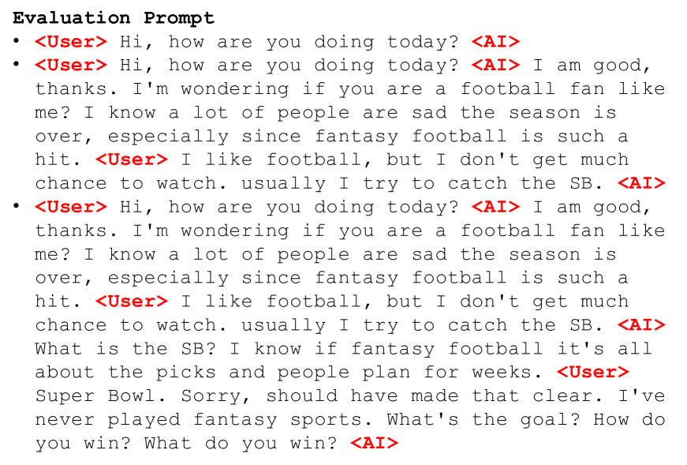
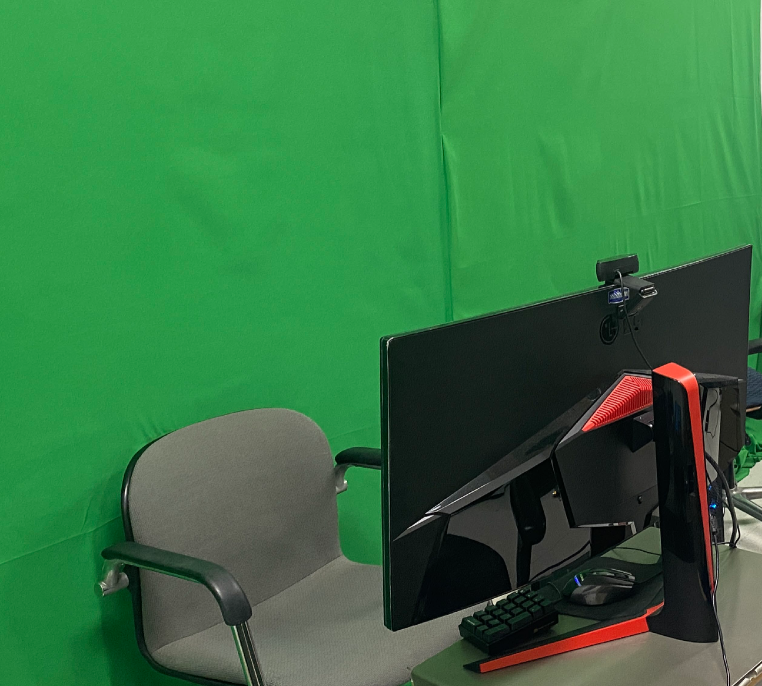

# 来一场真挚对话：面对面交流的口语对话模型

发布时间：2024年06月12日

`Agent

理由：该论文介绍了一种能够处理视听语音输入并进行面对面口语对话的模型，这种模型可以被视为一个Agent，因为它能够与用户进行交互并响应用户的输入。此外，论文中提到的MultiDialog语料库和模型的开发，都是为了构建能够进行自然语言交互的虚拟聊天机器人系统，这也是Agent应用的一个典型例子。虽然论文中提到了大型语言模型（LLM）的应用，但主要焦点在于模型的交互能力和多模态处理，而不是LLM的理论研究或特定的检索增强生成（RAG）技术。因此，将其归类为Agent更为合适。` `虚拟聊天机器人` `多模态合成`

> Let's Go Real Talk: Spoken Dialogue Model for Face-to-Face Conversation

# 摘要

> 本文介绍了一种创新的面对面口语对话模型，它能处理并响应用户的视听语音输入，为构建无需文本中介的虚拟聊天机器人系统奠定了基础。我们首次推出了MultiDialog，这是一个包含约340小时、9000个对话的大型多模态口语对话语料库，基于TopicalChat数据集录制，对话伙伴的视听录音均附有情感标注，预计将推动多模态合成研究的发展。我们的模型融合了文本预训练的大型语言模型，并通过语音-文本联合预训练技术，将其应用于视听口语对话领域。实验证明，该模型能有效促进面对面交流。相关演示和数据已分别在https://multidialog.github.io和https://huggingface.co/datasets/IVLLab/MultiDialog发布。

> In this paper, we introduce a novel Face-to-Face spoken dialogue model. It processes audio-visual speech from user input and generates audio-visual speech as the response, marking the initial step towards creating an avatar chatbot system without relying on intermediate text. To this end, we newly introduce MultiDialog, the first large-scale multimodal (i.e., audio and visual) spoken dialogue corpus containing 340 hours of approximately 9,000 dialogues, recorded based on the open domain dialogue dataset, TopicalChat. The MultiDialog contains parallel audio-visual recordings of conversation partners acting according to the given script with emotion annotations, which we expect to open up research opportunities in multimodal synthesis. Our Face-to-Face spoken dialogue model incorporates a textually pretrained large language model and adapts it into the audio-visual spoken dialogue domain by incorporating speech-text joint pretraining. Through extensive experiments, we validate the effectiveness of our model in facilitating a face-to-face conversation. Demo and data are available at https://multidialog.github.io and https://huggingface.co/datasets/IVLLab/MultiDialog, respectively.

[Arxiv](https://arxiv.org/abs/2406.07867)