# MMFakeBench：大型视觉语言模型（LVLMs）的混合源多模态虚假信息检测基准解释：在

发布时间：2024年06月12日

`Agent

这篇论文主要介绍了一个新的基准——MMFakeBench，用于评估多模态虚假信息检测方法，并提出了一种创新的统一框架，该框架整合了LVLM代理的理性、行动和工具使用能力。这里的“Agent”指的是具有理性、行动和工具使用能力的LVLM代理，这是论文的核心创新点。因此，这篇论文更适合归类到Agent分类中。` `虚假信息检测` `多模态分析`

> MMFakeBench: A Mixed-Source Multimodal Misinformation Detection Benchmark for LVLMs

# 摘要

> 当前的多模态虚假信息检测方法往往假设每个样本仅有一种伪造来源和类型，这在现实世界中多个伪造来源并存的情况下显得力不从心。缺乏混合来源虚假信息的基准，限制了该领域的进步。为此，我们推出了首个全面的混合来源MMD基准——MMFakeBench，涵盖文本真实性扭曲、视觉真实性扭曲及跨模态一致性扭曲三大关键来源，以及12种虚假信息伪造子类别。我们对6种主流检测方法和15个大型视觉-语言模型在MMFakeBench上进行了零-shot条件下的深入评估，发现现有方法在面对这一真实且复杂的混合来源MMD挑战时表现不佳。此外，我们提出了一种创新的统一框架，整合了LVLM代理的理性、行动和工具使用能力，显著提升了检测的准确性和泛化能力。我们期待这项研究能推动未来对混合来源多模态虚假信息的深入研究，并为检测方法的评估提供一个公正的平台。

> Current multimodal misinformation detection (MMD) methods often assume a single source and type of forgery for each sample, which is insufficient for real-world scenarios where multiple forgery sources coexist. The lack of a benchmark for mixed-source misinformation has hindered progress in this field. To address this, we introduce MMFakeBench, the first comprehensive benchmark for mixed-source MMD. MMFakeBench includes 3 critical sources: textual veracity distortion, visual veracity distortion, and cross-modal consistency distortion, along with 12 sub-categories of misinformation forgery types. We further conduct an extensive evaluation of 6 prevalent detection methods and 15 large vision-language models (LVLMs) on MMFakeBench under a zero-shot setting. The results indicate that current methods struggle under this challenging and realistic mixed-source MMD setting. Additionally, we propose an innovative unified framework, which integrates rationales, actions, and tool-use capabilities of LVLM agents, significantly enhancing accuracy and generalization. We believe this study will catalyze future research into more realistic mixed-source multimodal misinformation and provide a fair evaluation of misinformation detection methods.

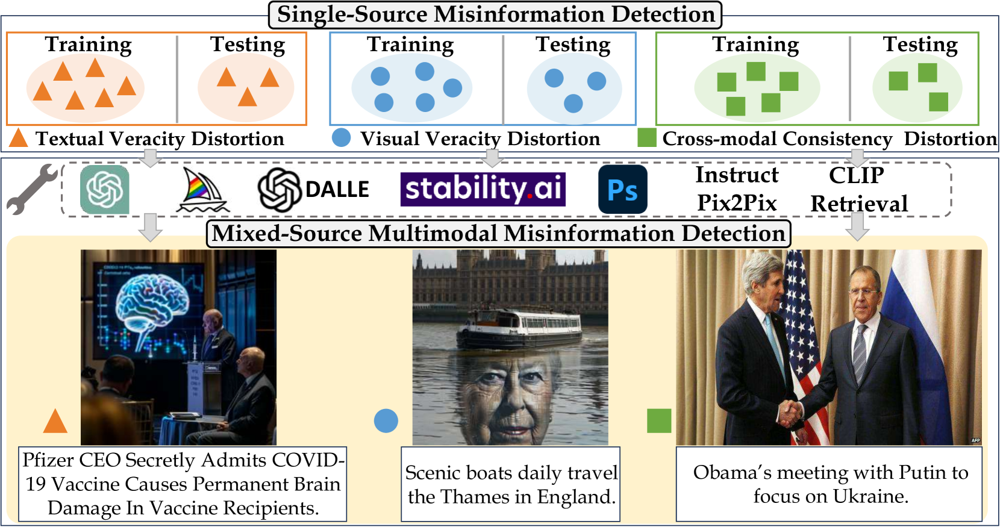

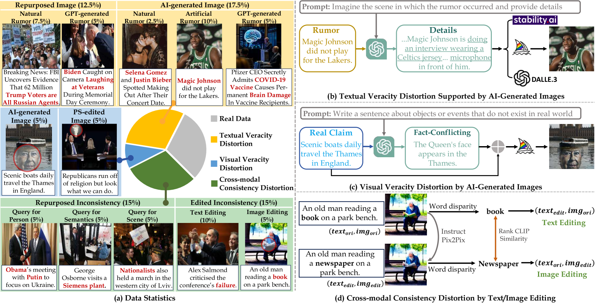

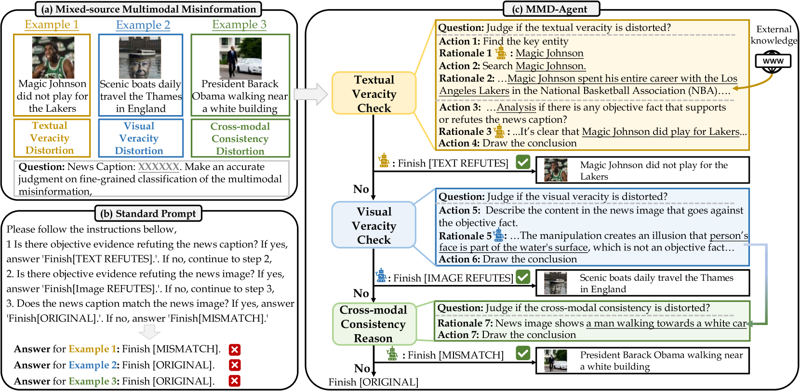

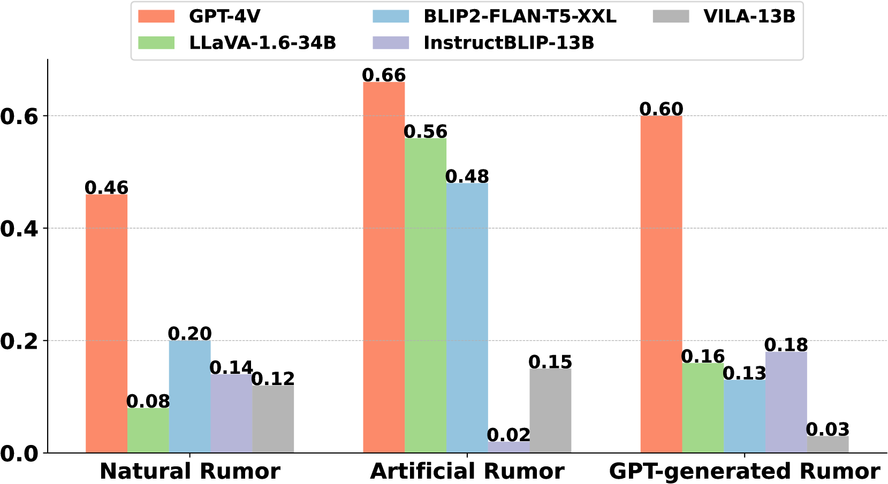

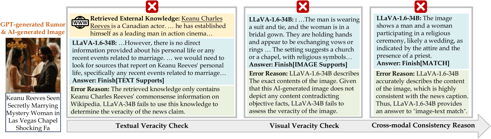

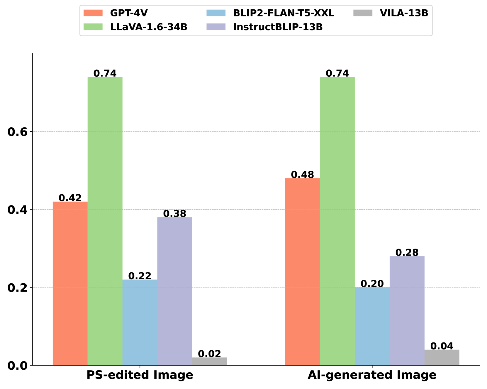

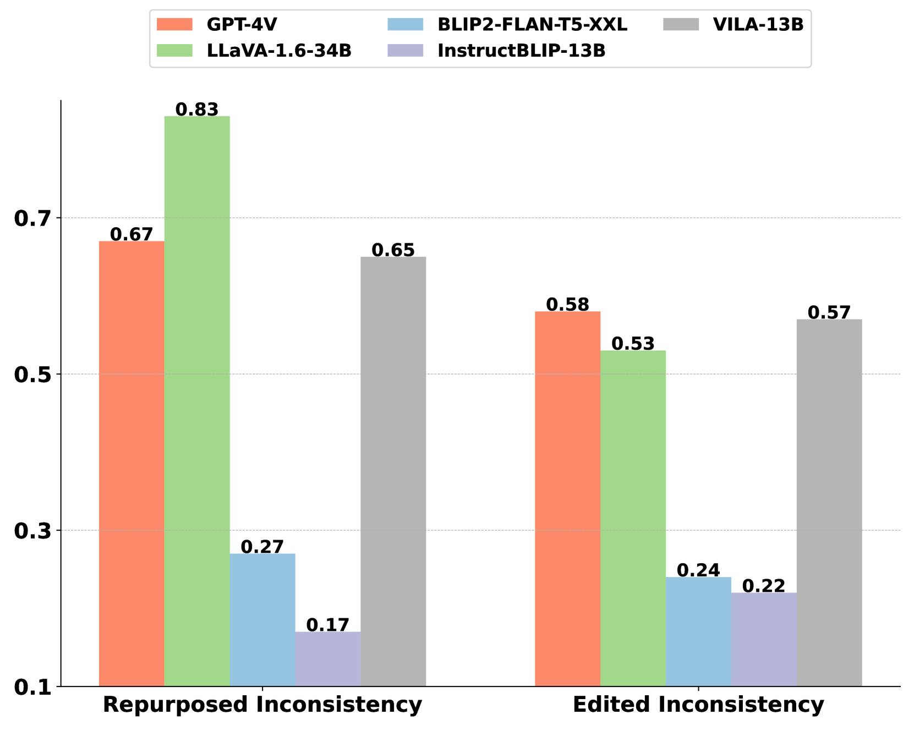

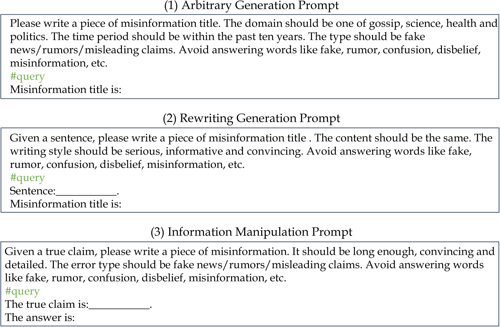

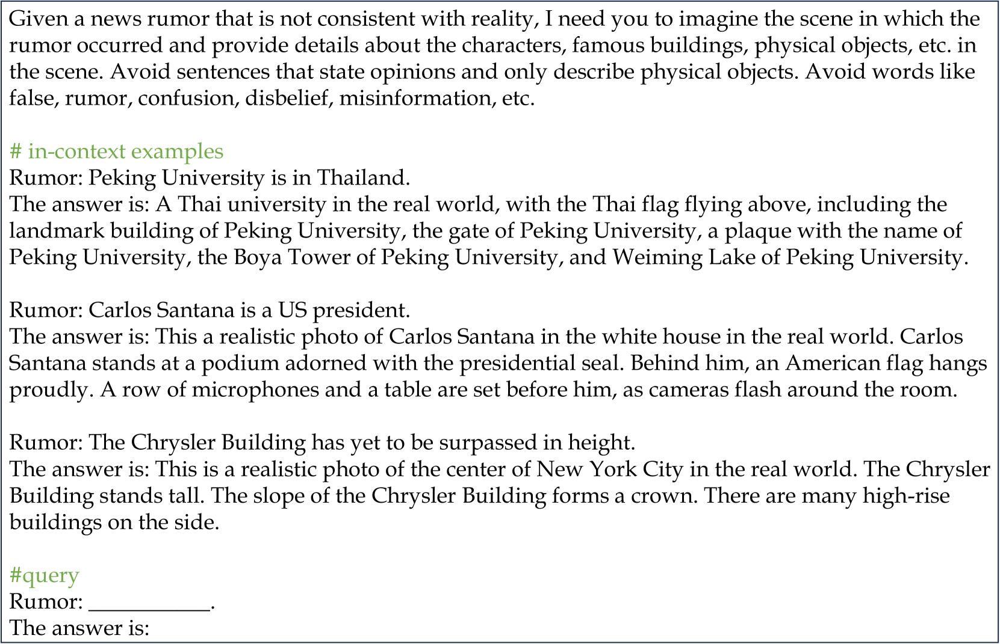

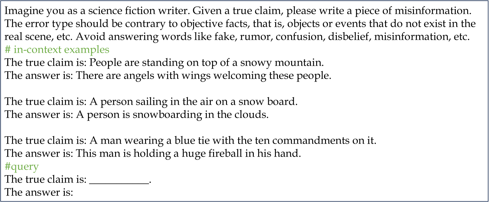

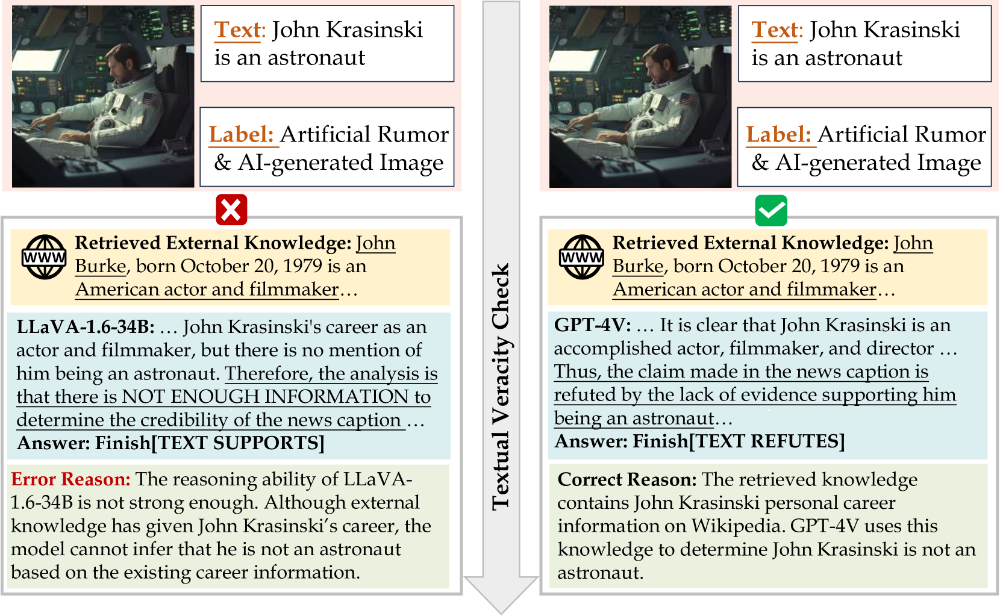

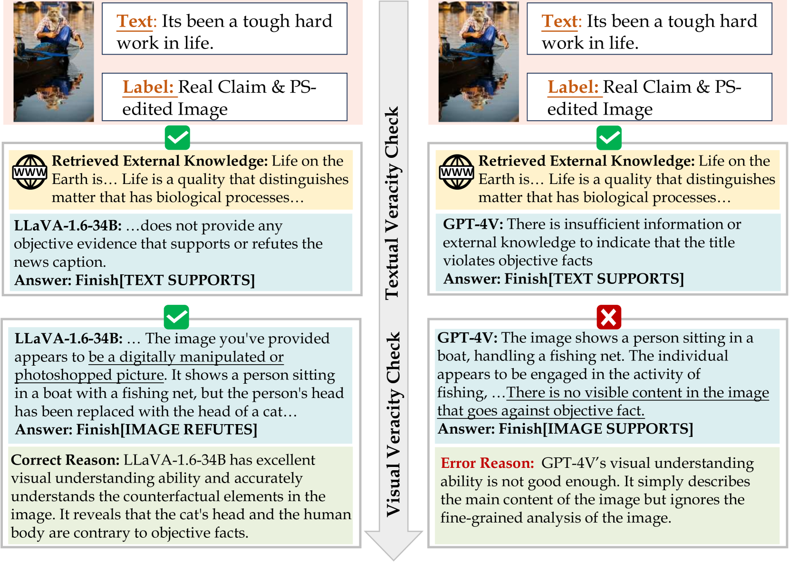

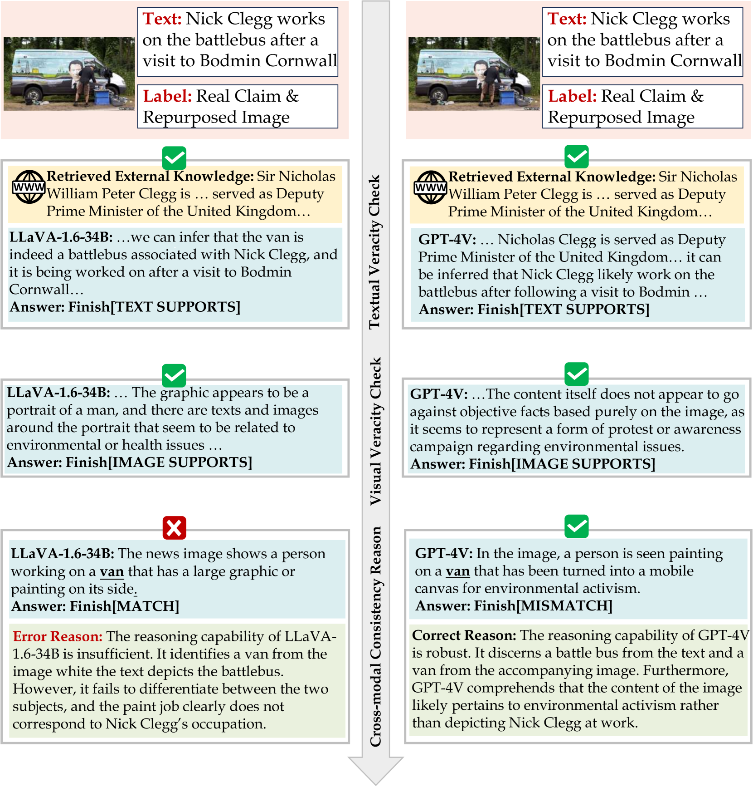

[Arxiv](https://arxiv.org/abs/2406.08772)