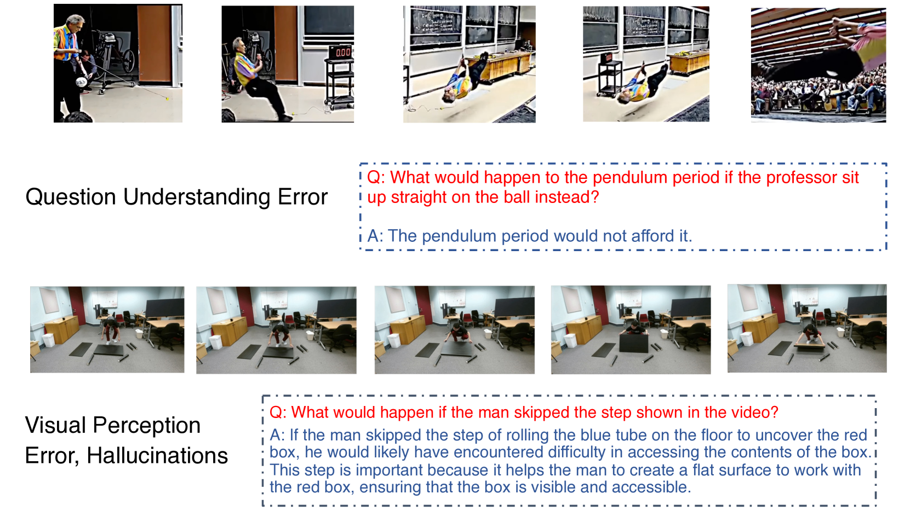

# MMWorld：探索视频中多学科多面世界模型的综合评估

发布时间：2024年06月12日

`RAG

理由：这篇论文介绍了一个名为MMWorld的多模态视频理解基准，用于评估多模态语言模型（MLLMs）在理解和推理现实世界动态方面的能力。这个基准特别关注多学科理解和多方面推理，如解释、反事实思考和未来预测等。虽然论文涉及到了多模态语言模型的应用，但其核心贡献在于提出了一个新的评估基准，这更符合RAG（评估和基准测试）的分类，而不是Agent、LLM应用或LLM理论。RAG通常指的是评估模型性能的基准或方法，这篇论文正是通过MMWorld这一基准来评估和揭示现有MLLMs的不足，并推动相关研究的进步。` `视频理解` `多学科教育`

> MMWorld: Towards Multi-discipline Multi-faceted World Model Evaluation in Videos

# 摘要

> 多模态语言模型（MLLMs）展现了“世界模型”的新兴能力，能够解释和推理现实世界的复杂动态。我们选择视频作为评估这些能力的理想媒介，因为视频能丰富地展现现实世界的动态与因果。为此，我们推出了MMWorld，这是一个全新的多学科、多方面的多模态视频理解基准。MMWorld的独特之处在于：一是涵盖多学科，需要领域专家深入理解；二是包含多方面推理，如解释、反事实思考和未来预测等。该基准包括一个人工标注的数据集，用于评估MLLMs对整个视频的理解，以及一个合成数据集，专注于单一感知模态的分析。MMWorld共包含1,910个视频，覆盖七个主要学科和69个子学科，配有6,627个问答对及相关说明。评估结果显示，包括2个专有和10个开源的MLLMs在MMWorld上的表现均不尽人意（例如，GPT-4V最佳，准确率也仅为52.3%），表明有待提升。消融研究还揭示了模型与人类在技能上的差异。我们期待MMWorld能成为视频中世界模型评估的关键一步。

> Multimodal Language Language Models (MLLMs) demonstrate the emerging abilities of "world models" -- interpreting and reasoning about complex real-world dynamics. To assess these abilities, we posit videos are the ideal medium, as they encapsulate rich representations of real-world dynamics and causalities. To this end, we introduce MMWorld, a new benchmark for multi-discipline, multi-faceted multimodal video understanding. MMWorld distinguishes itself from previous video understanding benchmarks with two unique advantages: (1) multi-discipline, covering various disciplines that often require domain expertise for comprehensive understanding; (2) multi-faceted reasoning, including explanation, counterfactual thinking, future prediction, etc. MMWorld consists of a human-annotated dataset to evaluate MLLMs with questions about the whole videos and a synthetic dataset to analyze MLLMs within a single modality of perception. Together, MMWorld encompasses 1,910 videos across seven broad disciplines and 69 subdisciplines, complete with 6,627 question-answer pairs and associated captions. The evaluation includes 2 proprietary and 10 open-source MLLMs, which struggle on MMWorld (e.g., GPT-4V performs the best with only 52.3\% accuracy), showing large room for improvement. Further ablation studies reveal other interesting findings such as models' different skill sets from humans. We hope MMWorld can serve as an essential step towards world model evaluation in videos.

[Arxiv](https://arxiv.org/abs/2406.08407)