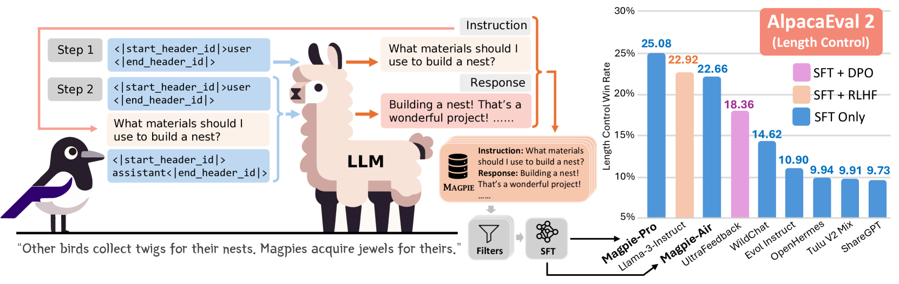
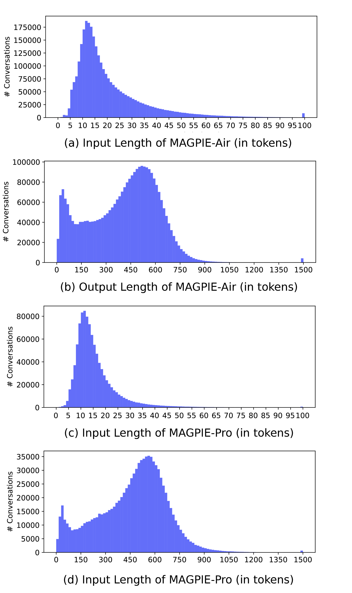
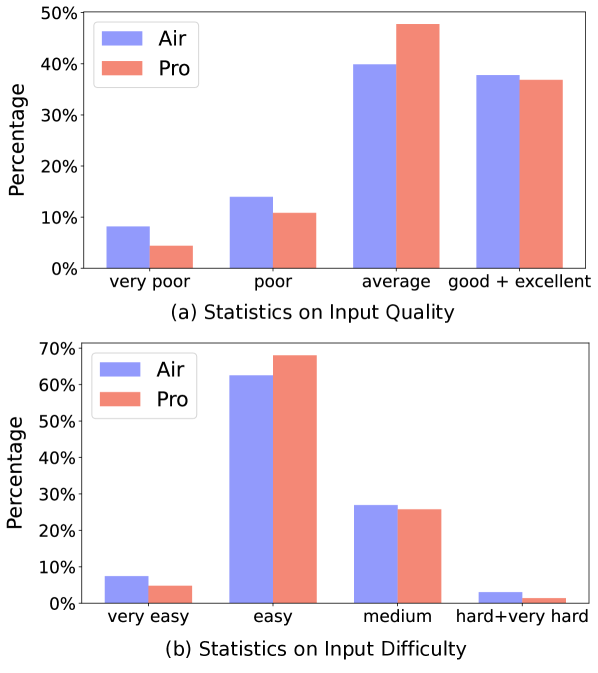
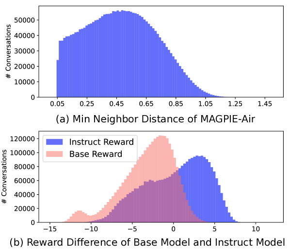
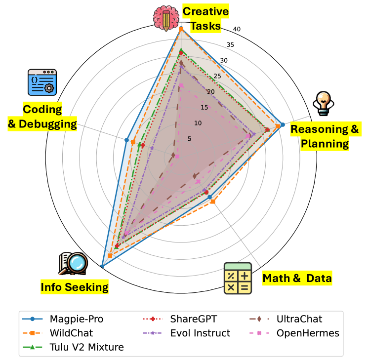
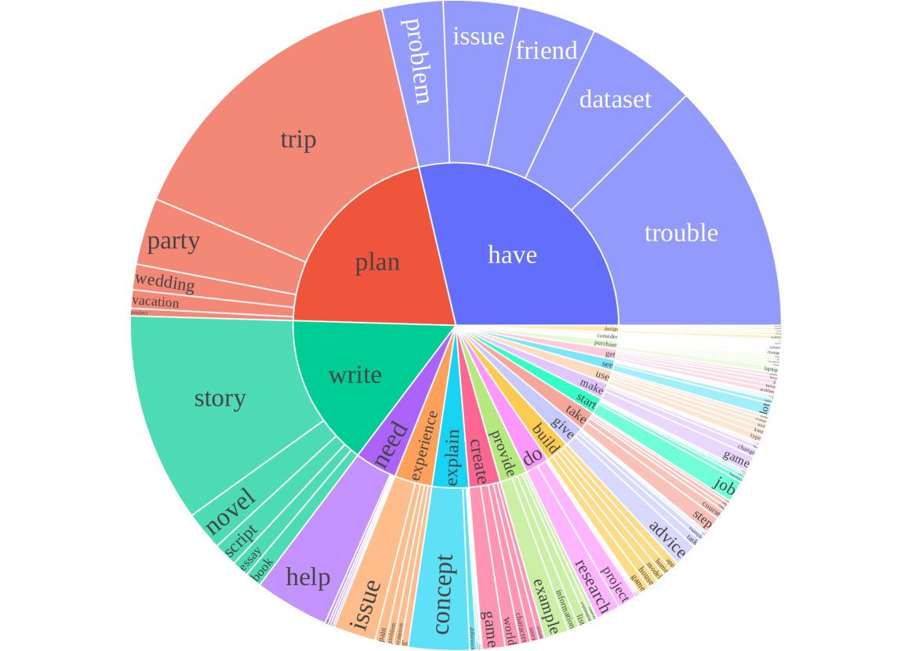
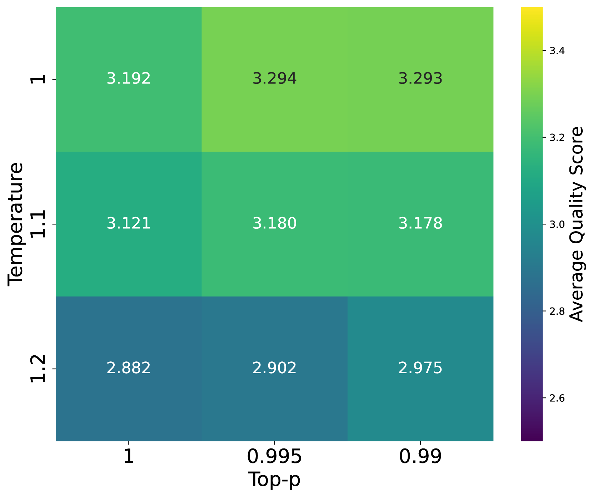
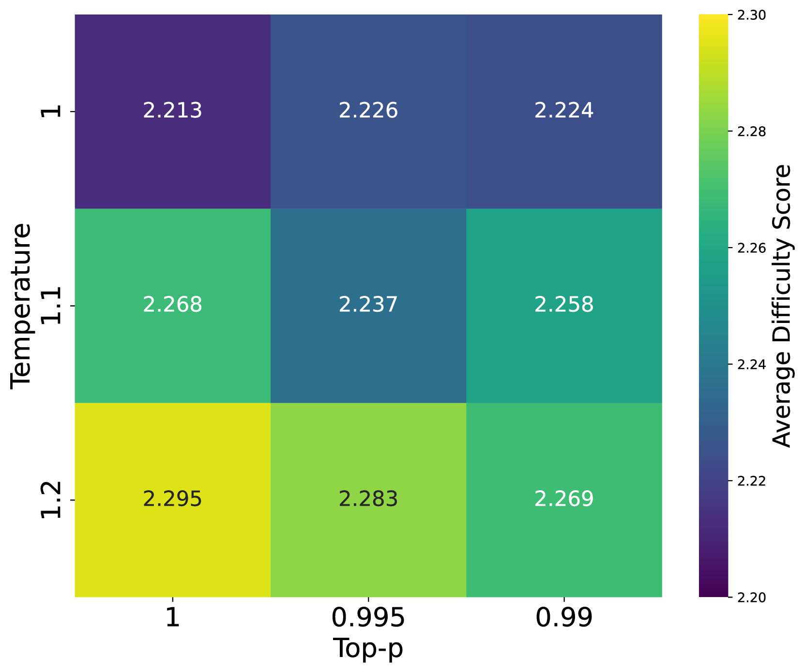
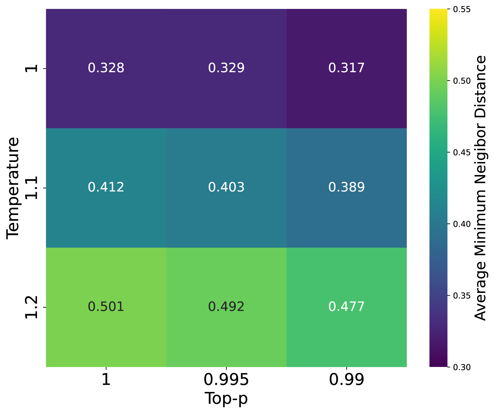
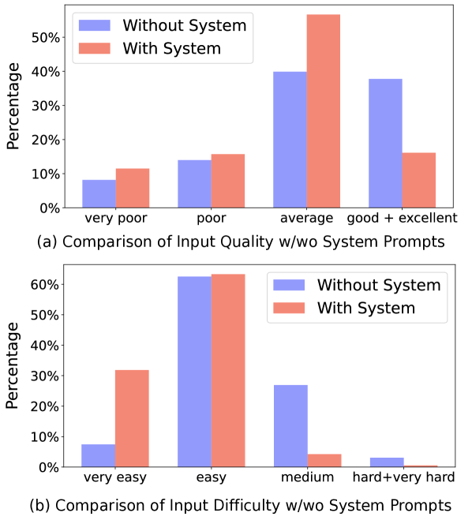

# Magpie：借助无任何先验知识，通过提示对齐的LLMs，从零开始生成对齐数据

发布时间：2024年06月12日

`LLM应用

这篇论文主要探讨了如何从对齐的大型语言模型（LLM）中提取和生成大规模高质量的指令数据，以用于模型的微调和优化。论文中提出的方法“Magpie”利用了LLM的自回归特性来生成指令数据，并通过实验证明了这种方法的有效性。这一研究直接应用于LLM的实际应用和优化中，因此属于LLM应用分类。` `人工智能` `数据处理`

> Magpie: Alignment Data Synthesis from Scratch by Prompting Aligned LLMs with Nothing

# 摘要

> 高质量指令数据对LLMs的调整至关重要。尽管如Llama-3-Instruct等模型已公开权重，但其对齐数据仍保密，影响了AI的普及。高人力成本和预设提示范围限制了开源数据创建方法的扩展，可能影响公共对齐数据集的多样性和质量。我们提出了一种名为Magpie的自合成方法，用于从对齐LLM中直接提取并生成大规模高质量指令数据。我们的研究发现，由于自回归特性，像Llama-3-Instruct这样的模型能在输入用户消息保留位置左侧模板时生成用户查询。我们利用此方法生成了400万条指令及响应，并精选出30万个高质量实例。通过微调Llama-3-8B-Base并与其他公共数据集比较，我们发现使用Magpie微调的模型在某些任务上与官方Llama-3-8B-Instruct表现相当，后者通过SFT和反馈学习增强了1000万个数据点。此外，仅使用Magpie进行SFT在某些对齐基准上超越了以往同时用于SFT和偏好优化的公共数据集。

> High-quality instruction data is critical for aligning large language models (LLMs). Although some models, such as Llama-3-Instruct, have open weights, their alignment data remain private, which hinders the democratization of AI. High human labor costs and a limited, predefined scope for prompting prevent existing open-source data creation methods from scaling effectively, potentially limiting the diversity and quality of public alignment datasets. Is it possible to synthesize high-quality instruction data at scale by extracting it directly from an aligned LLM? We present a self-synthesis method for generating large-scale alignment data named Magpie. Our key observation is that aligned LLMs like Llama-3-Instruct can generate a user query when we input only the left-side templates up to the position reserved for user messages, thanks to their auto-regressive nature. We use this method to prompt Llama-3-Instruct and generate 4 million instructions along with their corresponding responses. We perform a comprehensive analysis of the extracted data and select 300K high-quality instances. To compare Magpie data with other public instruction datasets, we fine-tune Llama-3-8B-Base with each dataset and evaluate the performance of the fine-tuned models. Our results indicate that in some tasks, models fine-tuned with Magpie perform comparably to the official Llama-3-8B-Instruct, despite the latter being enhanced with 10 million data points through supervised fine-tuning (SFT) and subsequent feedback learning. We also show that using Magpie solely for SFT can surpass the performance of previous public datasets utilized for both SFT and preference optimization, such as direct preference optimization with UltraFeedback. This advantage is evident on alignment benchmarks such as AlpacaEval, ArenaHard, and WildBench.

[Arxiv](https://arxiv.org/abs/2406.08464)