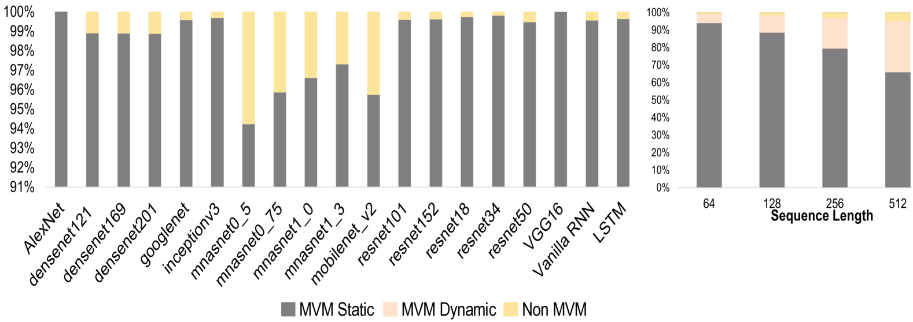

# 记忆至上：计算内存架构如何加速大型语言模型推理的全景解析

发布时间：2024年06月12日

`LLM理论

这篇论文主要探讨了大型语言模型（LLMs）在推理速度、效率和可及性方面的挑战，特别是在计算和内存技术进步方面。它详细分析了计算内存（CIM）技术如何通过在内存中直接进行模拟计算来降低延迟和功耗，从而加速AI推理。此外，论文还深入讨论了基于变压器的模型和多种CIM架构，以及它们如何应对现代AI计算系统的挑战。这些内容主要涉及LLM的理论和技术实现，因此归类为LLM理论。` `人工智能` `计算技术`

> Memory Is All You Need: An Overview of Compute-in-Memory Architectures for Accelerating Large Language Model Inference

# 摘要

> 大型语言模型（LLMs）的兴起，让机器能够流畅地生成人类般的文本，并进行深入对话，这标志着自然语言处理领域的一次飞跃。然而，随着这些模型对计算和内存的需求激增，我们面临着对LLM推理速度、效率和可及性的迫切需求。计算和内存技术的进步，因摩尔定律的终结而放缓，使得挑战更加严峻。当LLMs的规模超越单个GPU的承载极限时，它们需要高度复杂的并行处理配置。内存访问成本的飙升，形成了阻碍高效扩展的“内存墙”。计算内存（CIM）技术应运而生，它通过在内存中直接进行模拟计算，有望大幅降低延迟和功耗，为AI推理加速开辟了新路径。CIM通过紧密结合内存与计算单元，打破了冯·诺依曼瓶颈，减少了数据迁移，提升了能效。本篇综述深入探讨了基于变压器的模型，分析了多种CIM架构，并探讨了它们如何应对现代AI计算系统的紧迫挑战。我们详细讨论了变压器相关的操作及其硬件加速策略，并揭示了CIM设计中的关键挑战、发展趋势和深刻见解。

> Large language models (LLMs) have recently transformed natural language processing, enabling machines to generate human-like text and engage in meaningful conversations. This development necessitates speed, efficiency, and accessibility in LLM inference as the computational and memory requirements of these systems grow exponentially. Meanwhile, advancements in computing and memory capabilities are lagging behind, exacerbated by the discontinuation of Moore's law. With LLMs exceeding the capacity of single GPUs, they require complex, expert-level configurations for parallel processing. Memory accesses become significantly more expensive than computation, posing a challenge for efficient scaling, known as the memory wall. Here, compute-in-memory (CIM) technologies offer a promising solution for accelerating AI inference by directly performing analog computations in memory, potentially reducing latency and power consumption. By closely integrating memory and compute elements, CIM eliminates the von Neumann bottleneck, reducing data movement and improving energy efficiency. This survey paper provides an overview and analysis of transformer-based models, reviewing various CIM architectures and exploring how they can address the imminent challenges of modern AI computing systems. We discuss transformer-related operators and their hardware acceleration schemes and highlight challenges, trends, and insights in corresponding CIM designs.

[Arxiv](https://arxiv.org/abs/2406.08413)