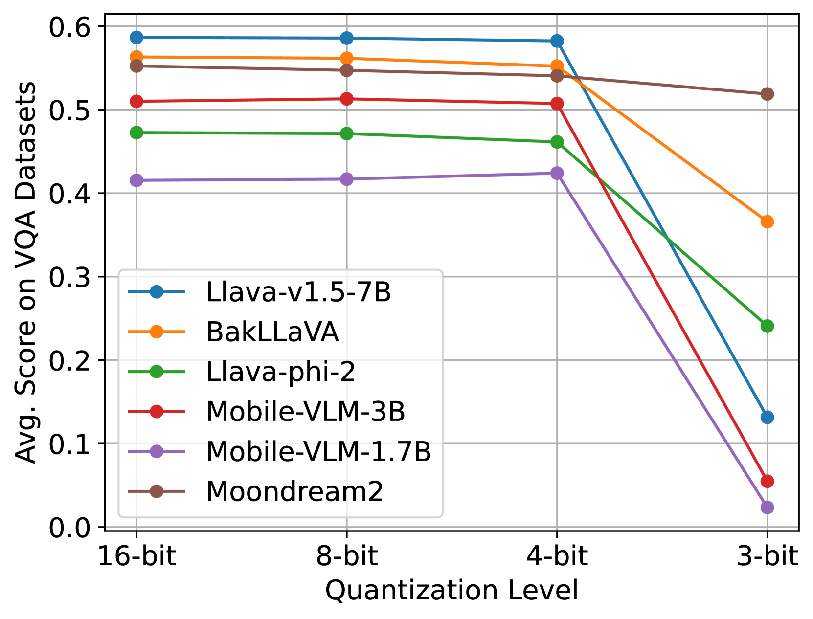
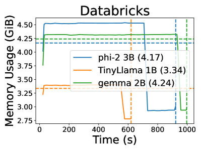

# MobileAIBench：设备端用例下的大型语言模型与多模态模型性能评测基准

发布时间：2024年06月12日

`LLM应用

这篇论文主要探讨了大型语言模型（LLMs）和多模态模型（LMMs）在移动设备上的应用，特别是在模型优化和性能评估方面。论文介绍了开发的MobileAIBench框架，用于评估这些模型在移动设备上的性能，包括量化对模型性能的影响以及设备延迟和资源消耗的测量。这与LLM应用分类相符，因为它关注的是LLMs和LMMs在实际应用中的性能和优化，而不是理论研究或Agent的设计与实现。` `移动设备` `人工智能`

> MobileAIBench: Benchmarking LLMs and LMMs for On-Device Use Cases

# 摘要

> 大型语言模型（LLMs）与多模态模型（LMMs）在移动设备上的应用因其提升的隐私保护、稳定性及个性化服务而备受瞩目。但受限于移动设备的硬件条件，我们不得不采用参数较少且经过量化等压缩技术处理的模型。目前，量化对LLM、LMM任务乃至信任与安全等关键性能的影响尚不明晰，且缺乏系统性测试移动设备上这些模型的有效工具。为此，我们开发了MobileAIBench，一个专为评估移动端优化后的LLMs和LMMs设计的全面基准框架。该框架在不同规模、量化等级及任务中对模型进行评估，并实测设备延迟与资源消耗。我们的开源框架分为两部分：一是在桌面端进行评估的库，二是用于测量iOS设备延迟及硬件利用率的App。通过深入分析，我们旨在为移动AI的研究与部署提供洞见，探讨在移动平台上部署LLMs和LMMs的性能与可行性，从而推动该领域的发展。

> The deployment of Large Language Models (LLMs) and Large Multimodal Models (LMMs) on mobile devices has gained significant attention due to the benefits of enhanced privacy, stability, and personalization. However, the hardware constraints of mobile devices necessitate the use of models with fewer parameters and model compression techniques like quantization. Currently, there is limited understanding of quantization's impact on various task performances, including LLM tasks, LMM tasks, and, critically, trust and safety. There is a lack of adequate tools for systematically testing these models on mobile devices. To address these gaps, we introduce MobileAIBench, a comprehensive benchmarking framework for evaluating mobile-optimized LLMs and LMMs. MobileAIBench assesses models across different sizes, quantization levels, and tasks, measuring latency and resource consumption on real devices. Our two-part open-source framework includes a library for running evaluations on desktops and an iOS app for on-device latency and hardware utilization measurements. Our thorough analysis aims to accelerate mobile AI research and deployment by providing insights into the performance and feasibility of deploying LLMs and LMMs on mobile platforms.

[Arxiv](https://arxiv.org/abs/2406.10290)