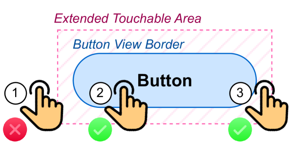
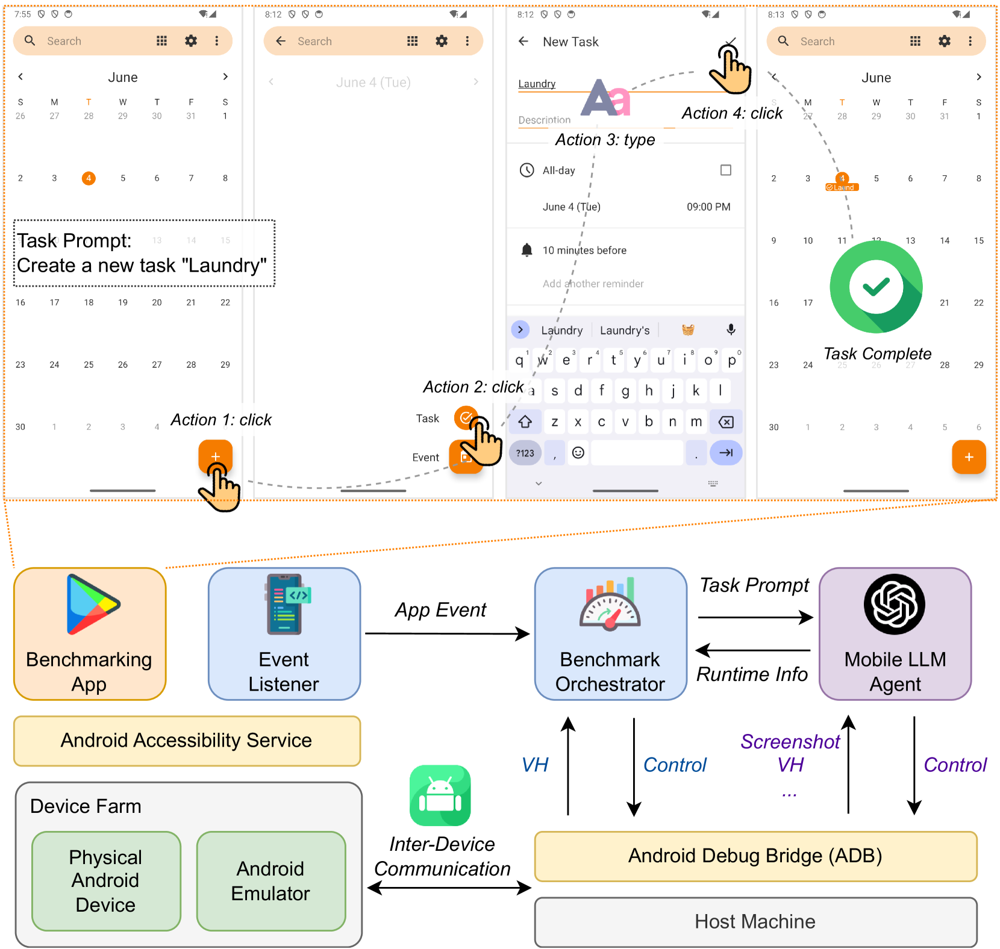
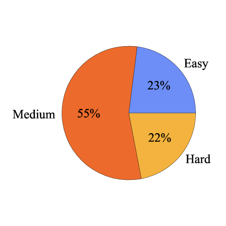
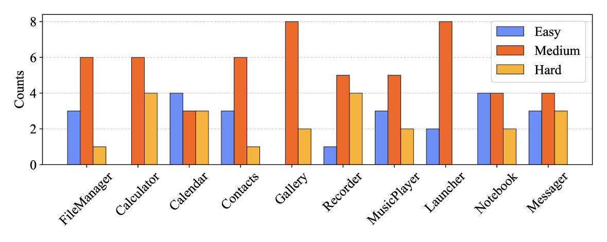
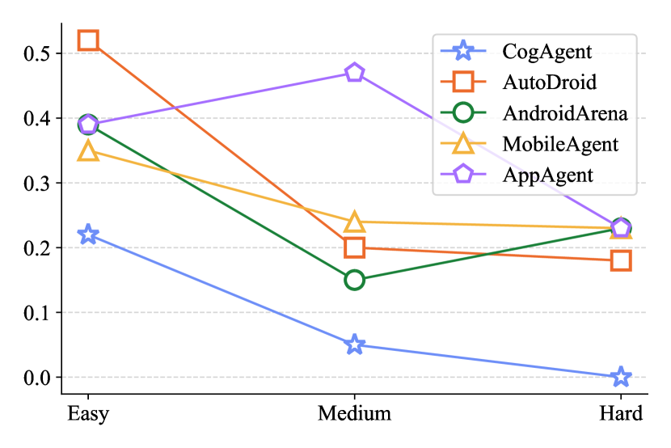
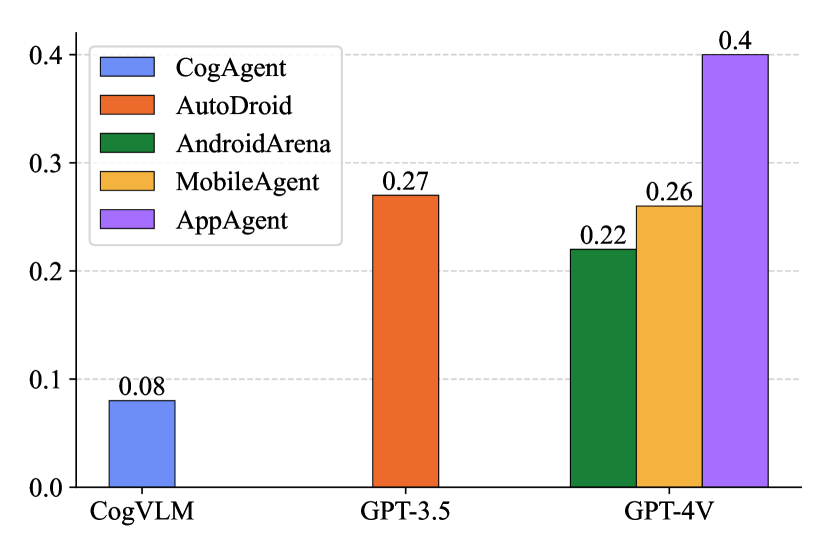

# MobileAgentBench：高效便捷的移动LLM代理评估标杆

发布时间：2024年06月12日

`Agent

这篇论文主要关注基于LLM的移动代理的性能评估，并推出了一个基准工具——MobileAgentBench，用于系统地评估移动代理在处理日常任务和与手机GUI互动方面的能力。这与Agent分类下的研究内容相符，因为Agent通常指的是能够自主执行任务的智能体或系统。因此，这篇论文应归类于Agent。` `移动应用` `自动化测试`

> MobileAgentBench: An Efficient and User-Friendly Benchmark for Mobile LLM Agents

# 摘要

> 基于LLM的移动代理因其能直接与手机GUI互动及自主处理日常任务的能力而日益流行。尽管在学术与工业界前景看好，但针对现有移动代理性能的基准研究却鲜有涉及，原因在于应用状态的无限性和可行操作序列定义的模糊性。为此，我们推出了高效且用户友好的基准工具——MobileAgentBench，旨在减轻手动测试的繁重负担。我们首先在10个开源应用中设定了100项任务，按难度分级。接着，我们对AppAgent和MobileAgent等移动代理进行了全面系统的性能评估。所有资料均可在我们的项目网页https://MobileAgentBench.github.io获取，以促进学术与工业界的进步。

> Large language model (LLM)-based mobile agents are increasingly popular due to their capability to interact directly with mobile phone Graphic User Interfaces (GUIs) and their potential to autonomously manage daily tasks. Despite their promising prospects in both academic and industrial sectors, little research has focused on benchmarking the performance of existing mobile agents, due to the inexhaustible states of apps and the vague definition of feasible action sequences. To address this challenge, we propose an efficient and user-friendly benchmark, MobileAgentBench, designed to alleviate the burden of extensive manual testing. We initially define 100 tasks across 10 open-source apps, categorized by multiple levels of difficulty. Subsequently, we evaluate several existing mobile agents, including AppAgent and MobileAgent, to thoroughly and systematically compare their performance. All materials are accessible on our project webpage: https://MobileAgentBench.github.io, contributing to the advancement of both academic and industrial fields.

[Arxiv](https://arxiv.org/abs/2406.08184)