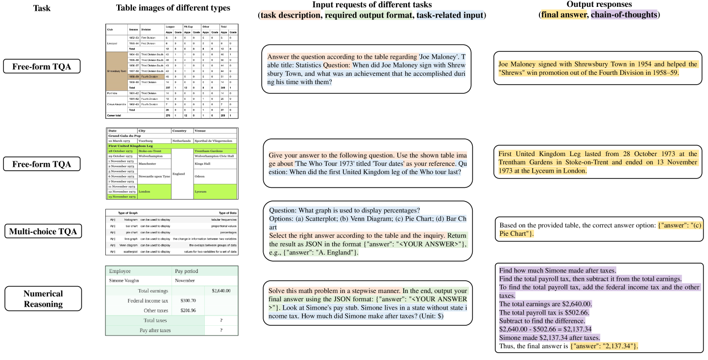

# 多模态下的表格智能解析

发布时间：2024年06月12日

`LLM应用

理由：该论文摘要讨论了基于大型语言模型（LLMs）的表格理解方法，并提出了一个新的多模态表格理解问题，即直接通过视觉信息理解表格。这涉及到创建新的数据集（MMTab）和开发新的模型（Table-LLaVA），这些都是在LLM框架下的具体应用，而不是理论研究或Agent、RAG相关的研究。因此，它属于LLM应用类别。` `数据处理` `人工智能`

> Multimodal Table Understanding

# 摘要

> 尽管基于LLMs的表格理解方法已取得显著进展，但它们依赖于将表格转换为特定文本序列的前提，这在实际应用中并不总是可行。面对这一挑战，我们提出了多模态表格理解的新问题，旨在直接通过视觉信息理解表格。为此，我们创建了MMTab数据集，并开发了Table-LLaVA模型，该模型在多个测试中超越了现有MLLM基线。详情及资源请访问https://github.com/SpursGoZmy/Table-LLaVA。

> Although great progress has been made by previous table understanding methods including recent approaches based on large language models (LLMs), they rely heavily on the premise that given tables must be converted into a certain text sequence (such as Markdown or HTML) to serve as model input. However, it is difficult to access such high-quality textual table representations in some real-world scenarios, and table images are much more accessible. Therefore, how to directly understand tables using intuitive visual information is a crucial and urgent challenge for developing more practical applications. In this paper, we propose a new problem, multimodal table understanding, where the model needs to generate correct responses to various table-related requests based on the given table image. To facilitate both the model training and evaluation, we construct a large-scale dataset named MMTab, which covers a wide spectrum of table images, instructions and tasks. On this basis, we develop Table-LLaVA, a generalist tabular multimodal large language model (MLLM), which significantly outperforms recent open-source MLLM baselines on 23 benchmarks under held-in and held-out settings. The code and data is available at this https://github.com/SpursGoZmy/Table-LLaVA

[Arxiv](https://arxiv.org/abs/2406.08100)