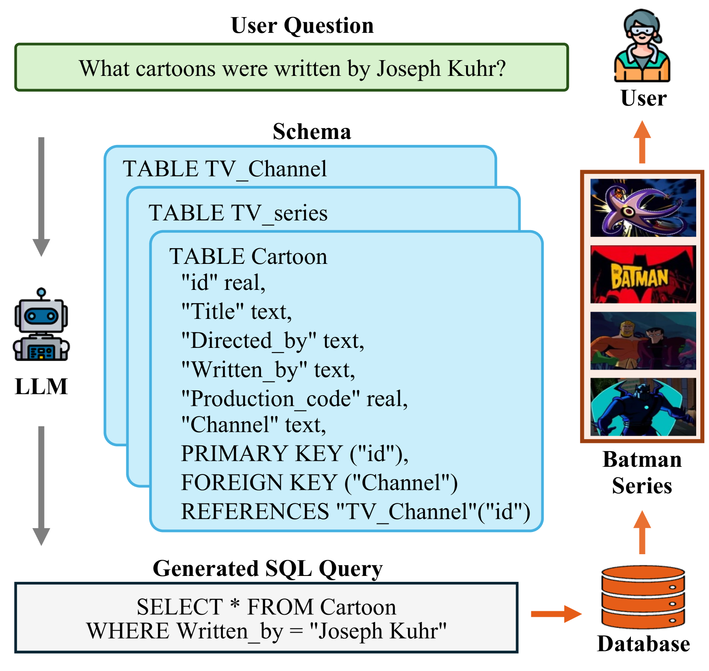
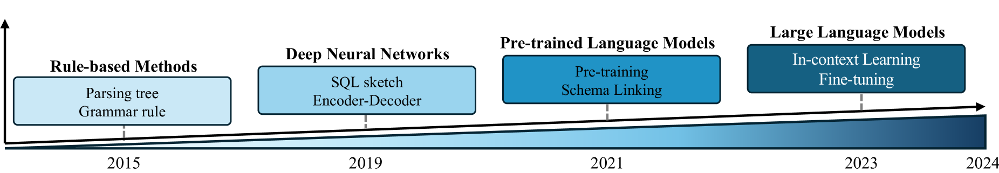

# 探索未来数据库交互：基于大型语言模型的文本至SQL技术综述

发布时间：2024年06月12日

`LLM应用

这篇论文摘要讨论了将大型语言模型（LLMs）应用于自然语言到SQL（text-to-SQL）的生成问题。它指出了传统方法和预训练语言模型（PLMs）在处理复杂数据库和问题时的局限性，并强调了LLMs在自然语言理解方面的潜力。论文综述了基于LLM的text-to-SQL的当前挑战、技术演进、评估体系以及最新进展，并展望了未来的研究方向。因此，这篇论文属于LLM应用分类。` `数据库`

> Next-Generation Database Interfaces: A Survey of LLM-based Text-to-SQL

# 摘要

> 自然语言到SQL（text-to-SQL）的准确生成一直是个难题，涉及用户问题解析、数据库架构理解和SQL语句构建。传统方法结合了人工设计和深度学习网络。预训练语言模型（PLMs）的引入虽提升了性能，但面对日益复杂的数据库和问题，其理解局限性导致SQL生成错误频发。这要求我们开发更精细的优化策略，但也限制了PLM系统的应用范围。随着模型规模的扩大，大型语言模型（LLMs）在自然语言理解上展现出巨大潜力。因此，将LLMs融入text-to-SQL研究，不仅带来新机遇，也面临新挑战。本综述全面探讨了基于LLM的text-to-SQL，概述了当前挑战与技术演进，详解了评估体系，分析了最新进展，并展望了未来研究方向。

> Generating accurate SQL according to natural language questions (text-to-SQL) is a long-standing problem since it is challenging in user question understanding, database schema comprehension, and SQL generation. Conventional text-to-SQL systems include human engineering and deep neural networks. Subsequently, pre-trained language models (PLMs) have been developed and utilized for text-to-SQL tasks, achieving promising performance. As modern databases become more complex and corresponding user questions more challenging, PLMs with limited comprehension capabilities can lead to incorrect SQL generation. This necessitates more sophisticated and tailored optimization methods, which, in turn, restricts the applications of PLM-based systems. Most recently, large language models (LLMs) have demonstrated significant abilities in natural language understanding as the model scale remains increasing. Therefore, integrating the LLM-based implementation can bring unique opportunities, challenges, and solutions to text-to-SQL research. In this survey, we present a comprehensive review of LLM-based text-to-SQL. Specifically, we propose a brief overview of the current challenges and the evolutionary process of text-to-SQL. Then, we provide a detailed introduction to the datasets and metrics designed to evaluate text-to-SQL systems. After that, we present a systematic analysis of recent advances in LLM-based text-to-SQL. Finally, we discuss the remaining challenges in this field and propose expectations for future directions.

[Arxiv](https://arxiv.org/abs/2406.08426)