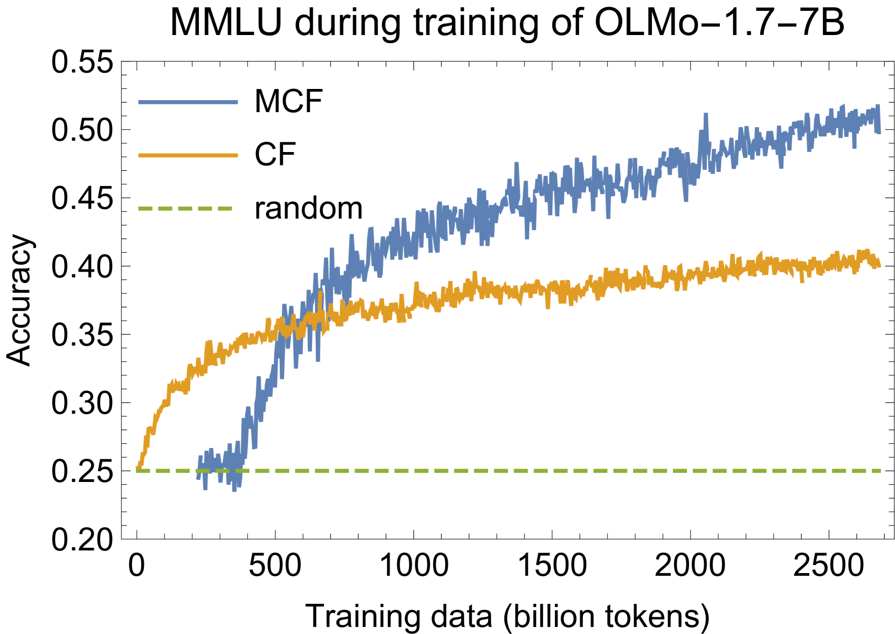

# OLMES：语言模型评估的标杆

发布时间：2024年06月12日

`LLM理论

这篇论文主要关注的是大型语言模型（LLM）的评估标准问题，提出了一个名为OLMES的评估标准，旨在解决现有评估方法的不一致性和不可重复性问题。论文通过深入分析社区评估实践中的多样因素，并提出了一套详尽记录、实用且开放的评估标准。这与LLM的理论研究紧密相关，因为它涉及到如何科学、公正地评估和比较不同LLM的性能，这是理论研究中的一个重要方面。因此，这篇论文应归类于LLM理论。` `人工智能评估` `语言模型`

> OLMES: A Standard for Language Model Evaluations

# 摘要

> AI的进步和创新往往体现在新模型在测试模型能力的任务上宣称性能提升。然而，评估语言模型是一项挑战，因为即使是评估方法的微小变化也可能导致性能评估的巨大波动。由于缺乏统一的评估标准，不同模型在相同任务上的评估方式各异，使得关于最佳模型的声明难以复现。为此，我们提出了OLMES，一个详尽记录、实用且开放的LLM评估标准，旨在实现可重复性。在制定OLMES时，我们深入分析了社区评估实践中存在的多样因素，包括提示格式、上下文示例选择、概率归一化及任务定义等。特别地，OLMES能够对需要“填空”格式的小型模型与能够直接处理原始格式的大型模型进行公平比较。该标准融合了现有文献的见解以及针对开放问题的全新实验结果，提供了周到的建议。

> Progress in AI is often demonstrated by new models claiming improved performance on tasks measuring model capabilities. Evaluating language models in particular is challenging, as small changes to how a model is evaluated on a task can lead to large changes in measured performance. There is no common standard setup, so different models are evaluated on the same tasks in different ways, leading to claims about which models perform best not being reproducible. We propose OLMES, a completely documented, practical, open standard for reproducible LLM evaluations. In developing this standard, we identify and review the varying factors in evaluation practices adopted by the community - such as details of prompt formatting, choice of in-context examples, probability normalizations, and task formulation. In particular, OLMES supports meaningful comparisons between smaller base models that require the unnatural "cloze" formulation of multiple-choice questions against larger models that can utilize the original formulation. OLMES includes well-considered recommendations guided by results from existing literature as well as new experiments investigating open questions.

[Arxiv](https://arxiv.org/abs/2406.08446)