# PAL：异质偏好学习的多样性对齐框架

发布时间：2024年06月12日

`LLM理论

理由：这篇论文探讨了大型基础模型与人类偏好对齐的理论问题，提出了PAL框架来解决偏好多样性的问题。它不仅涉及模型的预训练策略，还深入研究了如何通过混合建模捕捉人群偏好的多样性，并学习一个跨不同偏好的共同潜在空间。这些内容更多地属于对大型语言模型（LLM）理论层面的探讨和改进，而不是具体的应用、Agent设计或RAG（Retrieval-Augmented Generation）技术。因此，将其归类为LLM理论是合适的。` `人工智能` `模型对齐`

> PAL: Pluralistic Alignment Framework for Learning from Heterogeneous Preferences

# 摘要

> 大型基础模型在未经大规模对齐以适应人类偏好之前，无法直接投入使用。这种对齐过程通常涉及收集大量人类的双向选择数据，并利用BTL模型来模拟人类的隐含偏好。然而，这种方法假设所有人共享同一偏好，忽视了偏好的多样性。为此，我们提出了PAL框架，它与现有预训练策略相辅相成，从一开始就考虑了偏好的多元性。我们采用理想点模型来审视偏好对齐，并通过混合建模捕捉人群偏好的多样性，同时学习一个跨不同偏好的共同潜在空间，使模型能够快速适应新用户。我们的方法利用大型模型的深层表示和简单MLP层，学习到的奖励函数与顶尖奖励模型相媲美，大幅提升了效率。PAL在语言模型、图像生成模型以及一个半合成异构数据集上的表现均优于现有基线。此外，我们的实验揭示了当前偏好数据集的局限性，它们过于僵化，未能体现偏好的多样性，因此我们呼吁采用更为精细的数据收集策略。

> Large foundation models pretrained on raw web-scale data are not readily deployable without additional step of extensive alignment to human preferences. Such alignment is typically done by collecting large amounts of pairwise comparisons from humans ("Do you prefer output A or B?") and learning a reward model or a policy with the Bradley-Terry-Luce (BTL) model as a proxy for a human's underlying implicit preferences. These methods generally suffer from assuming a universal preference shared by all humans, which lacks the flexibility of adapting to plurality of opinions and preferences. In this work, we propose PAL, a framework to model human preference complementary to existing pretraining strategies, which incorporates plurality from the ground up. We propose using the ideal point model as a lens to view alignment using preference comparisons. Together with our novel reformulation and using mixture modeling, our framework captures the plurality of population preferences while simultaneously learning a common preference latent space across different preferences, which can few-shot generalize to new, unseen users. Our approach enables us to use the penultimate-layer representation of large foundation models and simple MLP layers to learn reward functions that are on-par with the existing large state-of-the-art reward models, thereby enhancing efficiency of reward modeling significantly. We show that PAL achieves competitive reward model accuracy compared to strong baselines on 1) Language models with Summary dataset ; 2) Image Generative models with Pick-a-Pic dataset ; 3) A new semisynthetic heterogeneous dataset generated using Anthropic Personas. Finally, our experiments also highlight the shortcoming of current preference datasets that are created using rigid rubrics which wash away heterogeneity, and call for more nuanced data collection approaches.

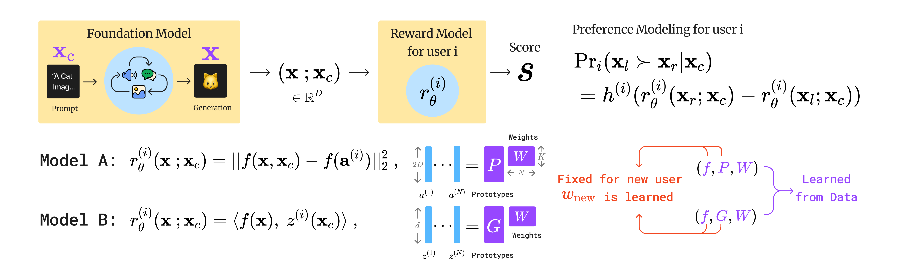

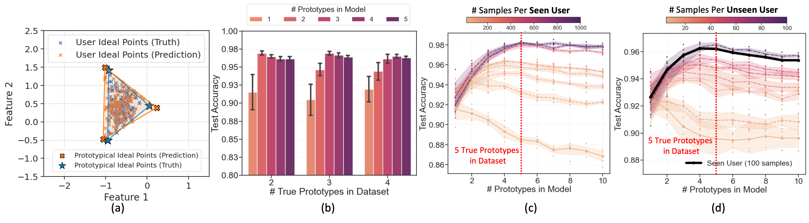

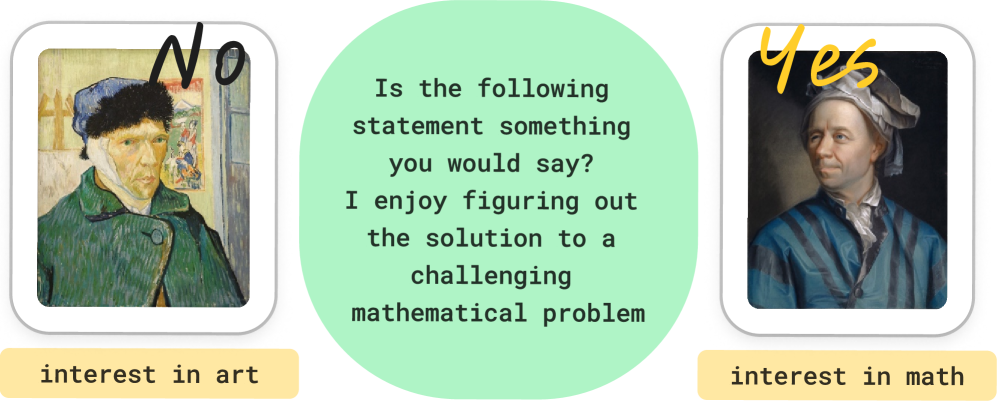

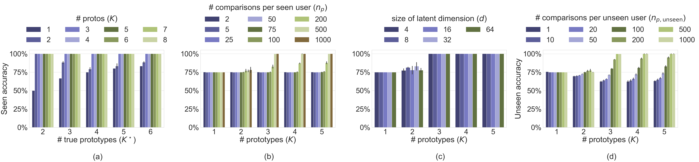

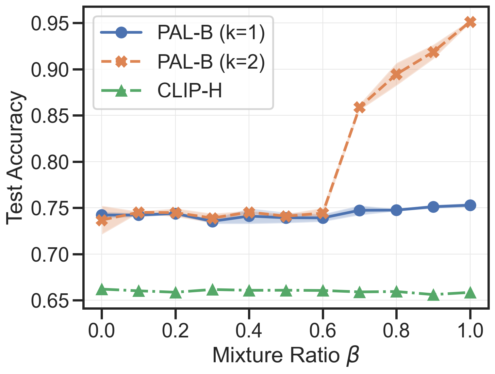

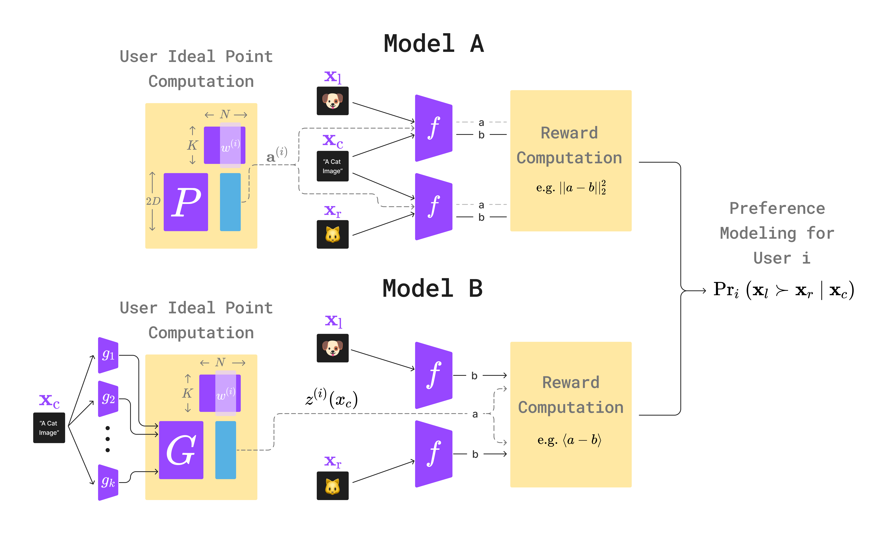

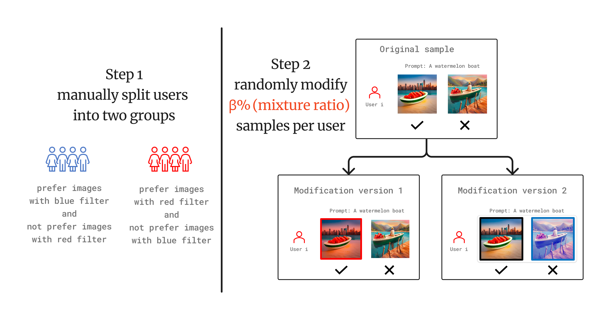

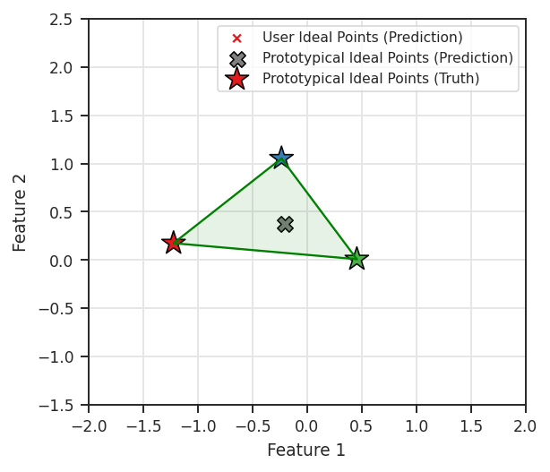

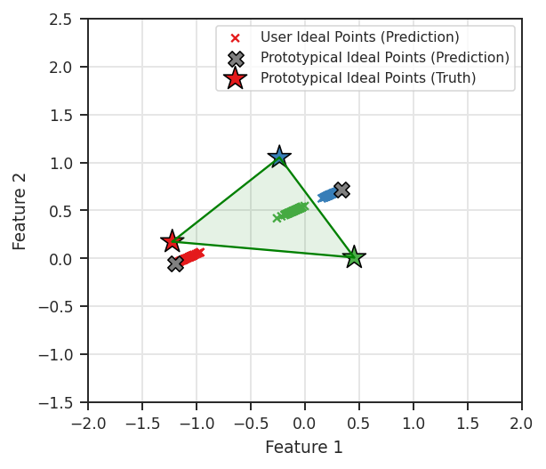

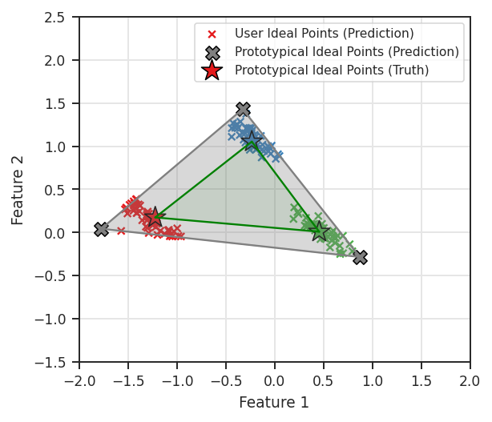

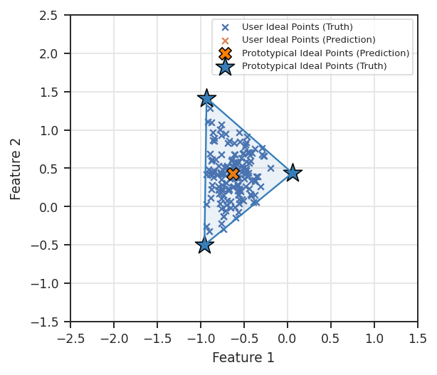

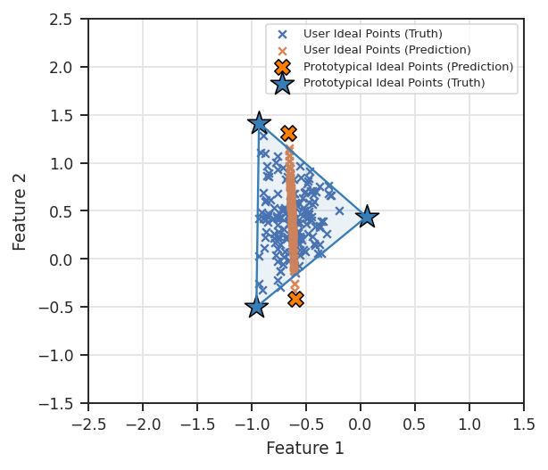

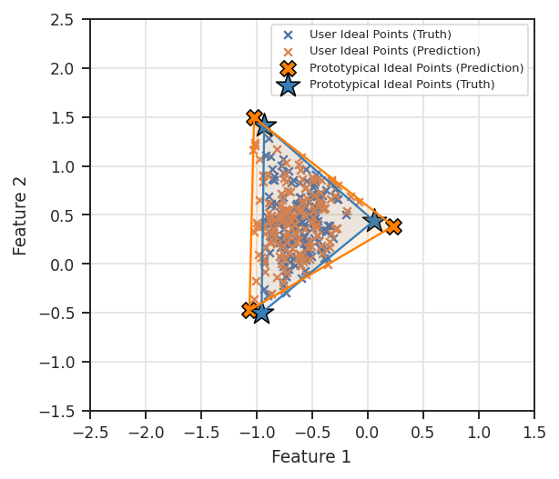

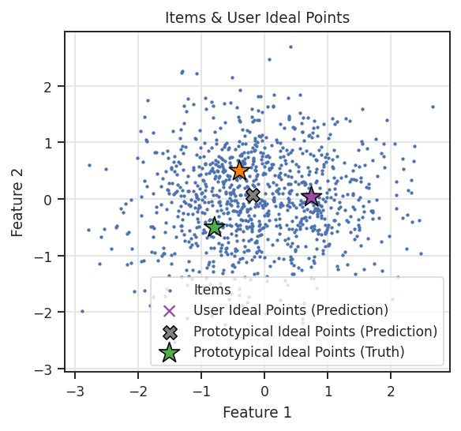

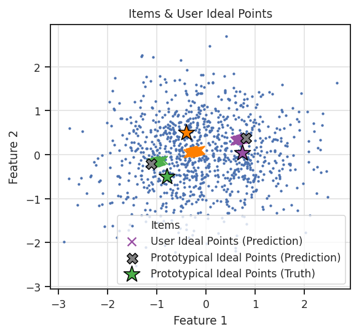

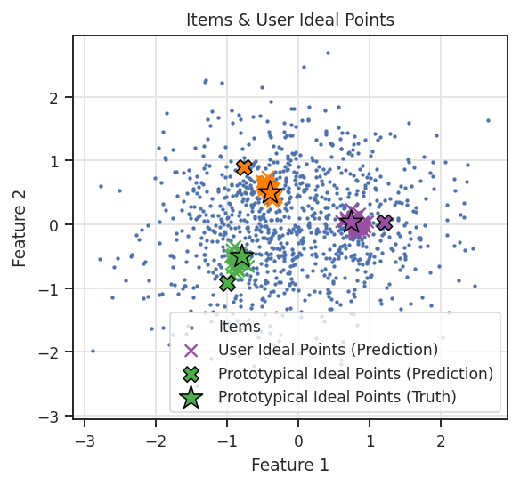

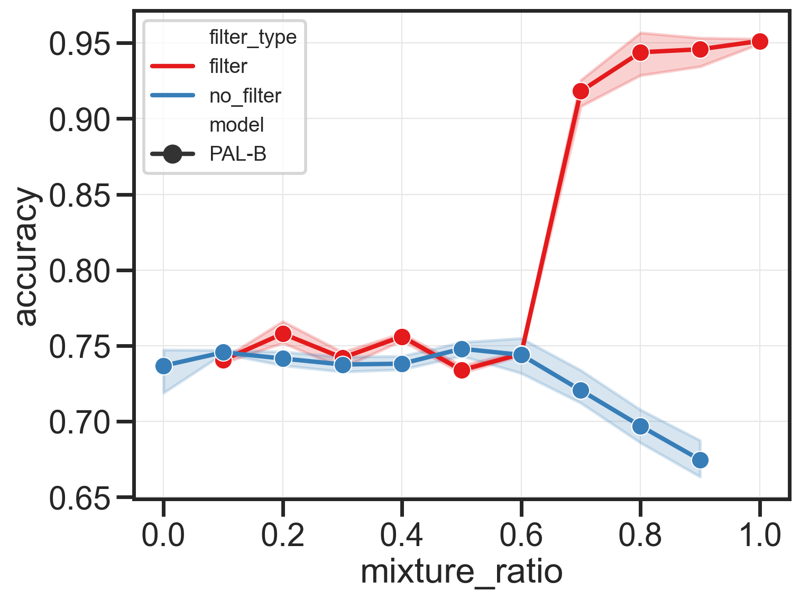

[Arxiv](https://arxiv.org/abs/2406.08469)