# ProTrain：利用内存感知技术优化大型语言模型训练效率

发布时间：2024年06月12日

`LLM理论

这篇论文主要探讨了大型语言模型（LLM）训练过程中的内存管理问题，并提出了一种新的系统（ProTrain）来优化这一过程。论文的核心贡献在于其提出的内存管理技术和系统，这些技术旨在提高内存利用率和训练性能，而不依赖于专家的手动配置。这与LLM的理论研究紧密相关，因为它涉及到LLM训练的基础设施和优化方法，而不是直接应用于特定的Agent或RAG系统，也不是关于LLM的具体应用案例。因此，将其归类为LLM理论是合适的。` `机器学习` `高性能计算`

> ProTrain: Efficient LLM Training via Memory-Aware Techniques

# 摘要

> 训练大型语言模型（LLM）对内存需求极大。现有技术如ZeRO-Offload通过结合CPU和GPU，使得用少数消费级显卡训练十亿级模型成为可能。然而，现有框架的内存管理通常较为粗糙，且依赖专家调整配置，导致硬件利用率和性能不尽如人意。本文提出的ProTrain系统，通过智能协调内存、计算与IO，实现了内存与性能的平衡。ProTrain采用基于Chunk的模型状态管理和块级激活管理，由内存感知运行时分析器自动优化，无需人工干预，且不影响训练算法的准确性。实验结果显示，ProTrain相比当前最先进的训练系统，训练吞吐量提升了1.43至2.71倍。

> It is extremely memory-hungry to train Large Language Models (LLM). To solve this problem, existing work exploits the combination of CPU and GPU for the training process, such as ZeRO-Offload. Such a technique largely democratizes billion-scale model training, making it possible to train with few consumer graphics cards. However, based on our observation, existing frameworks often provide coarse-grained memory management and require experienced experts in configuration tuning, leading to suboptimal hardware utilization and performance. This paper proposes ProTrain, a novel training system that intelligently balances memory usage and performance by coordinating memory, computation, and IO. ProTrain achieves adaptive memory management through Chunk-Based Model State Management and Block-Wise Activation Management, guided by a Memory-Aware Runtime Profiler without user intervention. ProTrain does not change the training algorithm and thus does not compromise accuracy. Experiments show that ProTrain improves training throughput by 1.43$\times$ to 2.71$\times$ compared to the SOTA training systems.

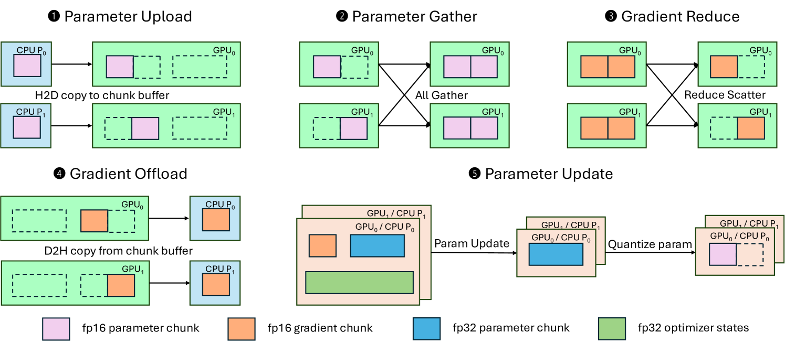

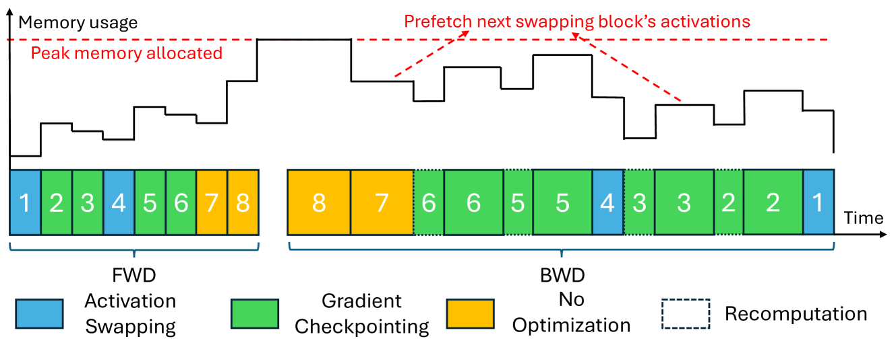

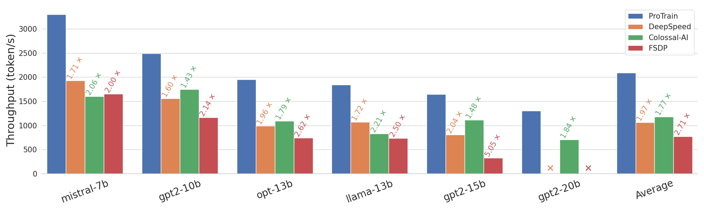

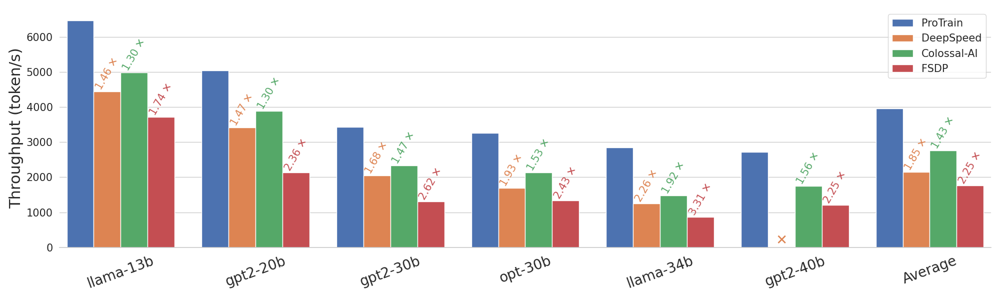

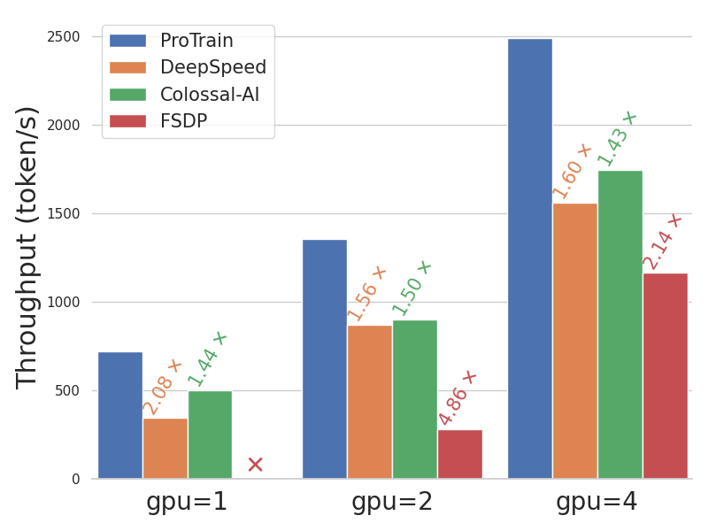

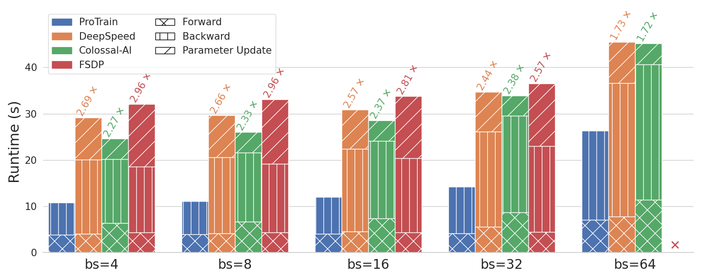

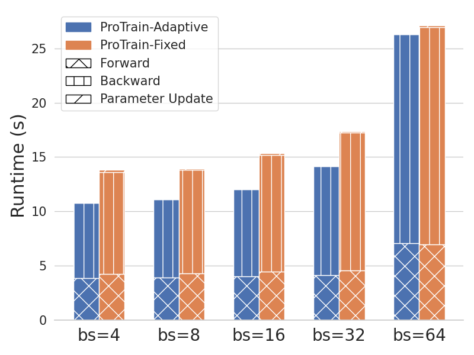

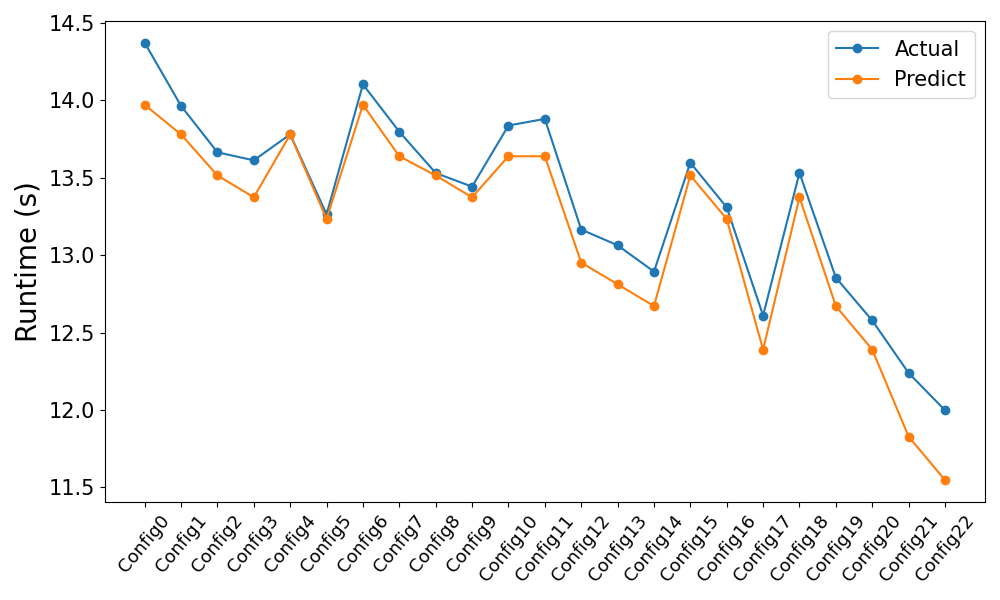

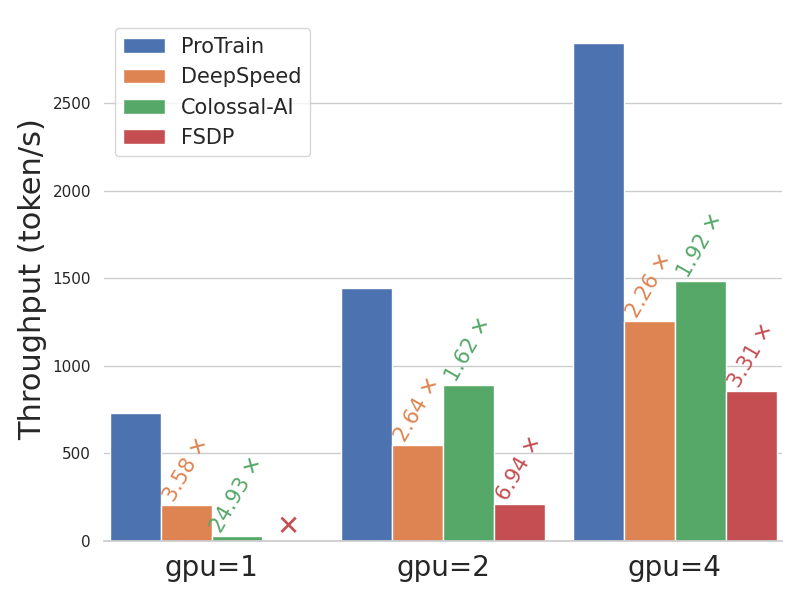

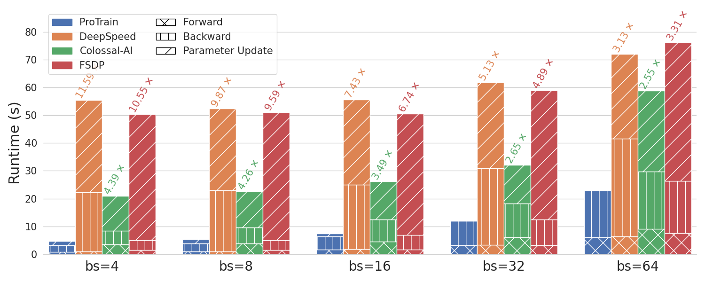

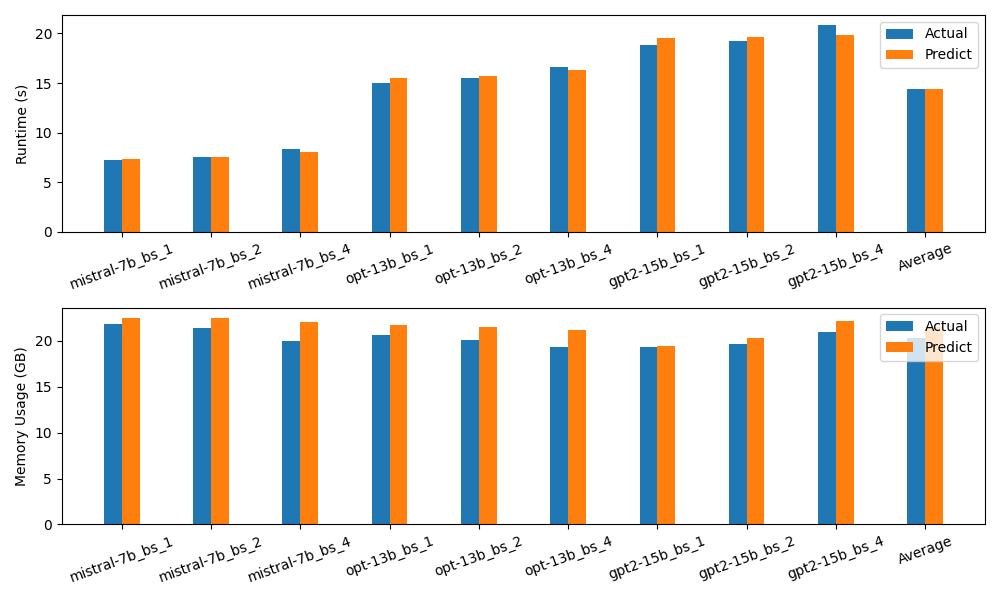

[Arxiv](https://arxiv.org/abs/2406.08334)