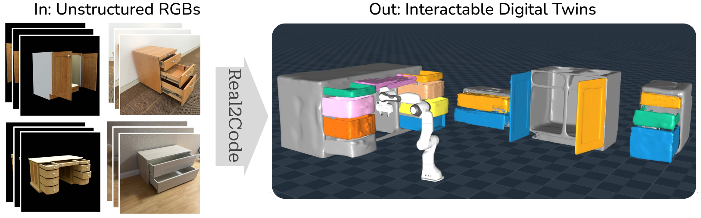
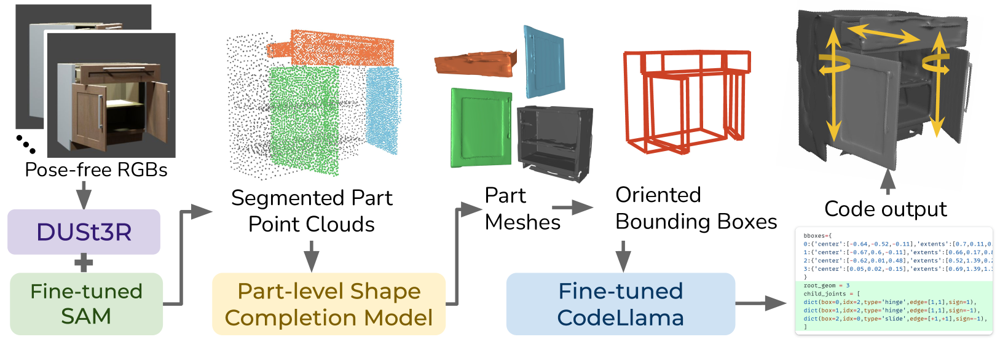
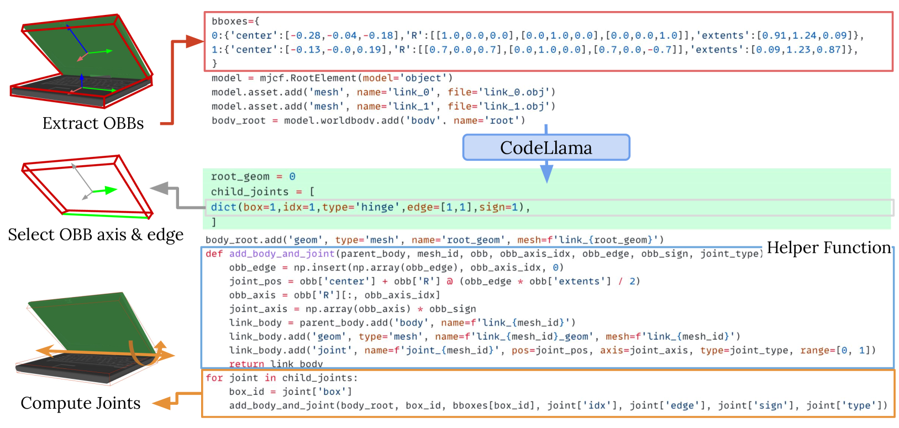
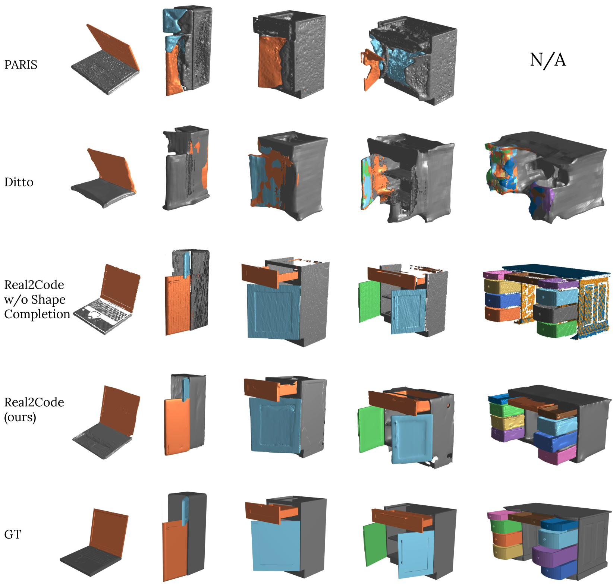
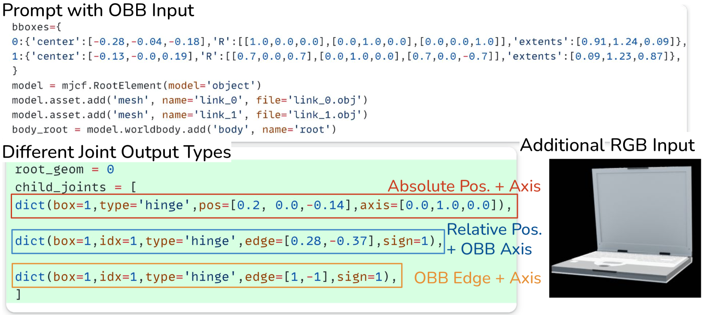
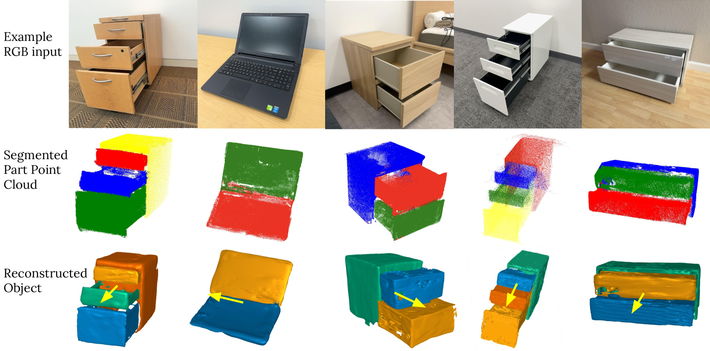
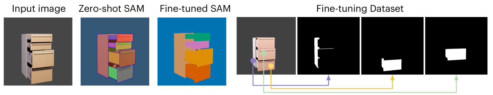
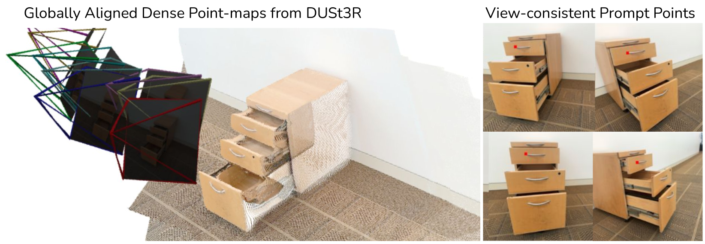
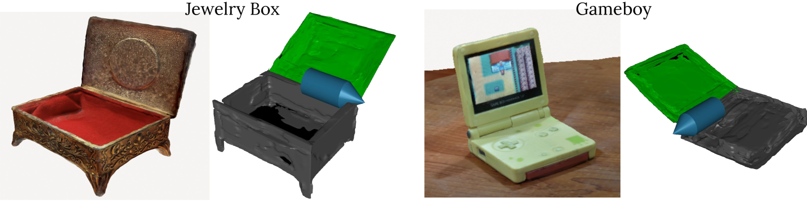

# Real2Code：代码生成助力关节对象重建

发布时间：2024年06月12日

`Agent

理由：这篇论文介绍了一种名为Real2Code的方法，该方法通过代码生成来重建可动对象。这种方法涉及使用图像分割和形状补全模型来重构对象部件的几何形态，并利用大型语言模型（LLM）来预测关节连接的代码。这种方法的创新之处在于它能够处理复杂的可动部件，并且能够从合成数据迁移到真实世界的非结构化环境中。这表明Real2Code更像是一个智能Agent，因为它能够理解和操作环境中的对象，而不仅仅是理论上的模型或应用。因此，将其归类为Agent更为合适。` `机器人技术` `计算机视觉`

> Real2Code: Reconstruct Articulated Objects via Code Generation

# 摘要

> 我们创新性地推出了Real2Code，一种通过代码生成巧妙重建可动对象的方法。首先，我们利用图像分割与形状补全模型，从视觉观察中重构对象部件的几何形态。接着，以定向边界框描绘这些部件，并将其输入至微调后的大型语言模型（LLM），预测关节连接的代码。得益于预训练的视觉与语言模型，Real2Code不仅优雅地适应了可动部件的增多，还成功从合成数据迁移至真实世界中非结构化环境的对象。实验证明，Real2Code在重建精度上大幅领先现有技术，更是首个突破训练集对象结构复杂性限制的方法，能重建多达10个可动部件的对象。结合立体重建模型，Real2Code还能仅凭少数多视角RGB图像，无需深度或相机信息，便能推广至真实世界对象。

> We present Real2Code, a novel approach to reconstructing articulated objects via code generation. Given visual observations of an object, we first reconstruct its part geometry using an image segmentation model and a shape completion model. We then represent the object parts with oriented bounding boxes, which are input to a fine-tuned large language model (LLM) to predict joint articulation as code. By leveraging pre-trained vision and language models, our approach scales elegantly with the number of articulated parts, and generalizes from synthetic training data to real world objects in unstructured environments. Experimental results demonstrate that Real2Code significantly outperforms previous state-of-the-art in reconstruction accuracy, and is the first approach to extrapolate beyond objects' structural complexity in the training set, and reconstructs objects with up to 10 articulated parts. When incorporated with a stereo reconstruction model, Real2Code also generalizes to real world objects from a handful of multi-view RGB images, without the need for depth or camera information.

[Arxiv](https://arxiv.org/abs/2406.08474)