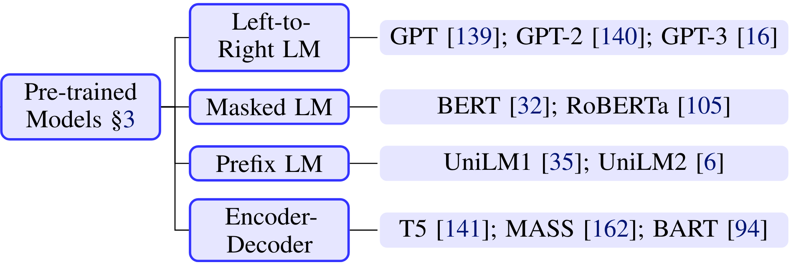
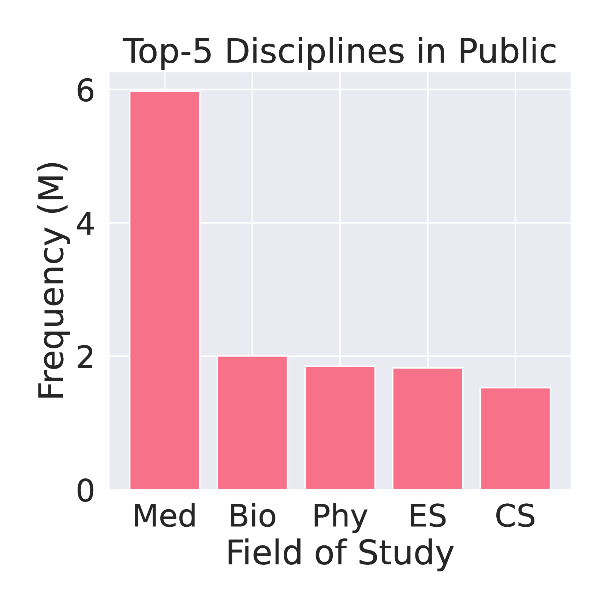
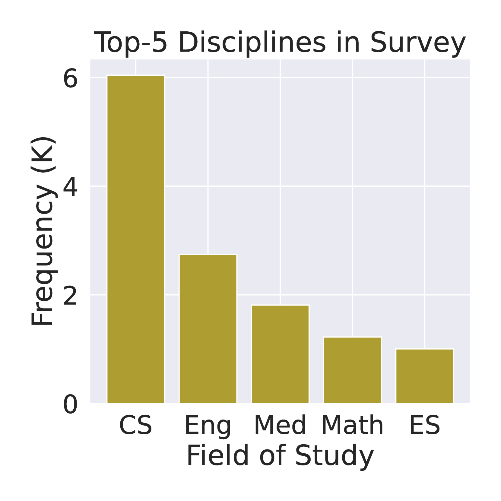
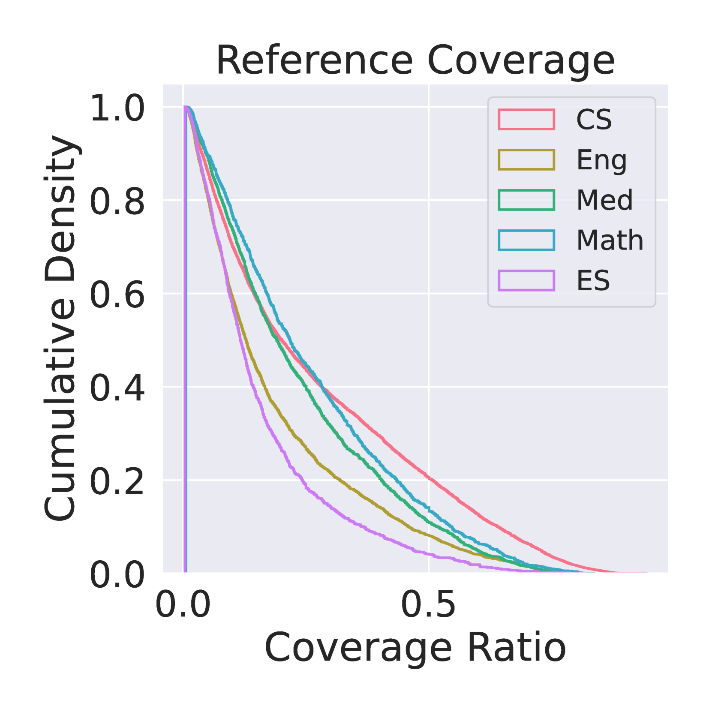
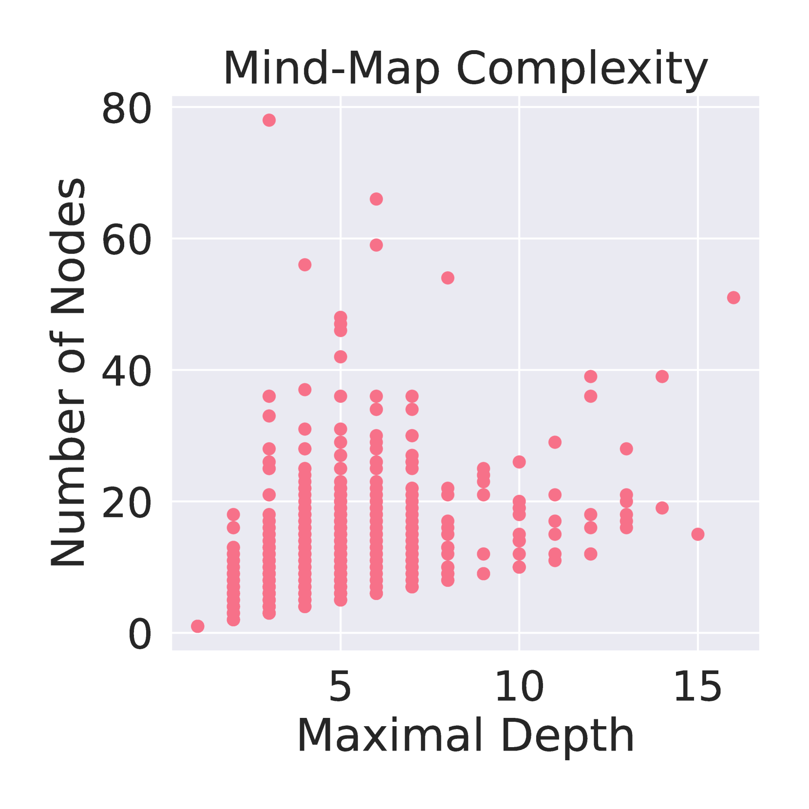

# ResearchArena：评估大型语言模型在作为研究代理时，收集与组织信息的效能

发布时间：2024年06月12日

`Agent

这篇论文介绍了一个名为 ResearchArena 的基准，用于评估大型语言模型（LLMs）代理在学术调查任务中的能力。该基准专注于分解调查过程为三个阶段，并构建了一个包含大量学术论文的环境来测试代理的能力。这表明论文主要关注的是如何利用LLM作为代理来执行特定任务，即学术调查，因此属于Agent分类。` `学术研究`

> ResearchArena: Benchmarking LLMs' Ability to Collect and Organize Information as Research Agents

# 摘要

> 大型语言模型（LLMs）在自然语言处理的多项任务中表现出色，但面对需要特定领域专业知识和高级分析技能的任务，如针对特定主题进行研究调查时，仍显不足。为此，我们开发了ResearchArena，一个专门评估LLM代理进行学术调查能力的基准，这是学术研究的第一步。我们详细分解了调查过程为三个阶段：发现相关论文、评估其对主题的重要性以及组织成有意义的结构。特别地，我们构建了一个包含1200万篇学术论文和7900篇调查论文的离线环境，用以测试代理在定位支持材料、评估论文影响并构建知识层次结构的能力。初步评估显示，现有基于LLM的方法在关键词检索技术面前表现不佳，揭示了未来研究的广阔前景。

> Large language models (LLMs) have exhibited remarkable performance across various tasks in natural language processing. Nevertheless, challenges still arise when these tasks demand domain-specific expertise and advanced analytical skills, such as conducting research surveys on a designated topic. In this research, we develop ResearchArena, a benchmark that measures LLM agents' ability to conduct academic surveys, an initial step of academic research process. Specifically, we deconstructs the surveying process into three stages 1) information discovery: locating relevant papers, 2) information selection: assessing papers' importance to the topic, and 3) information organization: organizing papers into meaningful structures. In particular, we establish an offline environment comprising 12.0M full-text academic papers and 7.9K survey papers, which evaluates agents' ability to locate supporting materials for composing the survey on a topic, rank the located papers based on their impact, and organize these into a hierarchical knowledge mind-map. With this benchmark, we conduct preliminary evaluations of existing techniques and find that all LLM-based methods under-performing when compared to basic keyword-based retrieval techniques, highlighting substantial opportunities for future research.

[Arxiv](https://arxiv.org/abs/2406.10291)