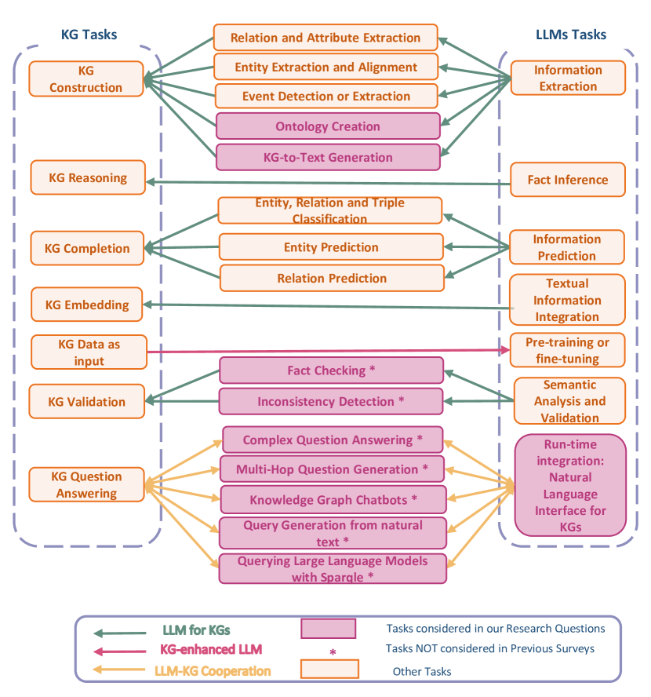
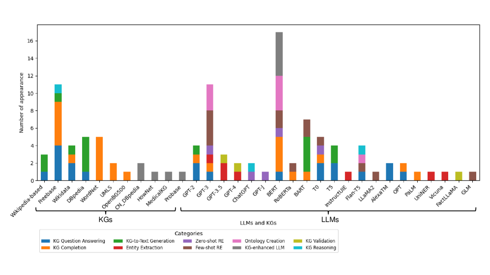

# 探索大型语言模型与知识图谱互动的研究潮流

发布时间：2024年06月12日

`LLM应用

这篇论文摘要探讨了大型语言模型（LLMs）与知识图谱（KGs）的协同效应，并分析了LLMs在生成KG的描述性文本和自然语言查询中的角色。研究通过探索KG问答、本体生成、KG验证等领域，旨在提升KG的准确性与一致性，并填补现有研究的空白。这些内容表明，论文主要关注的是LLMs在实际应用中的使用，特别是在与KGs结合以优化AI应用方面的应用，因此应归类为LLM应用。` `人工智能` `知识图谱`

> Research Trends for the Interplay between Large Language Models and Knowledge Graphs

# 摘要

> 本次调查深入探讨了大型语言模型（LLMs）与知识图谱（KGs）的协同效应，这对提升AI在理解、推理及语言处理能力方面至关重要。研究通过探索KG问答、本体生成、KG验证等领域，旨在填补现有研究的空白，并利用LLMs提升KG的准确性与一致性。此外，论文还分析了LLMs在生成KG的描述性文本和自然语言查询中的角色。通过系统地分类LLM-KG交互、审视方法论、探讨合作应用及潜在偏见，本研究力求揭示LLMs与KGs结合的新潜力。研究强调了两者互动对优化AI应用的重要性，并为未来的研究方向提供了蓝图。

> This survey investigates the synergistic relationship between Large Language Models (LLMs) and Knowledge Graphs (KGs), which is crucial for advancing AI's capabilities in understanding, reasoning, and language processing. It aims to address gaps in current research by exploring areas such as KG Question Answering, ontology generation, KG validation, and the enhancement of KG accuracy and consistency through LLMs. The paper further examines the roles of LLMs in generating descriptive texts and natural language queries for KGs. Through a structured analysis that includes categorizing LLM-KG interactions, examining methodologies, and investigating collaborative uses and potential biases, this study seeks to provide new insights into the combined potential of LLMs and KGs. It highlights the importance of their interaction for improving AI applications and outlines future research directions.

[Arxiv](https://arxiv.org/abs/2406.08223)