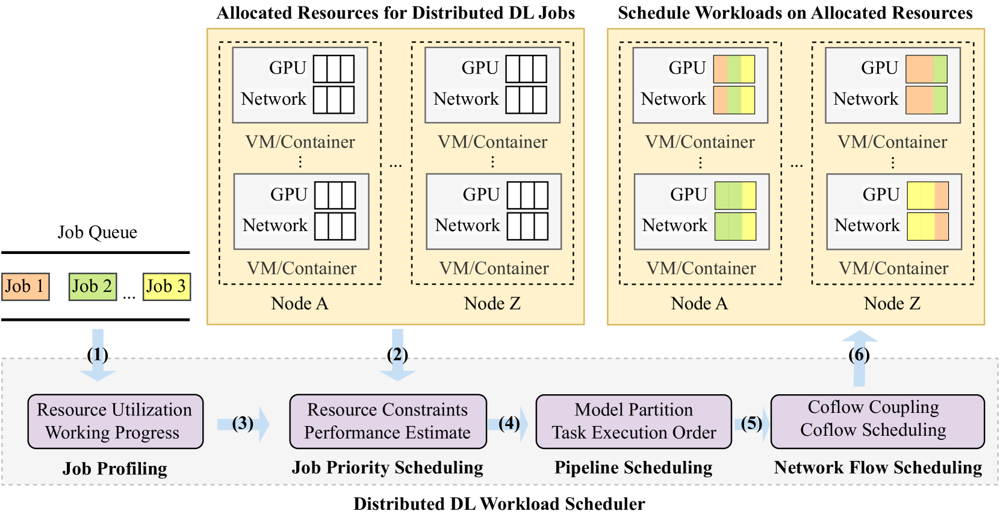

# 大规模分布式深度学习：资源分配与工作负载调度综述

发布时间：2024年06月12日

`LLM应用

这篇论文摘要主要讨论了在大规模数据中心中分布式深度学习任务的资源分配和负载调度问题。虽然涉及到大型语言模型（LLM）的训练案例，但重点在于资源管理和调度策略，而不是LLM的理论研究或Agent的行为分析。因此，这篇论文更符合LLM应用分类，因为它探讨了如何优化LLM训练过程中的资源使用和负载分配，这是LLM在实际应用中的一个重要方面。` `数据中心`

> Resource Allocation and Workload Scheduling for Large-Scale Distributed Deep Learning: A Survey

# 摘要

> 随着大规模数据中心中分布式深度学习任务的激增，如何高效分配资源和调度负载成为提升深度学习性能的关键。面对数据集、模型及计算通信资源的庞大体量，分布式深度学习在资源分配和负载调度上面临着调度复杂性、资源负载异质性及容错性等独特挑战。本综述回顾了2019至2024年间相关文献，聚焦于不同资源类型、调度粒度及性能目标，探讨了这些挑战及其解决方案，并针对每个主题的关键挑战和技术见解进行了讨论。通过一个大型语言模型训练的案例研究，我们展示了实际应用中的大规模资源分配和负载调度。本综述旨在启发计算机科学、人工智能和通信领域的研究者，深入理解最新进展，并探索未来针对大规模分布式深度学习的高效框架策略的研究方向。

> With rapidly increasing distributed deep learning workloads in large-scale data centers, efficient distributed deep learning framework strategies for resource allocation and workload scheduling have become the key to high-performance deep learning. The large-scale environment with large volumes of datasets, models, and computational and communication resources raises various unique challenges for resource allocation and workload scheduling in distributed deep learning, such as scheduling complexity, resource and workload heterogeneity, and fault tolerance. To uncover these challenges and corresponding solutions, this survey reviews the literature, mainly from 2019 to 2024, on efficient resource allocation and workload scheduling strategies for large-scale distributed DL. We explore these strategies by focusing on various resource types, scheduling granularity levels, and performance goals during distributed training and inference processes. We highlight critical challenges for each topic and discuss key insights of existing technologies. To illustrate practical large-scale resource allocation and workload scheduling in real distributed deep learning scenarios, we use a case study of training large language models. This survey aims to encourage computer science, artificial intelligence, and communications researchers to understand recent advances and explore future research directions for efficient framework strategies for large-scale distributed deep learning.

[Arxiv](https://arxiv.org/abs/2406.08115)