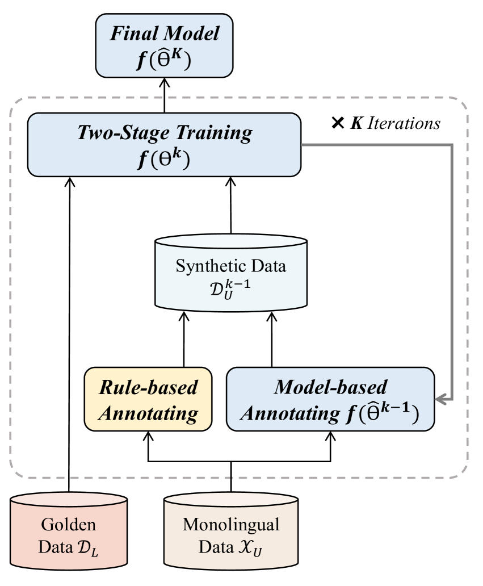
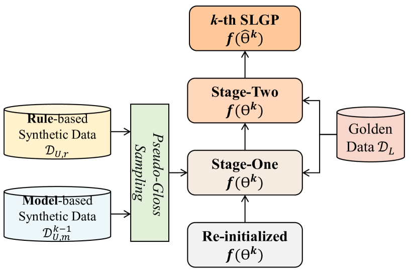

# 半监督口语语言注音技术

发布时间：2024年06月12日

`LLM应用

理由：这篇论文介绍了一个半监督的口语化语言注释框架（$S^3$LG），该框架旨在将口语文本转换为手语的书面记录。这个框架利用了大规模单语口语文本，并通过自训练机制和伪标签迭代学习来解决平行数据稀缺的问题。这个工作涉及到语言模型的应用，特别是在处理口语化语言注释的场景中，因此属于LLM应用类别。` `语言处理`

> Semi-Supervised Spoken Language Glossification

# 摘要

> 口语化语言注释（SLG）旨在将口语文本转换为手语的书面记录。我们提出的半监督口语化语言注释框架（$S^3$LG），通过整合大规模单语口语文本，有效解决了SLG中平行数据稀缺的问题。该框架采用自训练机制，通过伪标签迭代学习和标注。考虑到手语与口语在词汇和句法上的差异，$S^3$LG结合了规则启发式和模型方法进行自动标注。训练时，我们混合使用这些互补的合成数据集，并用特殊标记区分它们。为减轻合成数据中噪声的影响，$S^3$LG还引入了一致性正则化。通过在公共基准上的广泛实验，我们验证了$S^3$LG的有效性，相关代码已公开于\url{https://github.com/yaohj11/S3LG}。

> Spoken language glossification (SLG) aims to translate the spoken language text into the sign language gloss, i.e., a written record of sign language. In this work, we present a framework named $S$emi-$S$upervised $S$poken $L$anguage $G$lossification ($S^3$LG) for SLG. To tackle the bottleneck of limited parallel data in SLG, our $S^3$LG incorporates large-scale monolingual spoken language text into SLG training. The proposed framework follows the self-training structure that iteratively annotates and learns from pseudo labels. Considering the lexical similarity and syntactic difference between sign language and spoken language, our $S^3$LG adopts both the rule-based heuristic and model-based approach for auto-annotation. During training, we randomly mix these complementary synthetic datasets and mark their differences with a special token. As the synthetic data may be less quality, the $S^3$LG further leverages consistency regularization to reduce the negative impact of noise in the synthetic data. Extensive experiments are conducted on public benchmarks to demonstrate the effectiveness of the $S^3$LG. Our code is available at \url{https://github.com/yaohj11/S3LG}.

[Arxiv](https://arxiv.org/abs/2406.08173)