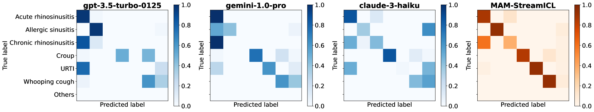

# StreamBench：探索语言代理持续优化的基准之路

发布时间：2024年06月12日

`Agent

理由：这篇论文主要关注的是大型语言模型（LLM）的自我提升能力，特别是在连续输入与反馈的环境中。它通过引入StreamBench这一基准来评估LLM的这种能力，并探讨了在线学习策略。这种研究更侧重于模型的自主学习和适应性，即Agent的特性，而不是理论研究或特定的应用场景。因此，将其归类为Agent更为合适。` `人工智能` `在线学习`

> StreamBench: Towards Benchmarking Continuous Improvement of Language Agents

# 摘要

> 最新研究表明，大型语言模型（LLM）能够通过经验自我提升，这对于部署后的持续增强至关重要。然而，现有评估主要关注其固有能力，忽略了其随时间进步的潜力。为此，我们推出了StreamBench，这一创新基准旨在评估LLM在连续输入与反馈中的自我提升能力。StreamBench模拟在线学习环境，让LLM接收持续反馈，不断优化性能。我们还提出了简单高效的改进策略，并深入分析了成功流策略的关键要素。本研究为开发LLM的在线学习策略奠定了基础，推动了流场景中更智能AI系统的发展。

> Recent works have shown that large language model (LLM) agents are able to improve themselves from experience, which is an important ability for continuous enhancement post-deployment. However, existing benchmarks primarily evaluate their innate capabilities and do not assess their ability to improve over time. To address this gap, we introduce StreamBench, a pioneering benchmark designed to evaluate the continuous improvement of LLM agents over an input-feedback sequence. StreamBench simulates an online learning environment where LLMs receive a continuous flow of feedback stream and iteratively enhance their performance. In addition, we propose several simple yet effective baselines for improving LLMs on StreamBench, and provide a comprehensive analysis to identify critical components that contribute to successful streaming strategies. Our work serves as a stepping stone towards developing effective online learning strategies for LLMs, paving the way for more adaptive AI systems in streaming scenarios.

[Arxiv](https://arxiv.org/abs/2406.08747)