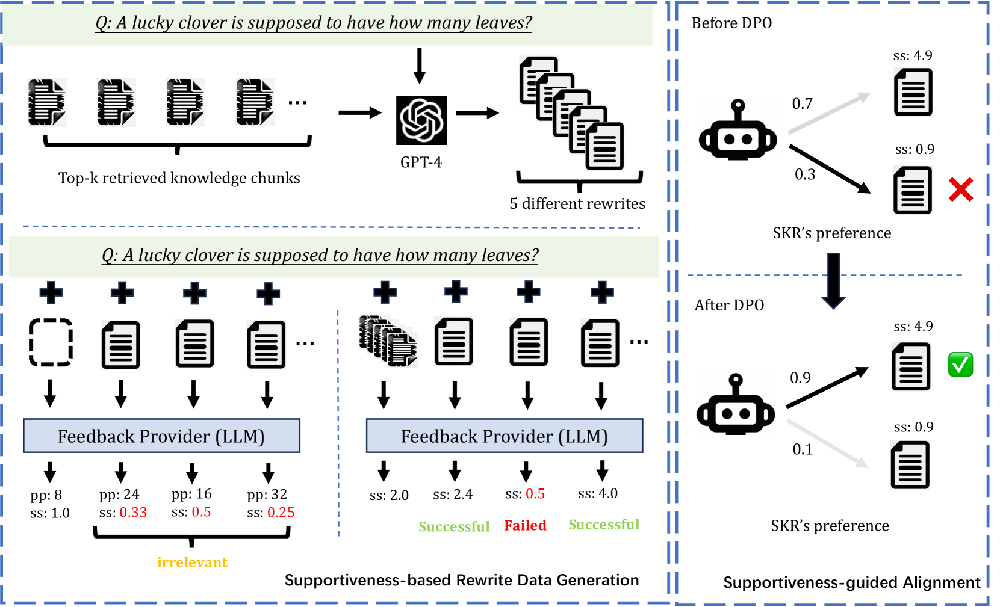
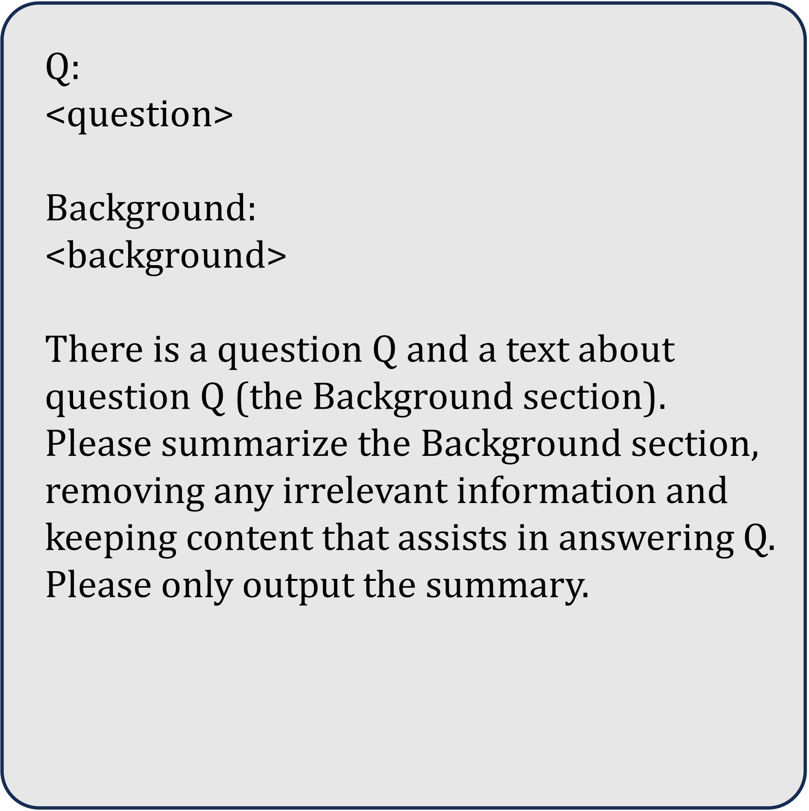
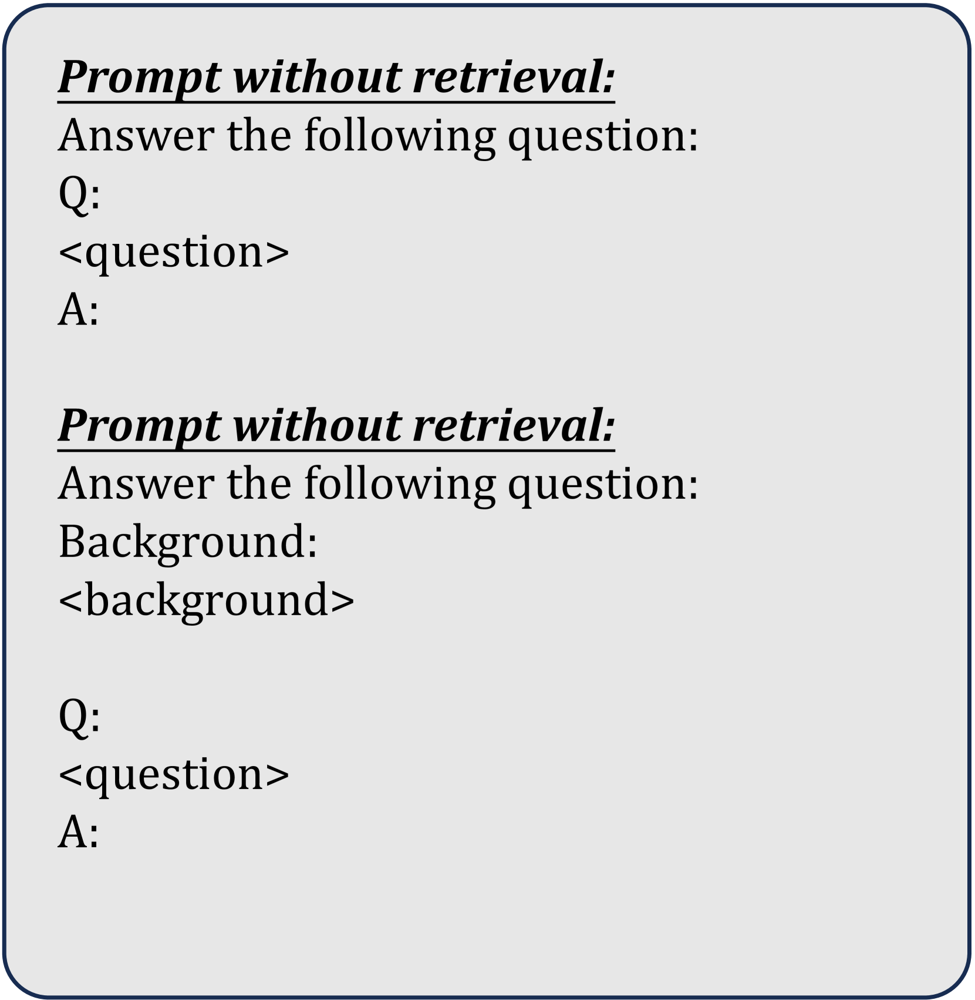
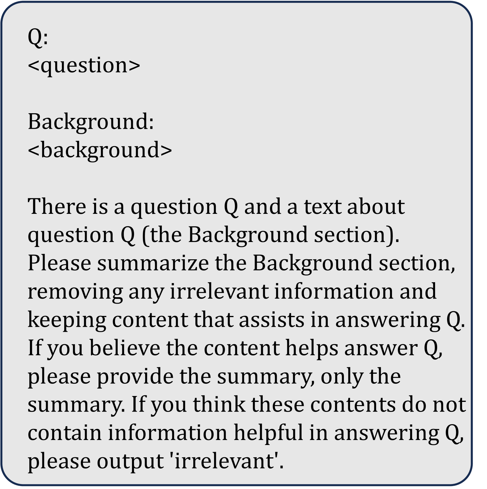

# 基于支持性的知识重写技术，用于提升检索增强型语言模型的性能

发布时间：2024年06月12日

`RAG

理由：这篇论文主要讨论了检索增强型语言模型（RALMs）的问题，并提出了一种名为“基于支持度的知识重写（SKR）”的技术，旨在优化大型语言模型（LLMs）的知识检索和重写过程。这种技术特别关注于提高检索到的知识的可靠性和对下游任务的支持度，这与RAG（Retrieval-Augmented Generation）模型的目标和功能相符，即通过增强检索机制来改善语言模型的性能。因此，这篇论文应归类于RAG。` `知识管理`

> Supportiveness-based Knowledge Rewriting for Retrieval-augmented Language Modeling

# 摘要

> 检索增强型语言模型（RALMs）近期在解决大型语言模型（LLMs）中隐含知识的局限性方面展现出巨大潜力，如对最新专业知识更新不及时和长尾知识保留不可靠。然而，外部知识库和检索器的可靠性无法保证，可能导致检索到的知识对LLM生成无益甚至误导。为此，本文提出了基于支持度的知识重写（SKR），一种专为LLM优化、稳健且可插拔的知识重写技术。我们创新性地引入了“支持度”概念，衡量知识对下游任务的促进效果，并考虑其对LLM响应文本困惑度的影响。通过精心设计的训练数据策略，我们有效筛选并剔除低支持度的不良重写，提升数据质量。同时，采用直接偏好优化（DPO）算法，确保重写内容与最佳支持度一致，优化最终响应。在六个知识密集型任务和四个LLM上的广泛测试证实了SKR的卓越性能。仅凭70亿参数，SKR在知识重写能力上超越了当前顶尖的通用LLM GPT-4。

> Retrieval-augmented language models (RALMs) have recently shown great potential in mitigating the limitations of implicit knowledge in LLMs, such as untimely updating of the latest expertise and unreliable retention of long-tail knowledge. However, since the external knowledge base, as well as the retriever, can not guarantee reliability, potentially leading to the knowledge retrieved not being helpful or even misleading for LLM generation. In this paper, we introduce Supportiveness-based Knowledge Rewriting (SKR), a robust and pluggable knowledge rewriter inherently optimized for LLM generation. Specifically, we introduce the novel concept of "supportiveness"--which represents how effectively a knowledge piece facilitates downstream tasks--by considering the perplexity impact of augmented knowledge on the response text of a white-box LLM. Based on knowledge supportiveness, we first design a training data curation strategy for our rewriter model, effectively identifying and filtering out poor or irrelevant rewrites (e.g., with low supportiveness scores) to improve data efficacy. We then introduce the direct preference optimization (DPO) algorithm to align the generated rewrites to optimal supportiveness, guiding the rewriter model to summarize augmented content that better improves the final response. Comprehensive evaluations across six popular knowledge-intensive tasks and four LLMs have demonstrated the effectiveness and superiority of SKR. With only 7B parameters, SKR has shown better knowledge rewriting capability over GPT-4, the current state-of-the-art general-purpose LLM.

[Arxiv](https://arxiv.org/abs/2406.08116)