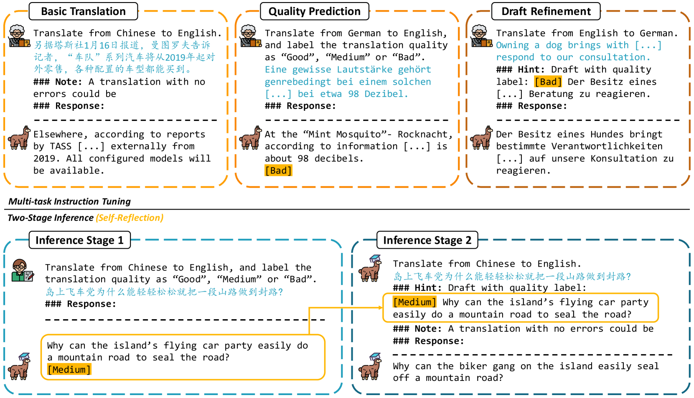
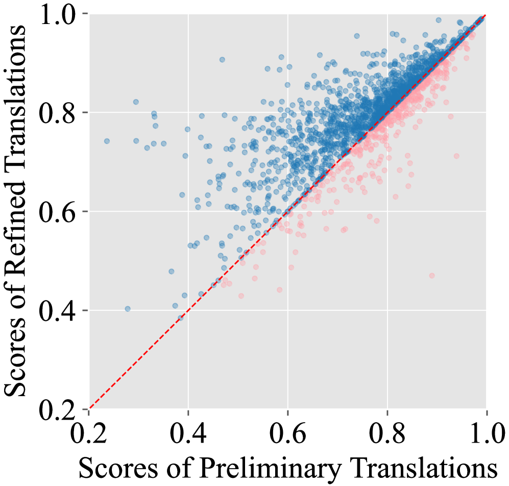
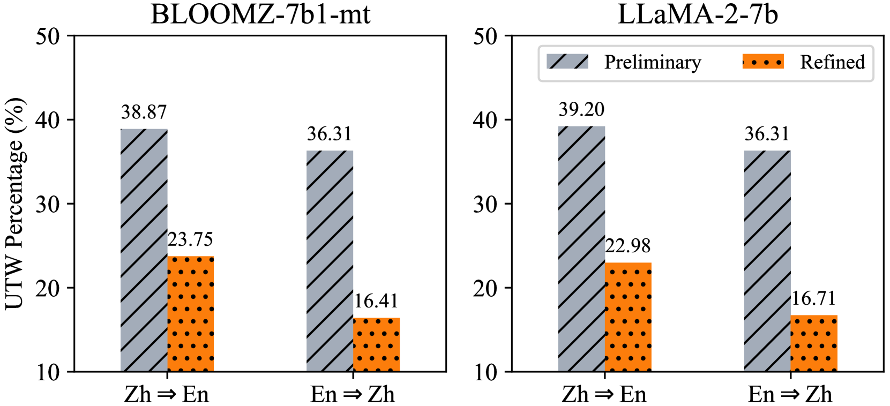
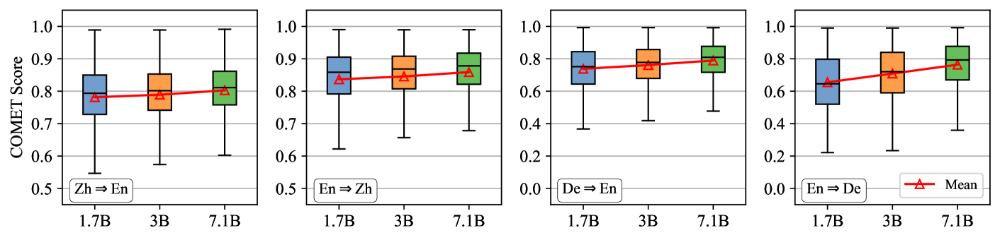

# TasTe：借助自我反思，大型语言模型翻译技艺得以精进

发布时间：2024年06月12日

`LLM应用

这篇论文摘要描述了一种新的框架（TasTe），该框架通过自我反思机制提升大型语言模型（LLMs）在机器翻译任务中的性能。这种方法特别强调了通过自我评估和精炼翻译来提高翻译质量，这在本质上是一种应用层面的创新，旨在优化LLMs在特定任务（机器翻译）中的表现。因此，这篇论文属于LLM应用分类。` `机器翻译`

> TasTe: Teaching Large Language Models to Translate through Self-Reflection

# 摘要

> 大型语言模型（LLMs）在众多自然语言处理任务中大放异彩，指令调优技术更是让其在机器翻译任务中如虎添翼。然而，现有方法的翻译质量仍难以媲美监督神经机器翻译（NMT）系统。究其原因，可能是这些方法中简单的提示未能充分激发LLMs遵循指令的潜能。为此，我们推出了TasTe框架，一种通过自我反思提升翻译质量的新途径。该框架包含两个推理阶段：首先，LLMs生成初步翻译并进行自我评估；随后，根据评估结果对翻译进行精炼。在WMT22基准测试中，我们的方法在四个语言方向上均显示出优于现有技术的成效。这一创新尝试不仅挖掘了LLMs的潜力，也为提升机器翻译能力开辟了新路径。相关代码和数据集已公开于https://github.com/YutongWang1216/ReflectionLLMMT。

> Large language models (LLMs) have exhibited remarkable performance in various natural language processing tasks. Techniques like instruction tuning have effectively enhanced the proficiency of LLMs in the downstream task of machine translation. However, the existing approaches fail to yield satisfactory translation outputs that match the quality of supervised neural machine translation (NMT) systems. One plausible explanation for this discrepancy is that the straightforward prompts employed in these methodologies are unable to fully exploit the acquired instruction-following capabilities. To this end, we propose the TasTe framework, which stands for translating through self-reflection. The self-reflection process includes two stages of inference. In the first stage, LLMs are instructed to generate preliminary translations and conduct self-assessments on these translations simultaneously. In the second stage, LLMs are tasked to refine these preliminary translations according to the evaluation results. The evaluation results in four language directions on the WMT22 benchmark reveal the effectiveness of our approach compared to existing methods. Our work presents a promising approach to unleash the potential of LLMs and enhance their capabilities in MT. The codes and datasets are open-sourced at https://github.com/YutongWang1216/ReflectionLLMMT.

[Arxiv](https://arxiv.org/abs/2406.08434)