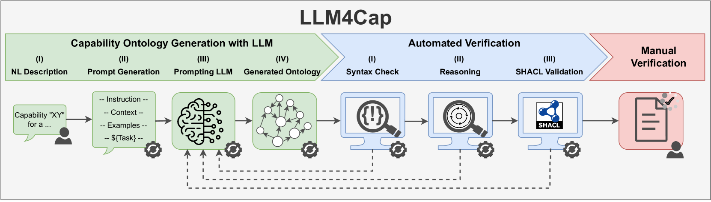

# 探索从自然语言描述中构建能力本体的方法

发布时间：2024年06月12日

`LLM应用

这篇论文介绍了一种利用大型语言模型（LLMs）自动化构建能力本体描述的方法。这种方法通过少样本提示技术和与LLM的交互循环步骤来自动验证生成的本体，从而减少了人工干预的需求。这种方法的应用性质明显，因为它专注于使用LLM来改进和自动化一个特定的任务（能力本体的构建），因此属于LLM应用分类。` `自动化` `本体论`

> Toward a Method to Generate Capability Ontologies from Natural Language Descriptions

# 摘要

> 为了打造一个灵活且适应性强的系统，我们越来越多地利用能力本体论来以机器可读的方式描述功能。然而，构建这些复杂的本体描述仍然是一项繁琐且易错的手工任务，需要深厚的本体论专业知识。本文介绍了一种创新方法，利用大型语言模型（LLMs）自动化这一过程，这些模型在此类任务中表现出色。我们的方法仅需提供能力的自然语言描述，随后通过少样本提示技术将其自动融入预设的提示中。提示LLM后，生成的能力本体将通过一系列与LLM交互的循环步骤自动验证，确保其正确性。首先进行语法检查，接着排查矛盾，最后审查是否存在幻觉或本体元素缺失。这一方法极大地减少了人工干预，仅需提供初始描述和最终的人工复审及必要的修正，从而优化了能力本体的生成流程。

> To achieve a flexible and adaptable system, capability ontologies are increasingly leveraged to describe functions in a machine-interpretable way. However, modeling such complex ontological descriptions is still a manual and error-prone task that requires a significant amount of effort and ontology expertise. This contribution presents an innovative method to automate capability ontology modeling using Large Language Models (LLMs), which have proven to be well suited for such tasks. Our approach requires only a natural language description of a capability, which is then automatically inserted into a predefined prompt using a few-shot prompting technique. After prompting an LLM, the resulting capability ontology is automatically verified through various steps in a loop with the LLM to check the overall correctness of the capability ontology. First, a syntax check is performed, then a check for contradictions, and finally a check for hallucinations and missing ontology elements. Our method greatly reduces manual effort, as only the initial natural language description and a final human review and possible correction are necessary, thereby streamlining the capability ontology generation process.

[Arxiv](https://arxiv.org/abs/2406.07962)