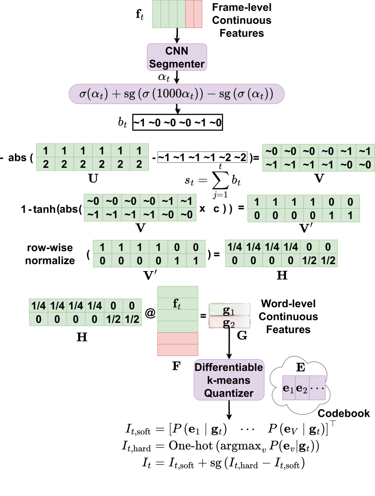

# 迈向无需发音模型的无监督语音识别

发布时间：2024年06月12日

`Agent

理由：这篇论文主要探讨了在缺乏配对语音和文本数据的情况下，如何训练自动语音识别（ASR）系统。它提出了一种新的方法，即通过摒弃对音素词典的依赖，利用无配对语音和文本语料库来开发ASR系统。这种方法涉及到了语音到语音和文本到文本的掩码令牌填充，以实现无监督的语音识别。虽然这种方法涉及到了语言模型（如掩码令牌填充可能涉及的语言模型技术），但论文的核心在于开发一个能够在特定条件下（无配对数据）工作的ASR系统，这更符合Agent的定义，即一个能够自主执行任务的系统。因此，将其归类为Agent更为合适。` `语音识别` `无监督学习`

> Towards Unsupervised Speech Recognition Without Pronunciation Models

# 摘要

> 监督自动语音识别（ASR）的最新进展得益于大型转录语音语料库的增多，取得了显著成就。然而，多数语言因缺乏足够的配对语音和文本数据，难以有效训练ASR系统。本文提出了一种新方法，通过摒弃对音素词典的依赖，开发无配对语音和文本语料库的ASR系统。我们探索了单词级无监督ASR的新方向，利用仅含高频英语单词的精选语音语料库，实现了近20%的单词错误率，无需平行转录或预知单词边界。实验还表明，通过联合语音到语音和文本到文本的掩码令牌填充，可以产生无监督的语音识别器，其性能超越了以往依赖直接分布匹配训练的无监督ASR模型。

> Recent advancements in supervised automatic speech recognition (ASR) have achieved remarkable performance, largely due to the growing availability of large transcribed speech corpora. However, most languages lack sufficient paired speech and text data to effectively train these systems. In this article, we tackle the challenge of developing ASR systems without paired speech and text corpora by proposing the removal of reliance on a phoneme lexicon. We explore a new research direction: word-level unsupervised ASR. Using a curated speech corpus containing only high-frequency English words, our system achieves a word error rate of nearly 20% without parallel transcripts or oracle word boundaries. Furthermore, we experimentally demonstrate that an unsupervised speech recognizer can emerge from joint speech-to-speech and text-to-text masked token-infilling. This innovative model surpasses the performance of previous unsupervised ASR models trained with direct distribution matching.

[Arxiv](https://arxiv.org/abs/2406.08380)