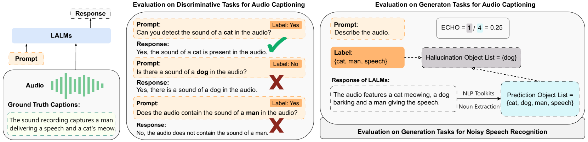

# 听声辨物却失问：大型音频-语言模型中物体幻觉的挑战

发布时间：2024年06月12日

`LLM应用

这篇论文主要探讨了大型音频语言模型（LALMs）在处理音频任务时的可靠性问题，特别是物体幻觉问题。研究通过评估LALMs在理解音频内容和回答区分性问题上的表现，揭示了其在区分性查询理解上的不足，并探索了通过提示工程优化这些模型表现的可能性。这属于对LLM（大型语言模型）在特定应用场景下的性能和优化研究，因此归类为LLM应用。` `音频处理`

> Understanding Sounds, Missing the Questions: The Challenge of Object Hallucination in Large Audio-Language Models

# 摘要

> 大型音频语言模型（LALMs）通过融合音频感知能力，扩展了传统语言模型的应用范围，使其能应对音频任务。尽管先前研究多关注LALMs在多任务中的表现，却鲜少探讨其可靠性，尤其是物体幻觉问题。本研究创新性地评估了公开LALMs的物体幻觉程度，发现它们在理解音频内容上与专业模型不相上下，但在回答需辨别特定声音的区分性问题时显得力不从心。这揭示了LALMs的一大短板：对区分性查询的理解不足。为此，我们进一步探索了通过提示工程优化LALMs在区分性问题上的表现的可能性。

> Large audio-language models (LALMs) enhance traditional large language models by integrating audio perception capabilities, allowing them to tackle audio-related tasks. Previous research has primarily focused on assessing the performance of LALMs across various tasks, yet overlooking their reliability, particularly concerning issues like object hallucination. In our study, we introduce methods to assess the extent of object hallucination of publicly available LALMs. Our findings reveal that LALMs are comparable to specialized audio captioning models in their understanding of audio content, but struggle to answer discriminative questions, specifically those requiring the identification of the presence of particular object sounds within an audio clip. This limitation highlights a critical weakness in current LALMs: their inadequate understanding of discriminative queries. Moreover, we explore the potential of prompt engineering to enhance LALMs' performance on discriminative questions.

[Arxiv](https://arxiv.org/abs/2406.08402)