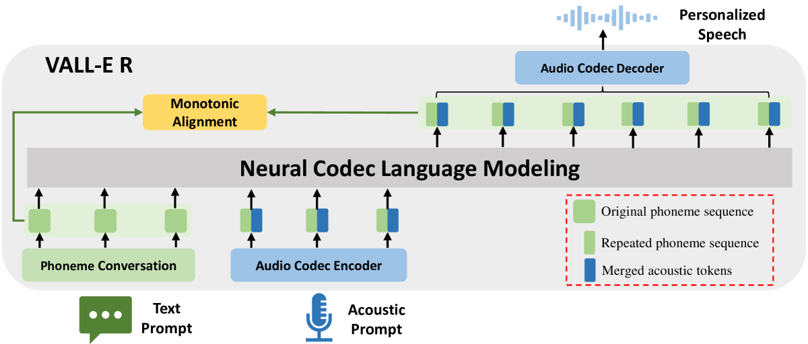
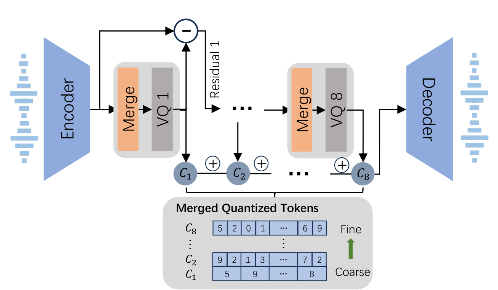
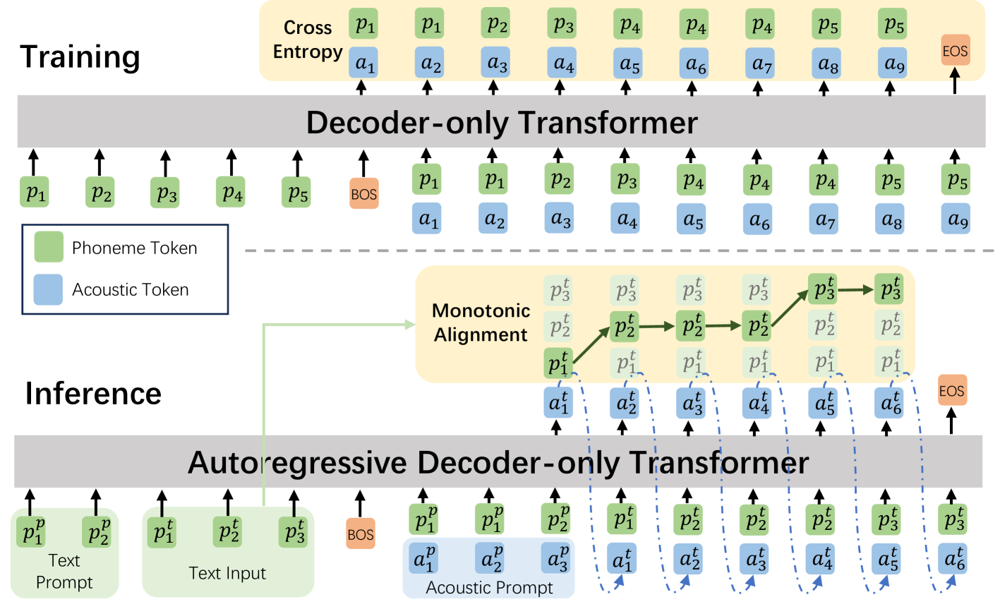
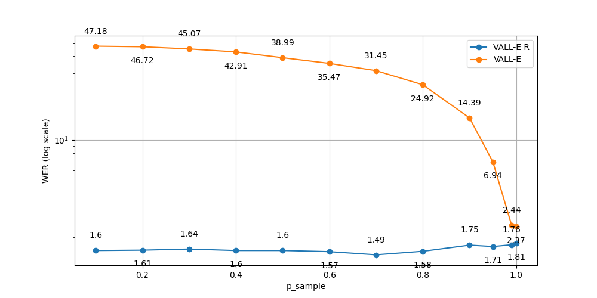
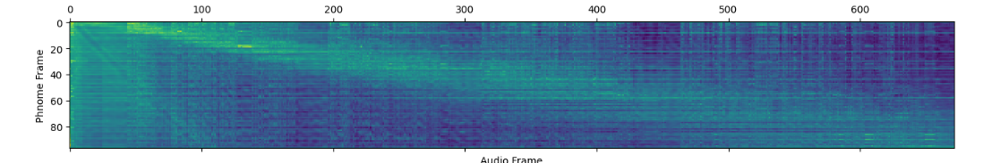
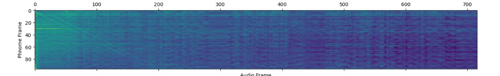
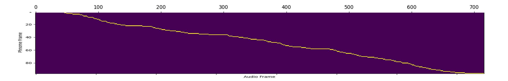

# VALL-E R：借助单调对齐，实现零-shot文本到语音合成的稳健与高效

发布时间：2024年06月12日

`LLM应用

这篇论文主要讨论了基于大型语言模型（LLM）的零-shot文本转语音（TTS）合成系统VALL-E R的开发和优化。论文中提到的技术包括音素单调对齐策略和编解码器合并技术，这些技术的应用旨在提高TTS系统的鲁棒性和效率。这些内容直接关联到LLM的具体应用，即在语音合成领域的应用，因此将其归类为LLM应用。` `语音合成` `医疗辅助`

> VALL-E R: Robust and Efficient Zero-Shot Text-to-Speech Synthesis via Monotonic Alignment

# 摘要

> 利用离散神经音频编解码器，大型语言模型（LLM）正逐渐成为零-shot文本转语音（TTS）合成的有力工具。尽管基于采样的解码策略为语音生成带来了丰富多样性，但也引发了如拼写错误、遗漏和重复等稳定性问题。同时，高音频采样率也大幅增加了自回归推理的计算负担。为此，我们开发了VALL-E R，一个基于VALL-E的鲁棒且高效的零-shot TTS系统。我们特别引入了音素单调对齐策略，强化音素与声学序列的关联，确保声学令牌与其对应音素精准匹配。此外，通过编解码器合并技术，我们在浅层量化层降低离散代码采样率，既加快了解码速度，又保持了语音质量。得益于这些创新，VALL-E R不仅实现了对音素的精细控制，还通过接近真实语音的词错误率（WER）展现了其卓越的鲁棒性，同时推理过程中的自回归步骤减少了60%以上。这项研究的应用潜力巨大，包括为失语症患者提供语音生成服务。音频样本可在此链接获取：https://aka.ms/valler。

> With the help of discrete neural audio codecs, large language models (LLM) have increasingly been recognized as a promising methodology for zero-shot Text-to-Speech (TTS) synthesis. However, sampling based decoding strategies bring astonishing diversity to generation, but also pose robustness issues such as typos, omissions and repetition. In addition, the high sampling rate of audio also brings huge computational overhead to the inference process of autoregression. To address these issues, we propose VALL-E R, a robust and efficient zero-shot TTS system, building upon the foundation of VALL-E. Specifically, we introduce a phoneme monotonic alignment strategy to strengthen the connection between phonemes and acoustic sequence, ensuring a more precise alignment by constraining the acoustic tokens to match their associated phonemes. Furthermore, we employ a codec-merging approach to downsample the discrete codes in shallow quantization layer, thereby accelerating the decoding speed while preserving the high quality of speech output. Benefiting from these strategies, VALL-E R obtains controllablity over phonemes and demonstrates its strong robustness by approaching the WER of ground truth. In addition, it requires fewer autoregressive steps, with over 60% time reduction during inference. This research has the potential to be applied to meaningful projects, including the creation of speech for those affected by aphasia. Audio samples will be available at: https://aka.ms/valler.

[Arxiv](https://arxiv.org/abs/2406.07855)