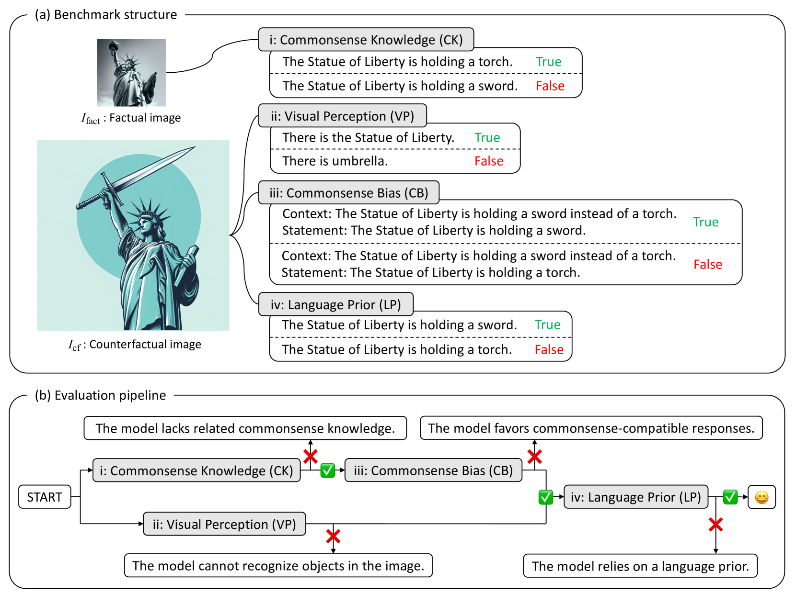

# VLind-Bench：探索大型视觉-语言模型中的语言先验

发布时间：2024年06月12日

`LLM应用

这篇论文关注的是大型视觉-语言模型（LVLMs）中的“语言优先”问题，并提出了一个名为VLind-Bench的基准来测量这一问题。虽然这个问题涉及到模型的理论和应用，但论文的主要贡献在于开发了一个用于评估和测量LVLMs性能的工具，这更偏向于应用层面。因此，将其归类为LLM应用是合适的。` `多模态学习` `模型评估`

> VLind-Bench: Measuring Language Priors in Large Vision-Language Models

# 摘要

> 大型视觉-语言模型（LVLMs）在多模态任务中表现出色，但面临一个名为“语言优先”的问题，即过度依赖文本模式而忽略图像信息，这可能导致处理非训练图像时的偏见或幻觉。尽管重要，目前对LVLMs中语言优先的准确测量方法研究不足。为此，我们推出了VLind-Bench，首个专为测量LVLMs的语言优先或盲点设计的基准。它通过反事实图像测试和一系列基本能力测试（如常识、视觉感知和偏见）来评估模型，确保在评估语言优先前通过所有基本测试，以减少其他因素的干扰。我们的评估显示，几乎所有LVLMs都显著依赖语言优先，这为领域带来了挑战。

> Large Vision-Language Models (LVLMs) have demonstrated outstanding performance across various multimodal tasks. However, they suffer from a problem known as language prior, where responses are generated based solely on textual patterns while disregarding image information. Addressing the issue of language prior is crucial, as it can lead to undesirable biases or hallucinations when dealing with images that are out of training distribution. Despite its importance, current methods for accurately measuring language priors in LVLMs are poorly studied. Although existing benchmarks based on counterfactual or out-of-distribution images can partially be used to measure language priors, they fail to disentangle language priors from other confounding factors. To this end, we propose a new benchmark called VLind-Bench, which is the first benchmark specifically designed to measure the language priors, or blindness, of LVLMs. It not only includes tests on counterfactual images to assess language priors but also involves a series of tests to evaluate more basic capabilities such as commonsense knowledge, visual perception, and commonsense biases. For each instance in our benchmark, we ensure that all these basic tests are passed before evaluating the language priors, thereby minimizing the influence of other factors on the assessment. The evaluation and analysis of recent LVLMs in our benchmark reveal that almost all models exhibit a significant reliance on language priors, presenting a strong challenge in the field.

[Arxiv](https://arxiv.org/abs/2406.08702)