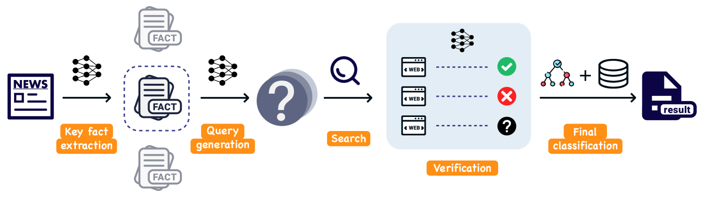

# VeraCT扫描：借助合理推理，增强检索能力以识别假新闻

发布时间：2024年06月12日

`RAG

理由：这篇论文介绍了一种创新的检索增强系统VeraCT Scan，用于假新闻检测。该系统通过提取新闻核心事实，全网搜索相关报道，并利用来源可信度进行验证，这些都是检索增强生成（RAG）技术的典型应用。此外，论文中提到的GPT-4 Turbo和Llama-2 13B的微调，也是为了提升系统在新闻内容理解、信息验证和推理能力，这些都是RAG框架下的关键技术。因此，这篇论文最适合归类为RAG。` `假新闻检测` `信息验证`

> VeraCT Scan: Retrieval-Augmented Fake News Detection with Justifiable Reasoning

# 摘要

> 假新闻的泛滥不仅散播误导信息，更侵蚀了民主的根基。生成式人工智能的进步将这一挑战推向了新的高度，使得真假新闻更难辨别。为此，我们开发了VeraCT Scan，一种创新的检索增强系统，专门用于假新闻检测。它通过提取新闻核心事实，全网搜索相关报道，并利用来源可信度进行验证。我们不仅确保新闻真实性，还提供透明证据和推理，增强结果的可信度和可解释性。此外，GPT-4 Turbo和Llama-2 13B均经过微调，以提升新闻内容理解、信息验证和推理能力，两者均在假新闻检测领域达到了顶尖的准确性。

> The proliferation of fake news poses a significant threat not only by disseminating misleading information but also by undermining the very foundations of democracy. The recent advance of generative artificial intelligence has further exacerbated the challenge of distinguishing genuine news from fabricated stories. In response to this challenge, we introduce VeraCT Scan, a novel retrieval-augmented system for fake news detection. This system operates by extracting the core facts from a given piece of news and subsequently conducting an internet-wide search to identify corroborating or conflicting reports. Then sources' credibility is leveraged for information verification. Besides determining the veracity of news, we also provide transparent evidence and reasoning to support its conclusions, resulting in the interpretability and trust in the results. In addition to GPT-4 Turbo, Llama-2 13B is also fine-tuned for news content understanding, information verification, and reasoning. Both implementations have demonstrated state-of-the-art accuracy in the realm of fake news detection.

[Arxiv](https://arxiv.org/abs/2406.10289)