# VisionLLM v2：全能型多模态大型语言模型，一站式解决数百种视觉与语言任务

发布时间：2024年06月12日

`LLM应用

这篇论文介绍了VisionLLM v2，一个端到端的多模态大型模型，它集成了视觉感知、理解和生成的能力，并能够处理多种视觉和视觉语言任务。论文中提到的“超级链接”机制和端到端联合训练方法，以及其在多个任务上的应用和性能，都表明这是一个关于大型语言模型（LLM）在多模态应用中的具体实现和优化。因此，这篇论文应归类于LLM应用。` `计算机视觉` `多模态学习`

> VisionLLM v2: An End-to-End Generalist Multimodal Large Language Model for Hundreds of Vision-Language Tasks

# 摘要

> 我们推出了VisionLLM v2，这一端到端的多模态大型模型，集视觉感知、理解和生成于一体。与传统模型不同，VisionLLM v2的应用领域大为拓展，不仅在视觉问答（VQA）等传统任务中表现卓越，还能应对开放式、跨领域的视觉挑战，如物体定位、姿态估计及图像的生成与编辑。为此，我们创新性地引入了“超级链接”机制，作为连接模型与任务特定解码器的桥梁，既保障了任务信息与梯度反馈的灵活传递，又巧妙解决了多任务训练中的冲突。为支撑广泛的任务需求，我们精心搜集并梳理了数百项公开视觉及视觉语言任务的数据。如此一来，VisionLLM v2能通过一组共享参数，在不同用户提示下，对众多视觉语言任务进行端到端联合训练，并取得与特定任务模型相匹敌的性能。我们期待VisionLLM v2能为多模态大型模型的泛化能力开启新视界。

> We present VisionLLM v2, an end-to-end generalist multimodal large model (MLLM) that unifies visual perception, understanding, and generation within a single framework. Unlike traditional MLLMs limited to text output, VisionLLM v2 significantly broadens its application scope. It excels not only in conventional visual question answering (VQA) but also in open-ended, cross-domain vision tasks such as object localization, pose estimation, and image generation and editing. To this end, we propose a new information transmission mechanism termed "super link", as a medium to connect MLLM with task-specific decoders. It not only allows flexible transmission of task information and gradient feedback between the MLLM and multiple downstream decoders but also effectively resolves training conflicts in multi-tasking scenarios. In addition, to support the diverse range of tasks, we carefully collected and combed training data from hundreds of public vision and vision-language tasks. In this way, our model can be joint-trained end-to-end on hundreds of vision language tasks and generalize to these tasks using a set of shared parameters through different user prompts, achieving performance comparable to task-specific models. We believe VisionLLM v2 will offer a new perspective on the generalization of MLLMs.

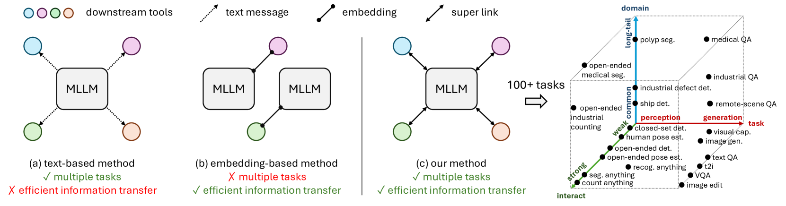

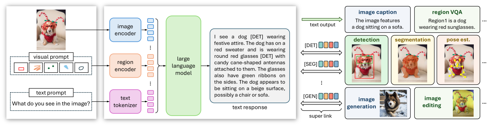

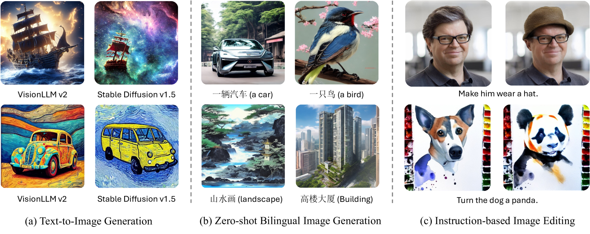

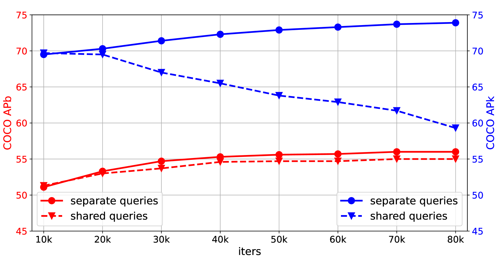

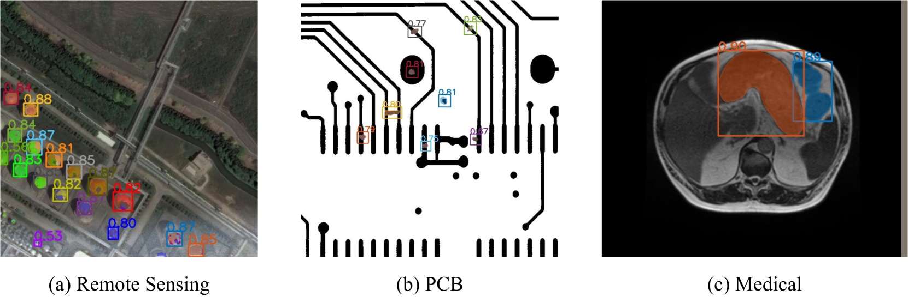

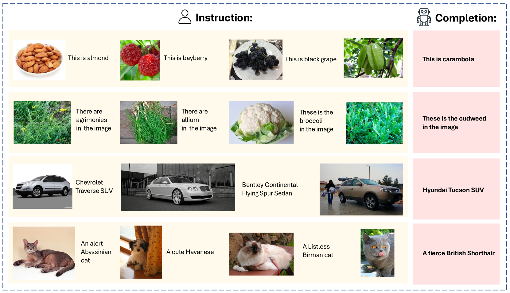

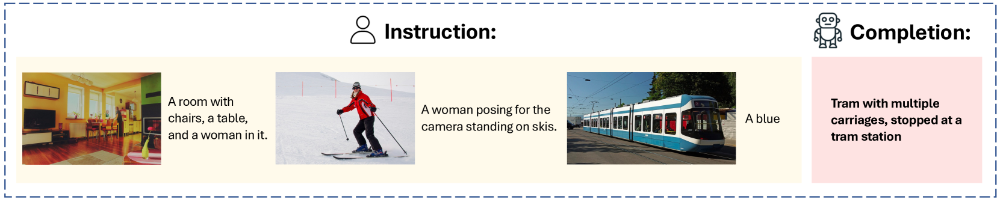

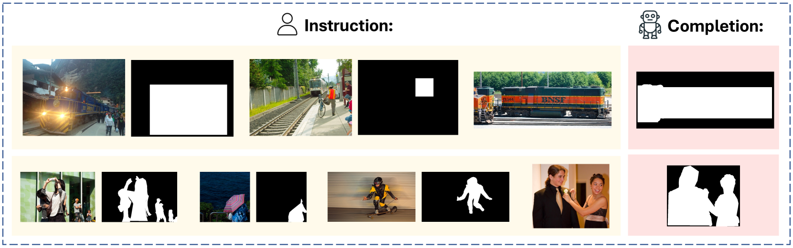

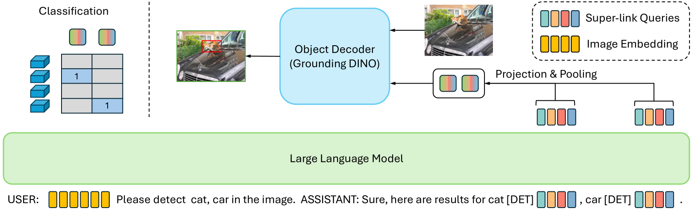

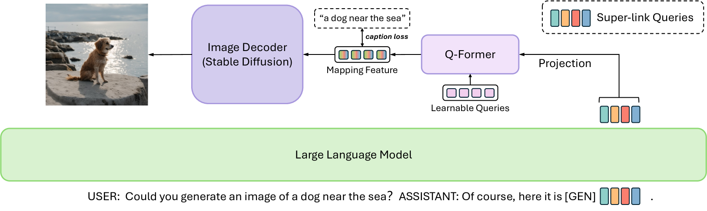

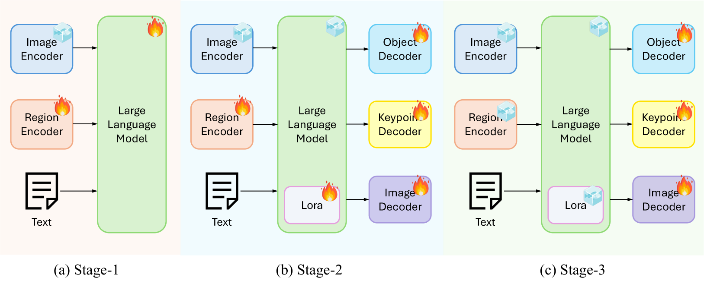

[Arxiv](https://arxiv.org/abs/2406.08394)