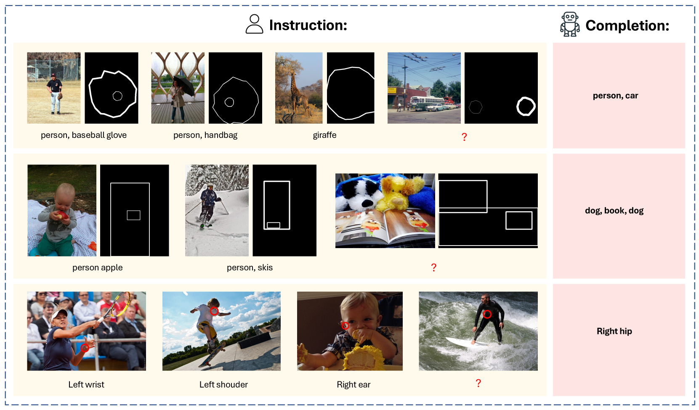

# VisionLLM v2：全能型多模态大型语言模型，一站式解决数百种视觉与语言任务

发布时间：2024年06月12日

`LLM应用

这篇论文介绍了VisionLLM v2，一个端到端的多模态大型模型，它结合了视觉感知、理解和生成能力。该模型不仅在传统的视觉问答任务中表现出色，还能处理更广泛的开放式和跨领域的视觉挑战。论文中提到的“超级链接”机制是连接多模态大型语言模型（MLLM）与特定任务解码器的关键，它允许灵活地传递任务信息和梯度反馈，解决了多任务训练中的冲突。此外，论文还强调了从大量公开的视觉及视觉语言任务中筛选和整合训练数据的重要性，以支持模型在多种任务上的端到端联合训练。这些特性使得VisionLLM v2能够在不同用户提示下推广至各类任务，性能接近特定任务模型。因此，这篇论文属于LLM应用类别，因为它专注于开发和应用大型语言模型来解决实际的多模态任务。` `计算机视觉` `人工智能`

> VisionLLM v2: An End-to-End Generalist Multimodal Large Language Model for Hundreds of Vision-Language Tasks

# 摘要

> 我们推出了VisionLLM v2，这一端到端的多模态大型模型，集视觉感知、理解和生成于一身。与传统仅输出文本的MLLMs不同，VisionLLM v2的应用领域大为拓宽，不仅在常规视觉问答中表现卓越，还能应对开放式、跨领域的视觉挑战，如物体定位、姿态估计及图像的生成与编辑。为此，我们创新性地提出了“超级链接”这一信息传递机制，作为连接MLLM与特定任务解码器的桥梁。它不仅实现了MLLM与多个下游解码器间任务信息与梯度反馈的灵活传递，还巧妙解决了多任务训练中的冲突。此外，为支撑广泛的任务需求，我们从数百个公开的视觉及视觉语言任务中精心筛选并整合了训练数据。如此一来，我们的模型得以在众多视觉语言任务上进行端到端联合训练，并通过一组共享参数，在不同用户提示下推广至各类任务，性能媲美特定任务模型。我们坚信，VisionLLM v2将为MLLMs的泛化能力开启新视界。

> We present VisionLLM v2, an end-to-end generalist multimodal large model (MLLM) that unifies visual perception, understanding, and generation within a single framework. Unlike traditional MLLMs limited to text output, VisionLLM v2 significantly broadens its application scope. It excels not only in conventional visual question answering (VQA) but also in open-ended, cross-domain vision tasks such as object localization, pose estimation, and image generation and editing. To this end, we propose a new information transmission mechanism termed "super link", as a medium to connect MLLM with task-specific decoders. It not only allows flexible transmission of task information and gradient feedback between the MLLM and multiple downstream decoders but also effectively resolves training conflicts in multi-tasking scenarios. In addition, to support the diverse range of tasks, we carefully collected and combed training data from hundreds of public vision and vision-language tasks. In this way, our model can be joint-trained end-to-end on hundreds of vision language tasks and generalize to these tasks using a set of shared parameters through different user prompts, achieving performance comparable to task-specific models. We believe VisionLLM v2 will offer a new perspective on the generalization of MLLMs.

[Arxiv](https://arxiv.org/abs/2406.08394)