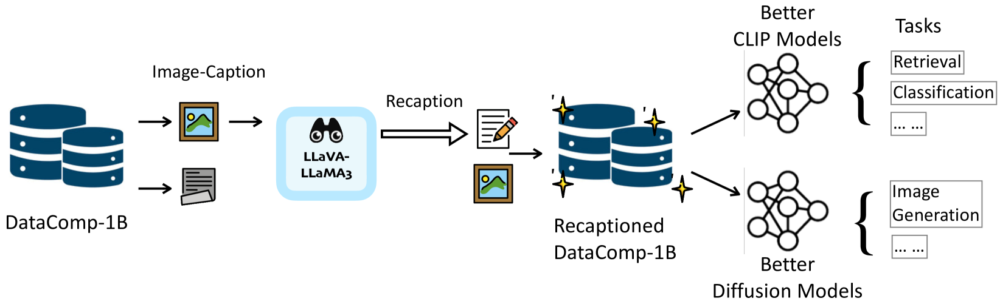

# 设想一下，如果我们利用LLaMA-3技术，为互联网上的数十亿张图片重新赋予标题，将会是怎样的场景？

发布时间：2024年06月12日

`LLM应用

这篇论文主要探讨了如何利用大型语言模型LLaMA-3来改进图像与文本配对的数据集，并通过微调模型来增强数据集的质量，从而提升视觉-语言模型的训练效果。这种方法涉及到LLM的具体应用，即在视觉和语言任务中使用LLM来改善数据集和模型的性能，因此属于LLM应用分类。` `图像处理` `数据增强`

> What If We Recaption Billions of Web Images with LLaMA-3?

# 摘要

> 网络爬取的图像与文本配对往往杂乱无章。以往的研究显示，通过语义对齐和丰富这些配对的文本描述，能显著提升模型在多种视觉与语言任务中的训练效果，尤其是在文本生成图像方面。尽管如此，该领域的大规模研究仍多保持闭源状态。我们的论文旨在弥合这一差距，利用开源的强大LLaMA-3（GPT-4级别的大型语言模型）。我们的重标注流程简洁明了：首先，我们微调由LLaMA-3-8B驱动的LLaVA-1.5，随后用它为DataComp-1B数据集中的13亿张图像重新标注。实证结果表明，增强后的数据集Recap-DataComp-1B在训练高级视觉-语言模型时效果显著。对于如CLIP这样的判别模型，跨模态检索任务中的零-shot性能有所提升。而对于文本到图像扩散变换器这类生成模型，生成的图像在遵循用户复杂文本指令时，与文本的对齐度有了显著提高。项目详情请访问：https://www.haqtu.me/Recap-Datacomp-1B/

> Web-crawled image-text pairs are inherently noisy. Prior studies demonstrate that semantically aligning and enriching textual descriptions of these pairs can significantly enhance model training across various vision-language tasks, particularly text-to-image generation. However, large-scale investigations in this area remain predominantly closed-source. Our paper aims to bridge this community effort, leveraging the powerful and \textit{open-sourced} LLaMA-3, a GPT-4 level LLM. Our recaptioning pipeline is simple: first, we fine-tune a LLaMA-3-8B powered LLaVA-1.5 and then employ it to recaption 1.3 billion images from the DataComp-1B dataset. Our empirical results confirm that this enhanced dataset, Recap-DataComp-1B, offers substantial benefits in training advanced vision-language models. For discriminative models like CLIP, we observe enhanced zero-shot performance in cross-modal retrieval tasks. For generative models like text-to-image Diffusion Transformers, the generated images exhibit a significant improvement in alignment with users' text instructions, especially in following complex queries. Our project page is https://www.haqtu.me/Recap-Datacomp-1B/

[Arxiv](https://arxiv.org/abs/2406.08478)