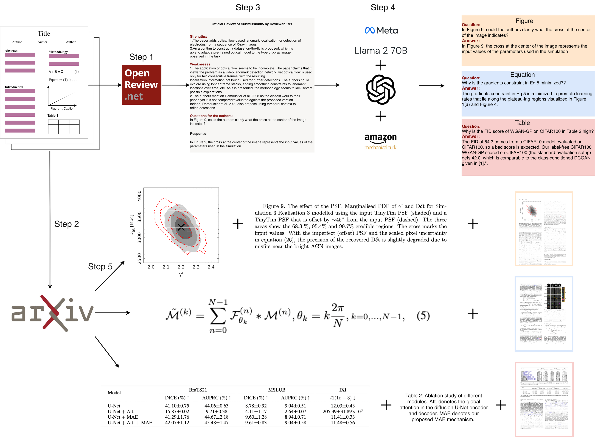

# cPAPERS：科学论文中情境化与多模态交互对话的数据集宝库

发布时间：2024年06月12日

`Agent

理由：这篇论文主要关注的是在SIMMC领域中，如何通过定制的方法来处理科学论文中的不同组件，以满足科研人员的需求。它推出了cPAPERS数据集，并设计了策略来获取问答对，并提出了一系列基于LLMs的方法来处理这个数据集。这些方法包括零-shot和微调方法，旨在为该领域设定基准。这些活动更接近于创建和优化一个Agent，该Agent能够理解和处理科学论文中的复杂内容，而不是专注于LLM的理论研究或应用，也不是RAG（检索增强生成）的具体应用。因此，将其分类为Agent是合适的。` `科学研究` `问答系统`

> cPAPERS: A Dataset of Situated and Multimodal Interactive Conversations in Scientific Papers

# 摘要

> 在SIMMC领域，科学论文的交互成为一个新兴研究方向。科学论文包含文本、公式、图表和表格，因此需要针对每个组件定制SIMMC方法，以满足科研人员深入探究的需求。本研究推出了cPAPERS数据集，该数据集收集了基于arXiv科学文档中论文组件及相关参考文献的学术论文评论中的对话式问答对。我们设计了一种策略，从OpenReview获取这些问答对，并结合LaTeX源文件的上下文信息。同时，我们提出了一系列基于LLMs的零-shot和微调方法，用于处理cPAPERS数据集，为该领域设定了基准。

> An emerging area of research in situated and multimodal interactive conversations (SIMMC) includes interactions in scientific papers. Since scientific papers are primarily composed of text, equations, figures, and tables, SIMMC methods must be developed specifically for each component to support the depth of inquiry and interactions required by research scientists. This work introduces Conversational Papers (cPAPERS), a dataset of conversational question-answer pairs from reviews of academic papers grounded in these paper components and their associated references from scientific documents available on arXiv. We present a data collection strategy to collect these question-answer pairs from OpenReview and associate them with contextual information from LaTeX source files. Additionally, we present a series of baseline approaches utilizing Large Language Models (LLMs) in both zero-shot and fine-tuned configurations to address the cPAPERS dataset.

[Arxiv](https://arxiv.org/abs/2406.08398)