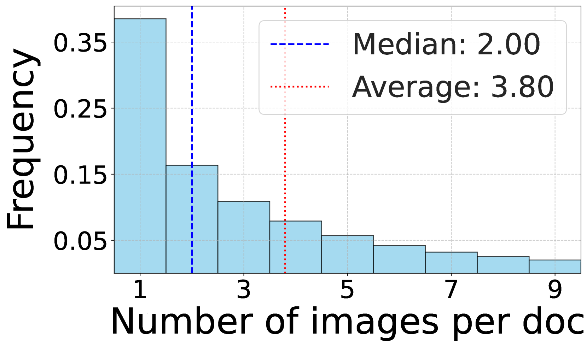
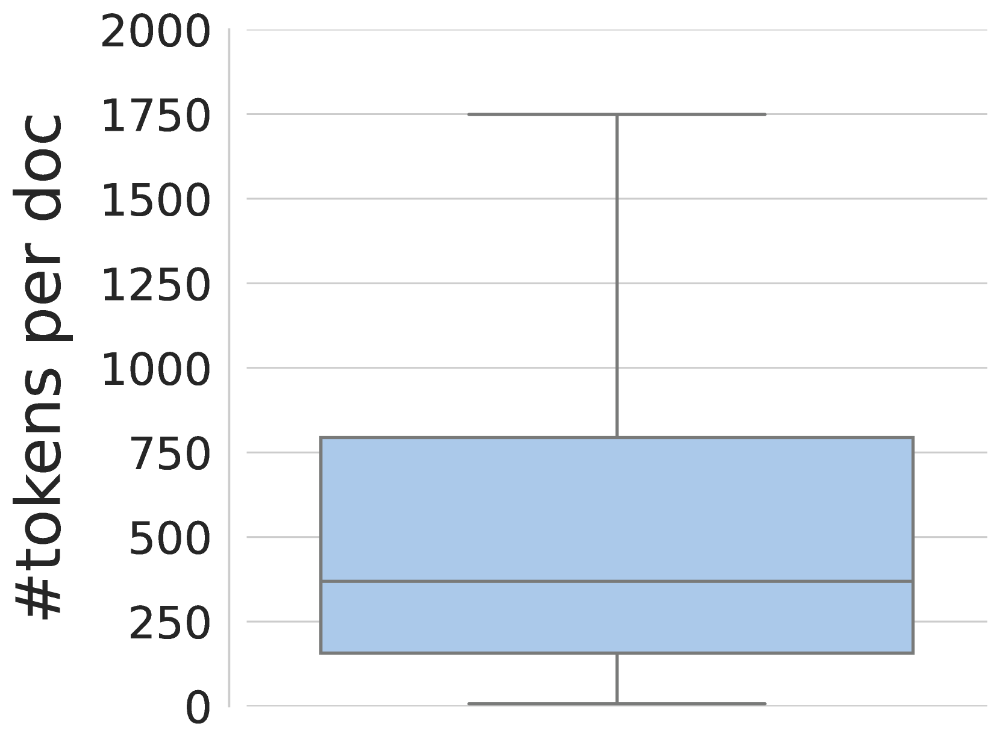
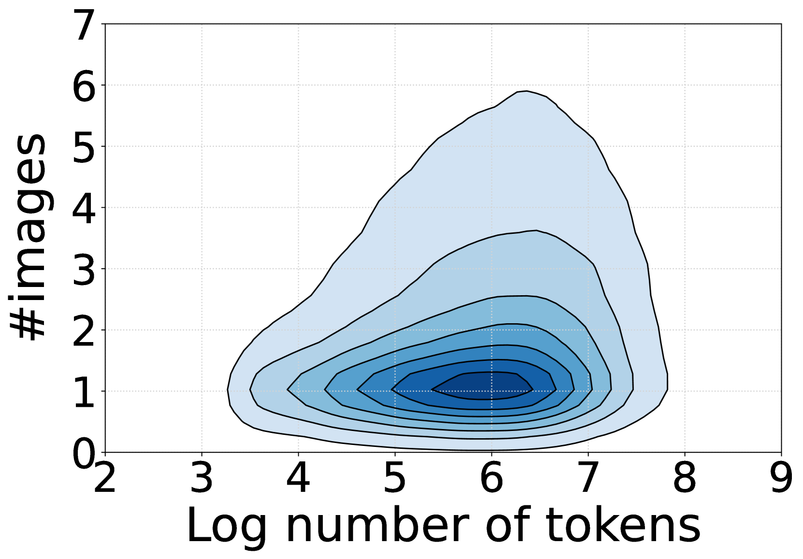
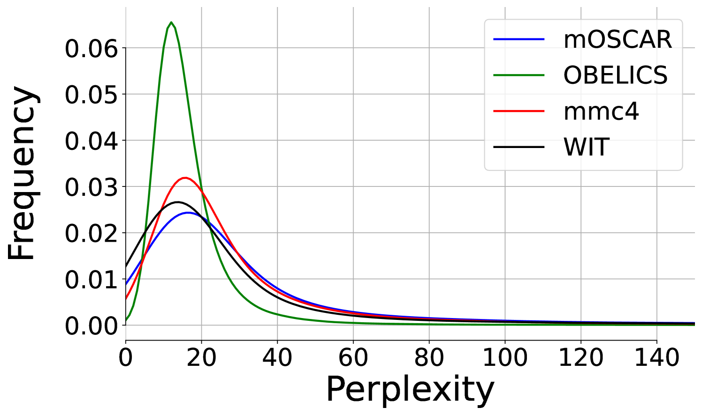
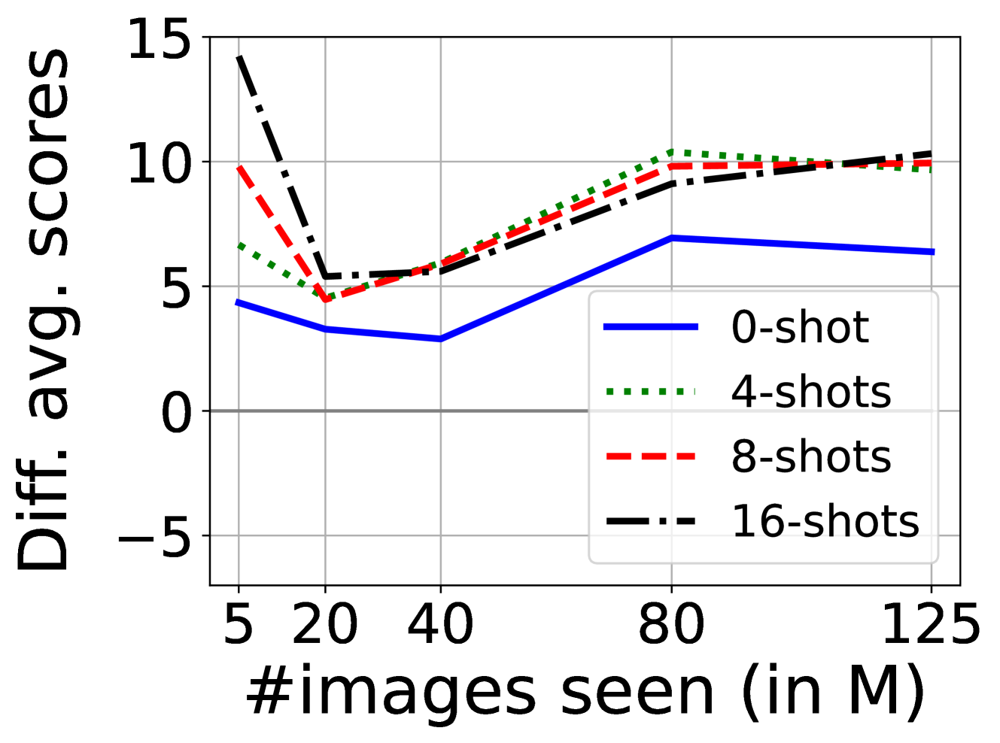
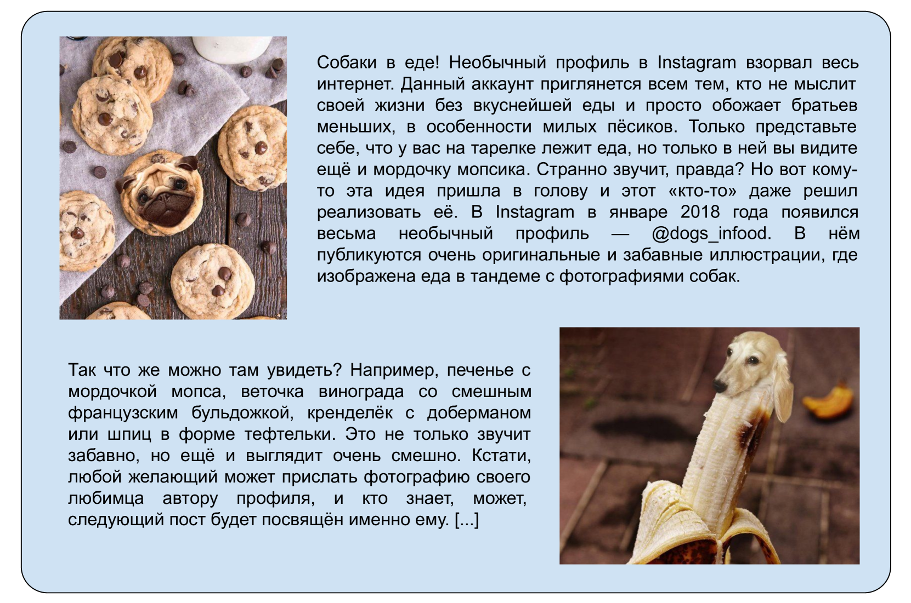
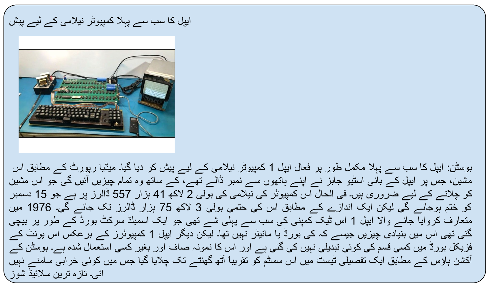
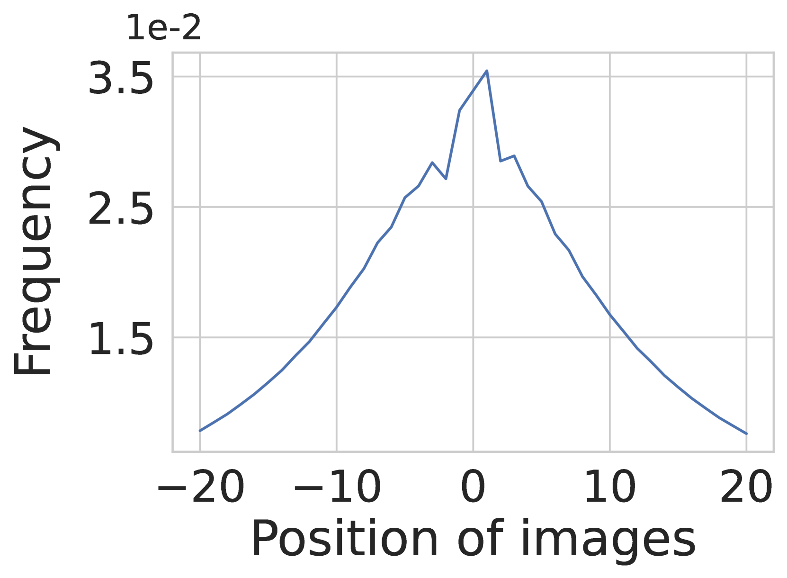
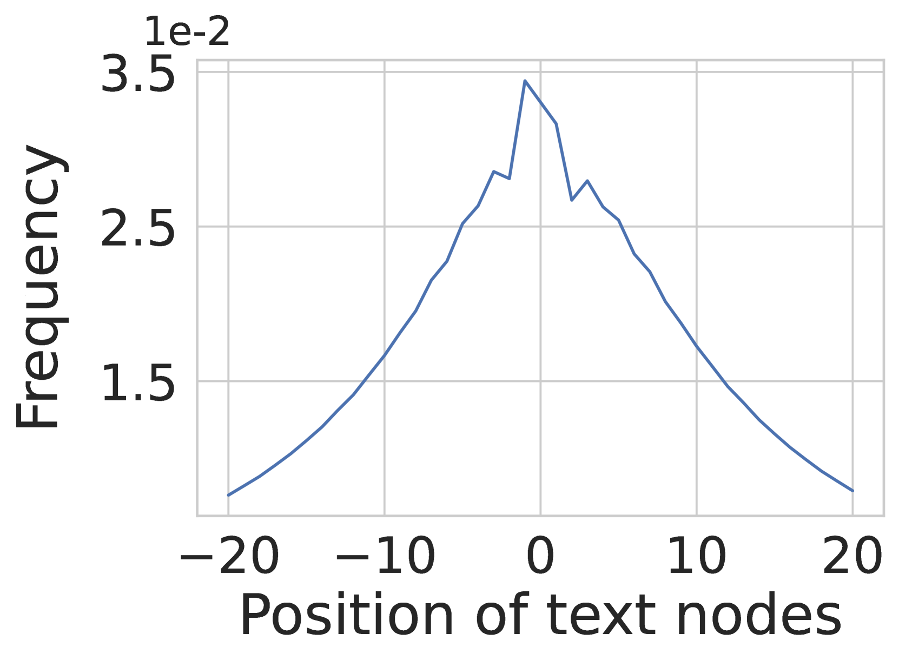

# mOSCAR：一个涵盖多语言与多模态的大规模文档级语料库

发布时间：2024年06月12日

`LLM应用

这篇论文介绍了mOSCAR，一个大规模的多语言多模态文档语料库，并探讨了其在训练多语言大型语言模型（mLLMs）中的应用。论文通过实验验证了使用mOSCAR训练的模型在多语言图像-文本任务和基准测试中的性能提升，这表明了mOSCAR在推动多语言mLLMs研究方面的重要性。因此，这篇论文属于LLM应用分类，因为它主要关注于实际应用中的数据集构建和模型训练，而不是理论研究或Agent的设计。` `多语言技术` `数据集`

> mOSCAR: A Large-scale Multilingual and Multimodal Document-level Corpus

# 摘要

> 多模态大型语言模型（mLLMs）通过大量文本-图像数据进行训练。尽管多数mLLMs仅在类似标题的数据上训练，Alayrac等人[2022]发现，通过在交错文本和图像序列上额外训练，可以激发情境学习能力。但他们使用的M3W数据集非公开且仅限英语。尽管有尝试重现其成果，但所有发布的数据集均为英语。与此不同，现有的多语言多模态数据集要么仅含标题类数据，要么规模有限或完全私有，这限制了全球7000多种语言的mLLM研究。为此，我们推出了mOSCAR，这是首个大规模多语言多模态文档语料库，涵盖163种语言、3.15亿文档、2140亿词元和12亿图像。我们精心实施了一系列过滤和评估，确保mOSCAR安全、多样且高质量。我们还训练了两种多语言模型以验证mOSCAR的优势：一是在mOSCAR子集和标题数据上训练的模型，另一是仅在标题数据上训练的模型。结果显示，在mOSCAR上额外训练的模型在多语言图像-文本任务和基准测试中，少样本学习性能显著提升，印证了之前仅针对英语mLLMs的研究发现。

> Multimodal Large Language Models (mLLMs) are trained on a large amount of text-image data. While most mLLMs are trained on caption-like data only, Alayrac et al. [2022] showed that additionally training them on interleaved sequences of text and images can lead to the emergence of in-context learning capabilities. However, the dataset they used, M3W, is not public and is only in English. There have been attempts to reproduce their results but the released datasets are English-only. In contrast, current multilingual and multimodal datasets are either composed of caption-like only or medium-scale or fully private data. This limits mLLM research for the 7,000 other languages spoken in the world. We therefore introduce mOSCAR, to the best of our knowledge the first large-scale multilingual and multimodal document corpus crawled from the web. It covers 163 languages, 315M documents, 214B tokens and 1.2B images. We carefully conduct a set of filtering and evaluation steps to make sure mOSCAR is sufficiently safe, diverse and of good quality. We additionally train two types of multilingual model to prove the benefits of mOSCAR: (1) a model trained on a subset of mOSCAR and captioning data and (2) a model train on captioning data only. The model additionally trained on mOSCAR shows a strong boost in few-shot learning performance across various multilingual image-text tasks and benchmarks, confirming previous findings for English-only mLLMs.

[Arxiv](https://arxiv.org/abs/2406.08707)