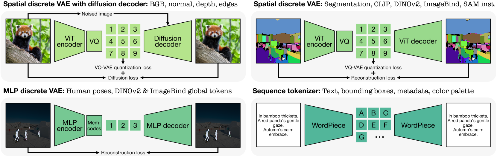
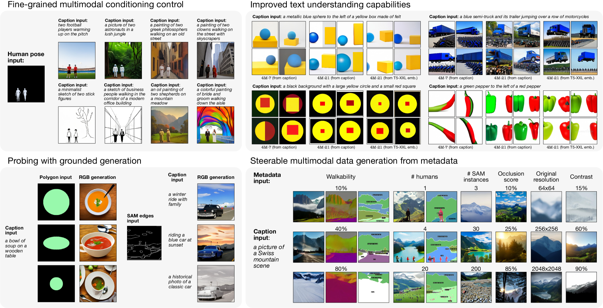
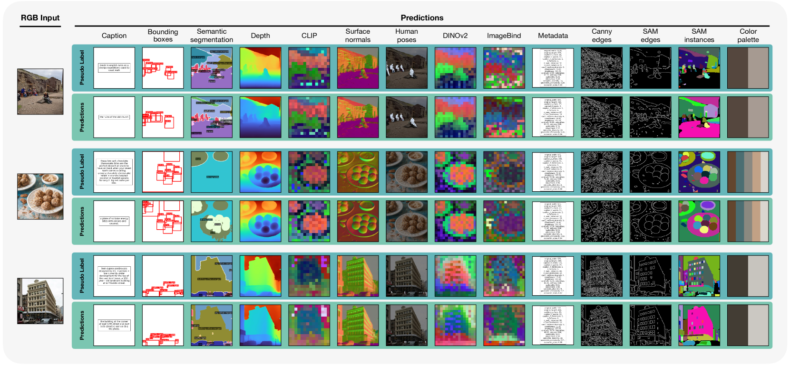
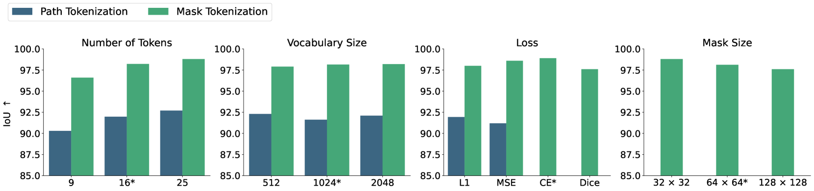
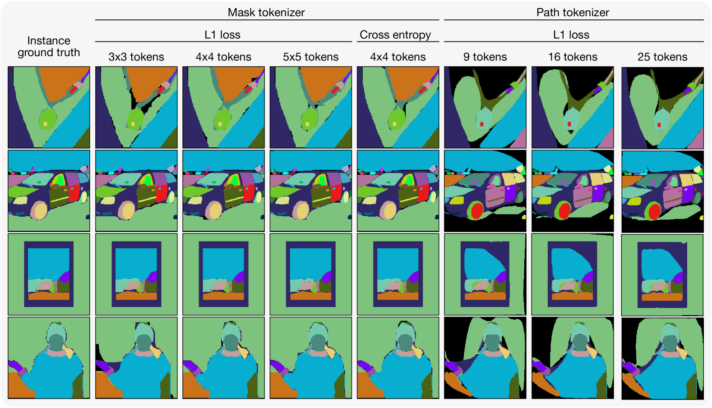

# 4M-21：一款全能视觉模型，轻松应对多任务多模态挑战

发布时间：2024年06月13日

`RAG

理由：这篇论文主要探讨了如何通过训练一个单一模型来处理多种模态和任务，以扩展多模态多任务基础模型的能力。这种方法涉及对各种模态进行离散化标记，并在大规模多模态数据集和文本库上进行联合训练。这种研究方向与RAG（Retrieval-Augmented Generation）模型的概念相符，即通过整合多种数据源和模态来增强模型的生成能力和适应性。因此，这篇论文更适合归类于RAG。` `多模态学习` `人工智能`

> 4M-21: An Any-to-Any Vision Model for Tens of Tasks and Modalities

# 摘要

> 尽管4M和UnifiedIO等多模态多任务基础模型前景看好，但它们的即开即用能力仍受限于其训练的模态和任务数量。本研究通过训练一个单一模型处理数十种高度多样化的模态，并在大规模多模态数据集和文本库上进行联合训练，显著扩展了这些模型的能力。我们涵盖了多种语义和几何模态，以及来自尖端模型如DINOv2和ImageBind的特征图，专家模型的伪标签如SAM和4DHumans，并引入了一系列新模态，如图像元数据或调色板，以创新方式与模型互动和指导生成。关键在于对各种模态进行离散化标记，无论是图像、神经网络特征、向量、结构化数据还是文本数据。这一创新不仅增强了多模态模型的即开即用能力，还展示了单个模型能解决至少三倍于现有模型的任务/模态，且性能不受影响。这为更精细、可控的多模态生成开辟了道路，并使我们能够探索将多样训练数据和目标的模型整合成统一模型的可能性。我们已成功训练出一个拥有三十亿参数的模型，使用多种模态和数据集，并将模型和训练代码在4m.epfl.ch上开源。

> Current multimodal and multitask foundation models like 4M or UnifiedIO show promising results, but in practice their out-of-the-box abilities to accept diverse inputs and perform diverse tasks are limited by the (usually rather small) number of modalities and tasks they are trained on. In this paper, we expand upon the capabilities of them by training a single model on tens of highly diverse modalities and by performing co-training on large-scale multimodal datasets and text corpora. This includes training on several semantic and geometric modalities, feature maps from recent state of the art models like DINOv2 and ImageBind, pseudo labels of specialist models like SAM and 4DHumans, and a range of new modalities that allow for novel ways to interact with the model and steer the generation, for example image metadata or color palettes. A crucial step in this process is performing discrete tokenization on various modalities, whether they are image-like, neural network feature maps, vectors, structured data like instance segmentation or human poses, or data that can be represented as text. Through this, we expand on the out-of-the-box capabilities of multimodal models and specifically show the possibility of training one model to solve at least 3x more tasks/modalities than existing ones and doing so without a loss in performance. This enables more fine-grained and controllable multimodal generation capabilities and allows us to study the distillation of models trained on diverse data and objectives into a unified model. We successfully scale the training to a three billion parameter model using tens of modalities and different datasets. The resulting models and training code are open sourced at 4m.epfl.ch.

[Arxiv](https://arxiv.org/abs/2406.09406)