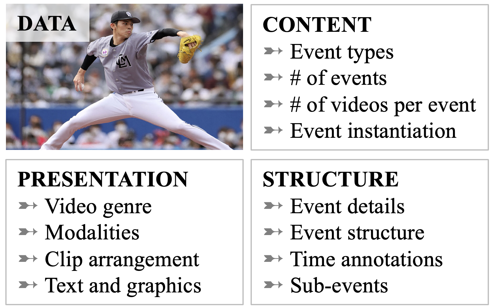
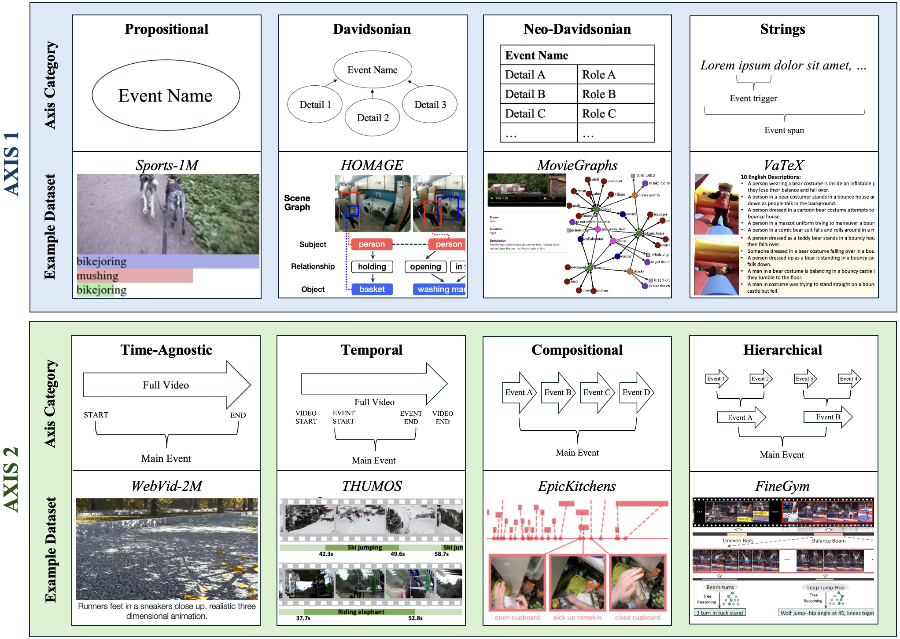

# 视频数据集在事件理解中的应用综述

发布时间：2024年06月13日

`Agent

这篇论文主要关注的是视频事件理解，这是一个涉及多模态AI系统的任务，需要具备类似人类视觉理解的全面常识推理能力。论文通过调查现有的视频数据集和任务，探讨了如何构建视频事件理解的研究资源，并提出了关于数据集管理和任务构建的建议。这与Agent分类相关，因为Agent通常指的是能够执行任务、做出决策并与其他系统或环境交互的智能实体。在这个上下文中，Agent可以被视为能够理解和处理视频事件的多模态AI系统。` `视频分析` `事件理解`

> A Survey of Video Datasets for Grounded Event Understanding

# 摘要

> 尽管现有的视频基准主要关注如检索或问答等特定任务，但现代多模态AI系统需具备类似人类视觉理解的全面常识推理能力。人类的时间-视觉感知能力中，识别和认知“事件”的能力至关重要。虽然视频字幕等任务已隐含地测试了这种能力，但并未将视频事件理解作为一个独立任务来考虑。近期研究开始探索视频中的事件提取，但任务定义和数据集仍局限于特定类型。尽管以事件为中心的视频研究领域已有十多年历史，但如何构建视频事件理解以及可用的研究资源仍不明确。本文调查了105个需要事件理解能力的视频数据集，探讨了它们对视频中鲁棒事件理解研究的贡献，并评估了相关事件提取任务。我们基于此调查提出了关于数据集管理和任务构建的建议，特别强调了视频事件的时间特性和视觉内容的模糊性。

> While existing video benchmarks largely consider specialized downstream tasks like retrieval or question-answering (QA), contemporary multimodal AI systems must be capable of well-rounded common-sense reasoning akin to human visual understanding. A critical component of human temporal-visual perception is our ability to identify and cognitively model "things happening", or events. Historically, video benchmark tasks have implicitly tested for this ability (e.g., video captioning, in which models describe visual events with natural language), but they do not consider video event understanding as a task in itself. Recent work has begun to explore video analogues to textual event extraction but consists of competing task definitions and datasets limited to highly specific event types. Therefore, while there is a rich domain of event-centric video research spanning the past 10+ years, it is unclear how video event understanding should be framed and what resources we have to study it. In this paper, we survey 105 video datasets that require event understanding capability, consider how they contribute to the study of robust event understanding in video, and assess proposed video event extraction tasks in the context of this body of research. We propose suggestions informed by this survey for dataset curation and task framing, with an emphasis on the uniquely temporal nature of video events and ambiguity in visual content.

[Arxiv](https://arxiv.org/abs/2406.09646)