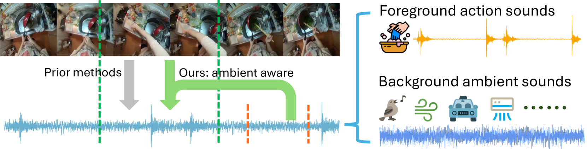
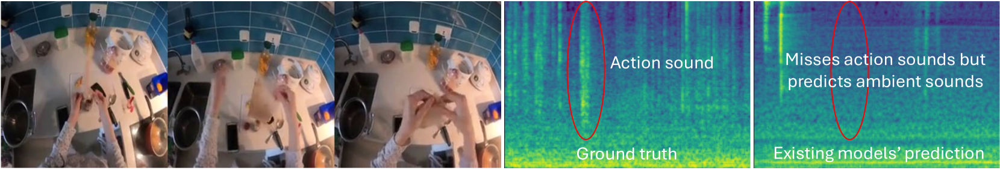
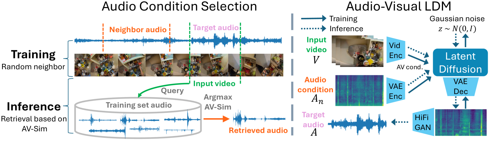
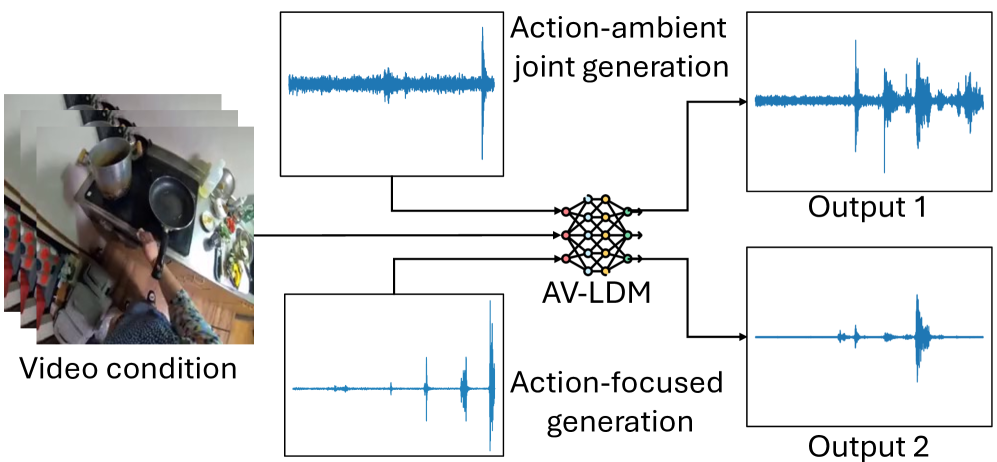
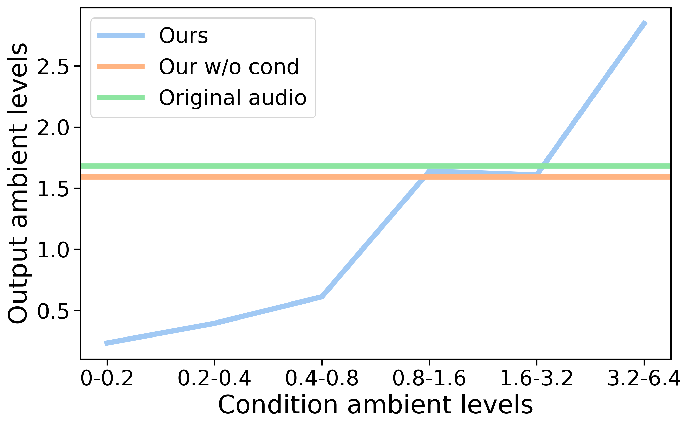
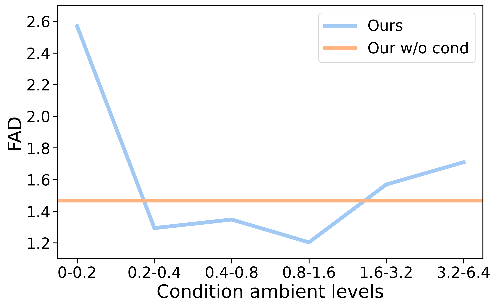
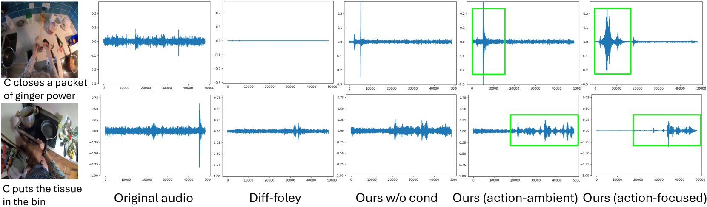
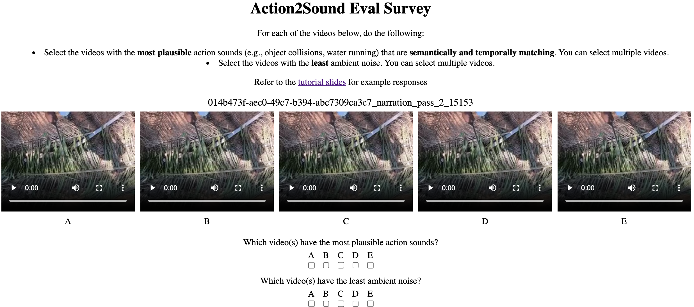

# Action2Sound：从第一视角视频中生成与环境相协调的动作声音

发布时间：2024年06月13日

`Agent

这篇论文主要介绍了一种名为AV-LDM的环境感知音频生成模型，该模型能够从视频中分离并生成与视觉内容相符的音频，特别是在处理无声视频时，通过检索增强技术实现音频的生成。这种模型可以被视为一个智能Agent，因为它能够根据视频内容自主地生成相应的音频，适应不同的应用场景，如电影音效或虚拟现实游戏。因此，这篇论文更适合归类到Agent分类中。` `音频生成` `虚拟现实`

> Action2Sound: Ambient-Aware Generation of Action Sounds from Egocentric Videos

# 摘要

> 在众多应用中，如电影音效或虚拟现实游戏，生成逼真的人际交互音频至关重要。然而，现有方法在训练时默认视频与音频完全同步，忽视了屏幕外声音与视觉内容的弱关联，导致测试时环境声音失控或出现幻觉。为此，我们创新性地提出了AV-LDM环境感知音频生成模型，通过独特的音频条件机制，在自然视频中分离前景动作声与背景环境声。面对无声视频，我们的模型运用检索增强技术，生成与视觉内容语义及时序相符的音频。在Ego4D和EPIC-KITCHENS两个第一人称视频数据集上的实验表明，我们的模型不仅超越了现有技术，还实现了环境声音的可控生成，并展现出适应计算机图形游戏片段的潜力。本研究首次聚焦于从自然背景声音的未筛选视频片段中，忠实于视觉内容进行视频到音频的生成。

> Generating realistic audio for human interactions is important for many applications, such as creating sound effects for films or virtual reality games. Existing approaches implicitly assume total correspondence between the video and audio during training, yet many sounds happen off-screen and have weak to no correspondence with the visuals -- resulting in uncontrolled ambient sounds or hallucinations at test time. We propose a novel ambient-aware audio generation model, AV-LDM. We devise a novel audio-conditioning mechanism to learn to disentangle foreground action sounds from the ambient background sounds in in-the-wild training videos. Given a novel silent video, our model uses retrieval-augmented generation to create audio that matches the visual content both semantically and temporally. We train and evaluate our model on two in-the-wild egocentric video datasets Ego4D and EPIC-KITCHENS. Our model outperforms an array of existing methods, allows controllable generation of the ambient sound, and even shows promise for generalizing to computer graphics game clips. Overall, our work is the first to focus video-to-audio generation faithfully on the observed visual content despite training from uncurated clips with natural background sounds.

[Arxiv](https://arxiv.org/abs/2406.09272)