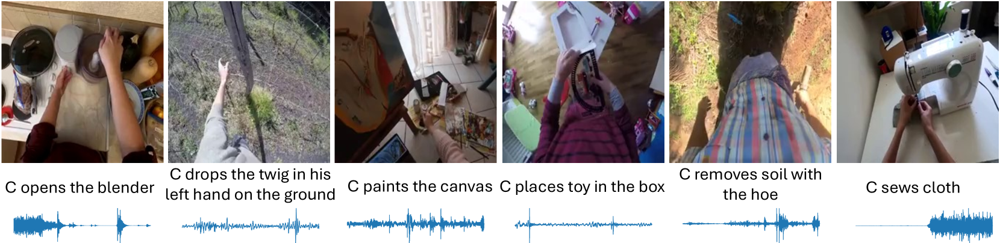
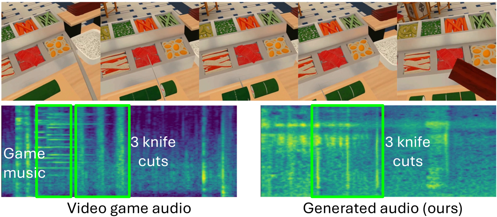

# Action2Sound：从第一视角视频中，智能生成与环境相协调的动作声音

发布时间：2024年06月13日

`LLM应用

这篇论文介绍了一种名为AV-LDM的环境感知音频生成技术，该技术能够从自然背景声中分离出动作声音，并生成与视频内容在语义和时间上相契合的音频。这种技术在电影音效或虚拟现实游戏等应用中具有重要价值。虽然论文中没有直接提到大型语言模型（LLM），但其使用的技术和方法，如检索增强技术，与LLM应用领域中处理和生成复杂数据的技术有相似之处。因此，这篇论文更适合归类于LLM应用，因为它展示了如何应用类似LLM的技术来解决实际问题，即生成逼真的音频以增强视听体验。` `音频生成` `虚拟现实`

> Action2Sound: Ambient-Aware Generation of Action Sounds from Egocentric Videos

# 摘要

> 在众多应用中，如电影音效或虚拟现实游戏，生成逼真的人际交互音频至关重要。现有技术常假设视频与音频在训练中完全同步，但许多声音实际上发生在画面之外，与视觉内容关联甚微，导致测试时环境声音失控或产生幻觉。为此，我们创新性地提出了AV-LDM模型，一种环境感知音频生成技术。该模型通过独特的音频条件机制，能从自然背景声中分离出动作声音。面对一段无声视频，我们的模型运用检索增强技术，生成与画面内容在语义和时间上均相契合的音频。经过Ego4D和EPIC-KITCHENS这两个第一人称视频数据集的训练与评估，AV-LDM不仅超越了现有技术，还实现了环境声音的可控生成，并展现出对计算机图形游戏片段的泛化潜力。我们的研究首次聚焦于从自然背景声未筛选剪辑中训练的视频到音频生成，确保了视觉内容的忠实呈现。

> Generating realistic audio for human interactions is important for many applications, such as creating sound effects for films or virtual reality games. Existing approaches implicitly assume total correspondence between the video and audio during training, yet many sounds happen off-screen and have weak to no correspondence with the visuals -- resulting in uncontrolled ambient sounds or hallucinations at test time. We propose a novel ambient-aware audio generation model, AV-LDM. We devise a novel audio-conditioning mechanism to learn to disentangle foreground action sounds from the ambient background sounds in in-the-wild training videos. Given a novel silent video, our model uses retrieval-augmented generation to create audio that matches the visual content both semantically and temporally. We train and evaluate our model on two in-the-wild egocentric video datasets Ego4D and EPIC-KITCHENS. Our model outperforms an array of existing methods, allows controllable generation of the ambient sound, and even shows promise for generalizing to computer graphics game clips. Overall, our work is the first to focus video-to-audio generation faithfully on the observed visual content despite training from uncurated clips with natural background sounds.

[Arxiv](https://arxiv.org/abs/2406.09272)