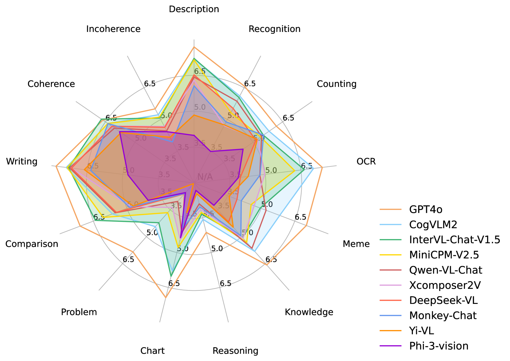

# AlignMMBench：大型视觉-语言模型中中文多模态对齐的评估工具

发布时间：2024年06月13日

`Agent

这篇论文主要关注的是大型视觉-语言模型（VLMs）的对齐能力评估，特别是针对中文VLMs的评估基准AlignMMBench的开发和应用。论文中提到的CritiqueVLM评估器和VLMs的表现分析，都是为了更好地理解和提升这些模型作为助手的效率和能力。因此，这篇论文更符合Agent分类，因为它涉及的是如何评估和改进模型作为智能代理的能力，而不是理论研究或特定应用开发。` `人工智能` `语言模型`

> AlignMMBench: Evaluating Chinese Multimodal Alignment in Large Vision-Language Models

# 摘要

> 为了确保大型视觉-语言模型（VLMs）能成为高效的助手，评估它们的对齐能力至关重要。然而，当前的评估基准多侧重于非言语的基本能力测试，如是非题和选择题。为此，我们推出了AlignMMBench，一个专为中文VLMs量身打造的全面对齐基准。它从真实世界和中文网络中精选素材，覆盖三个类别的十三个任务，并涵盖单轮与多轮对话。通过提示重写策略，AlignMMBench收录了1,054张图片和4,978个问答对。我们还开发了CritiqueVLM，一个超越GPT-4评估能力的规则校准评估器，以优化评估流程。最后，我们展示了代表性VLMs在AlignMMBench上的表现，揭示了不同架构VLMs的优势与短板。所有相关代码和数据已公开于https://alignmmbench.github.io。

> Evaluating the alignment capabilities of large Vision-Language Models (VLMs) is essential for determining their effectiveness as helpful assistants. However, existing benchmarks primarily focus on basic abilities using nonverbal methods, such as yes-no and multiple-choice questions. In this paper, we address this gap by introducing AlignMMBench, a comprehensive alignment benchmark specifically designed for emerging Chinese VLMs. This benchmark is meticulously curated from real-world scenarios and Chinese Internet sources, encompassing thirteen specific tasks across three categories, and includes both single-turn and multi-turn dialogue scenarios. Incorporating a prompt rewrite strategy, AlignMMBench encompasses 1,054 images and 4,978 question-answer pairs. To facilitate the evaluation pipeline, we propose CritiqueVLM, a rule-calibrated evaluator that exceeds GPT-4's evaluation ability. Finally, we report the performance of representative VLMs on AlignMMBench, offering insights into the capabilities and limitations of different VLM architectures. All evaluation codes and data are available on https://alignmmbench.github.io.

[Arxiv](https://arxiv.org/abs/2406.09295)