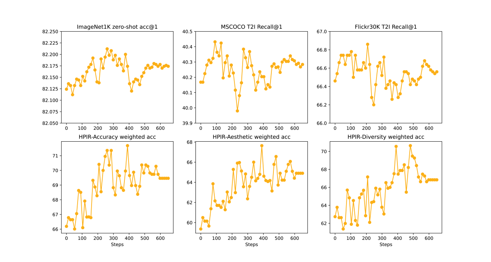
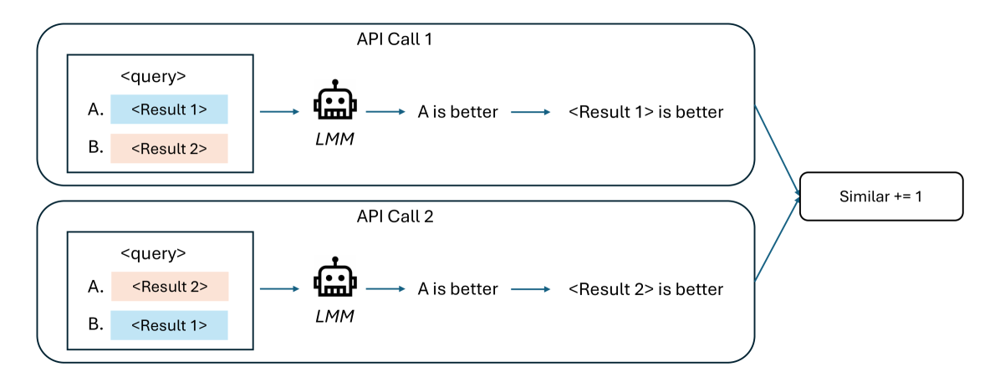

# 视觉模型与人类美学的对齐：检索基准与算法探索

发布时间：2024年06月13日

`Agent

理由：这篇论文主要关注的是如何通过大型语言模型（LLMs）和强化学习策略来微调视觉模型，以更好地匹配人类的美学标准。这涉及到创建一个能够理解和响应人类偏好的智能系统，即Agent。论文中提到的“基于偏好的强化学习策略”和“融合LLMs的推理智慧与美学模型的专业知识”表明，这是一个关于如何构建和优化能够执行特定任务（在此案例中是美学检索）的智能Agent的研究。此外，论文还提到了创建新的数据集来评估模型的性能，这进一步强调了其Agent的特性，即模型需要通过学习和适应来改进其性能。因此，这篇论文更适合归类为Agent。` `视觉美学` `检索系统`

> Aligning Vision Models with Human Aesthetics in Retrieval: Benchmarks and Algorithms

# 摘要

> 现代视觉模型虽在庞大噪声数据集上训练，能力强大，但在视觉美学、风格偏好及责任感等方面，未必能准确反映用户意图。本文聚焦于视觉美学，力求在检索系统中使视觉模型与人类美学标准相契合。现有检索系统虽采用多级美学模型进行精细筛选，但往往受限于低级视觉特征，难以应对风格、文化或知识背景的复杂性。我们发现，借助大型语言模型（LLMs）的推理能力，重新构思搜索请求并扩展美学预期，能有效弥补这一缺陷。为此，我们提出了一种基于偏好的强化学习策略，通过微调视觉模型，融合LLMs的推理智慧与美学模型的专业知识，以期更精准地匹配人类美学。同时，鉴于缺乏专为检索系统设计的评估基准，我们运用大型多模态模型（LMM）来评估其美学表现。考虑到美学评估的主观性，我们创建了名为HPIR的新数据集，以验证LMM的稳健性。实验结果显示，我们的方法在多个美学评价指标上显著提升了视觉模型的表现。我们坚信，这一算法将成为视觉模型与人类价值观对齐的通用实践。

> Modern vision models are trained on very large noisy datasets. While these models acquire strong capabilities, they may not follow the user's intent to output the desired results in certain aspects, e.g., visual aesthetic, preferred style, and responsibility. In this paper, we target the realm of visual aesthetics and aim to align vision models with human aesthetic standards in a retrieval system. Advanced retrieval systems usually adopt a cascade of aesthetic models as re-rankers or filters, which are limited to low-level features like saturation and perform poorly when stylistic, cultural or knowledge contexts are involved. We find that utilizing the reasoning ability of large language models (LLMs) to rephrase the search query and extend the aesthetic expectations can make up for this shortcoming. Based on the above findings, we propose a preference-based reinforcement learning method that fine-tunes the vision models to distill the knowledge from both LLMs reasoning and the aesthetic models to better align the vision models with human aesthetics. Meanwhile, with rare benchmarks designed for evaluating retrieval systems, we leverage large multi-modality model (LMM) to evaluate the aesthetic performance with their strong abilities. As aesthetic assessment is one of the most subjective tasks, to validate the robustness of LMM, we further propose a novel dataset named HPIR to benchmark the alignment with human aesthetics. Experiments demonstrate that our method significantly enhances the aesthetic behaviors of the vision models, under several metrics. We believe the proposed algorithm can be a general practice for aligning vision models with human values.

[Arxiv](https://arxiv.org/abs/2406.09397)