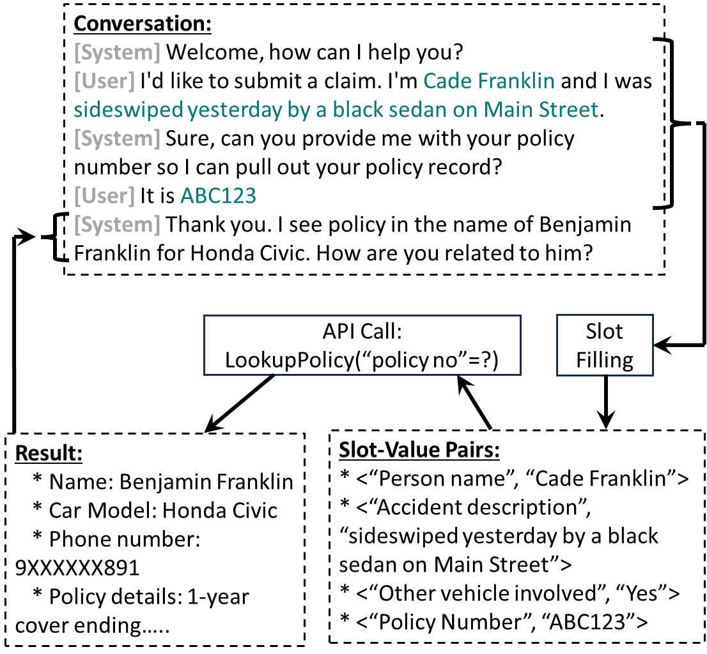

# 打造工业级对话助手零-shot槽填充系统的策略

发布时间：2024年06月13日

`LLM应用

理由：这篇论文介绍了一种基于大型语言模型（LLM）的槽填充系统，该系统优化了对话助手中的对话状态跟踪，并针对多行业的广泛应用进行了优化。论文中提到的系统设计考虑了低延迟和高效部署的需求，以及零-shot能力以适应多样化的领域和对话情境。这些特性表明该研究是关于LLM在实际应用中的使用，特别是在对话系统中的应用，因此属于LLM应用分类。` `对话系统`

> An Approach to Build Zero-Shot Slot-Filling System for Industry-Grade Conversational Assistants

# 摘要

> 我们开发了一种基于LLM的槽填充系统，旨在优化对话助手中的对话状态跟踪，适用于多行业的广泛应用。该系统需满足两个关键条件：一是采用小型模型以确保低延迟和高效部署；二是具备零-shot能力，以适应多样化的领域和对话情境。我们通过特定任务数据对预训练的LLM进行微调，构建了槽填充模型，并精心设计了涵盖多领域槽填充场景的训练数据。详细阐述了数据处理和模型构建的流程，并对实验结果进行了深入分析。实验表明，我们的方法在实际测试中F1分数提升了6.9%，同时延迟减少了57%。此外，我们的数据准备策略使得在不同槽类型上的F1分数平均提升了4.2%。

> We present an approach to build Large Language Model (LLM) based slot-filling system to perform Dialogue State Tracking in conversational assistants serving across a wide variety of industry-grade applications. Key requirements of this system include: 1) usage of smaller-sized models to meet low latency requirements and to enable convenient and cost-effective cloud and customer premise deployments, and 2) zero-shot capabilities to serve across a wide variety of domains, slot types and conversational scenarios. We adopt a fine-tuning approach where a pre-trained LLM is fine-tuned into a slot-filling model using task specific data. The fine-tuning data is prepared carefully to cover a wide variety of slot-filling task scenarios that the model is expected to face across various domains. We give details of the data preparation and model building process. We also give a detailed analysis of the results of our experimental evaluations. Results show that our prescribed approach for slot-filling model building has resulted in 6.9% relative improvement of F1 metric over the best baseline on a realistic benchmark, while at the same time reducing the latency by 57%. More over, the data we prepared has helped improve F1 on an average by 4.2% relative across various slot-types.

[Arxiv](https://arxiv.org/abs/2406.08848)