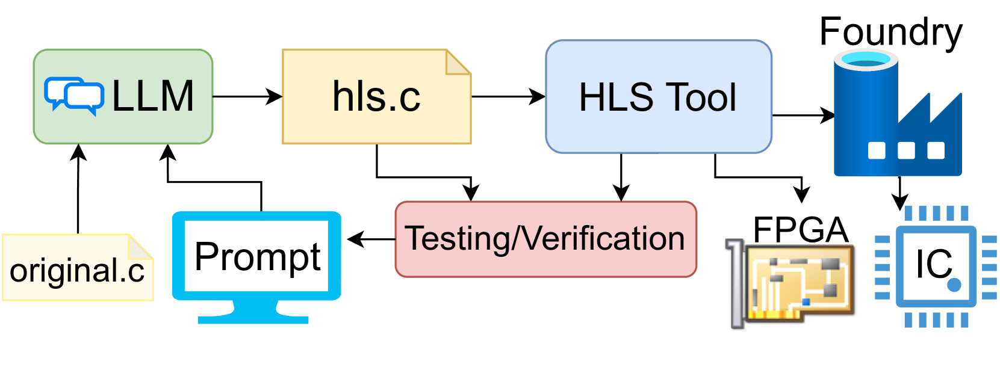
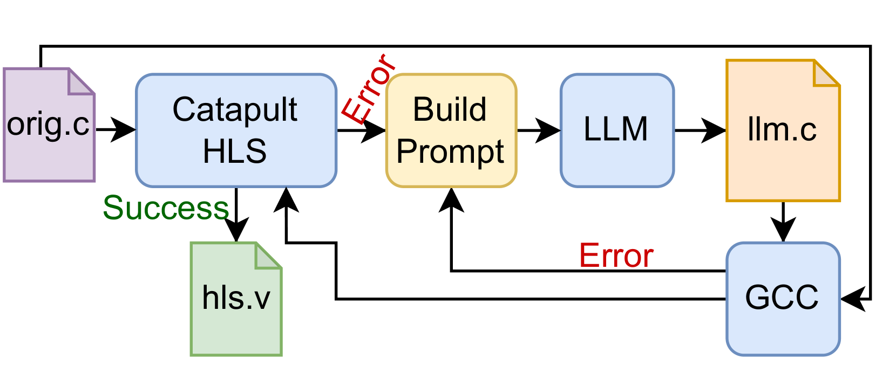

# C2HLSC：大型语言模型是否能成为连接软件与硬件设计之间的桥梁？

发布时间：2024年06月13日

`LLM应用

这篇论文探讨了如何利用大型语言模型（LLMs）将C代码重构为与硬件描述语言（HLS）工具兼容的格式。通过具体的案例研究，如NIST 800-22随机性测试、快速排序及AES-128的C代码重写，论文展示了LLM在协助硬件设计中将常规C代码转化为HLS可综合C代码的潜力。这种方法展示了LLM在实际应用中的能力，特别是在代码转换和硬件设计领域，因此属于LLM应用分类。` `硬件设计` `软件开发`

> C2HLSC: Can LLMs Bridge the Software-to-Hardware Design Gap?

# 摘要

> HLS工具虽能快速从C代码生成硬件设计，但兼容性受代码结构限制。本文探讨了如何利用大型语言模型（LLMs）将C代码重构为HLS兼容格式。通过LLM对NIST 800-22随机性测试、快速排序及AES-128的C代码进行重写，我们展示了多个案例。在用户提示引导下，LLM迭代转换代码，实现数据流和硬件特定信号等功能，证明了其在协助硬件设计中将常规C代码转化为HLS可综合C代码的潜力。

> High Level Synthesis (HLS) tools offer rapid hardware design from C code, but their compatibility is limited by code constructs. This paper investigates Large Language Models (LLMs) for refactoring C code into HLS-compatible formats. We present several case studies by using an LLM to rewrite C code for NIST 800-22 randomness tests, a QuickSort algorithm and AES-128 into HLS-synthesizable c. The LLM iteratively transforms the C code guided by user prompts, implementing functions like streaming data and hardware-specific signals. This evaluation demonstrates the LLM's potential to assist hardware design refactoring regular C code into HLS synthesizable C code.

[Arxiv](https://arxiv.org/abs/2406.09233)