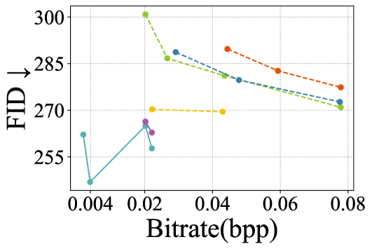
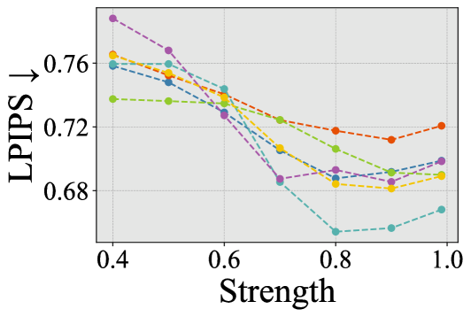

# CMC-Bench：开启视觉信号压缩的新纪元

发布时间：2024年06月13日

`LLM应用

这篇论文主要探讨了大型多模态模型（LMMs）在图像压缩领域的应用，特别是通过跨模态压缩（CMC）技术实现超低比特率图像压缩。论文介绍了CMC-Bench这一基准测试，用于评估图像到文本（I2T）和文本到图像（T2I）模型的协同性能，并展示了这些模型在极低比特率下的表现。这表明了LMMs在特定应用场景（如图像压缩）中的实际应用和优化潜力。因此，这篇论文应归类为LLM应用。` `图像压缩` `多媒体技术`

> CMC-Bench: Towards a New Paradigm of Visual Signal Compression

# 摘要

> 超低比特率图像压缩挑战重重，随着大型多模态模型（LMMs）的进步，一种新颖的跨模态压缩（CMC）模式——图像-文本-图像应运而生。这种语义级压缩技术能将图像数据压缩至原大小的0.1%以下，潜力巨大。但CMC在保持图像原始质感和感知质量上存在短板。为此，我们推出了CMC-Bench，一个针对图像压缩的I2T与T2I模型协同性能的基准，涵盖了18,000至40,000张图像，验证了6大主流I2T及12个T2I模型，并包含了16万个人类专家标注的主观偏好分数。在极低比特率下，本研究表明，某些I2T与T2I模型的组合已超越顶尖视觉信号编解码器，同时揭示了LMMs在压缩任务上的优化潜力。我们诚邀LMM开发者参与测试，共同推动视觉信号编解码技术的发展。

> Ultra-low bitrate image compression is a challenging and demanding topic. With the development of Large Multimodal Models (LMMs), a Cross Modality Compression (CMC) paradigm of Image-Text-Image has emerged. Compared with traditional codecs, this semantic-level compression can reduce image data size to 0.1\% or even lower, which has strong potential applications. However, CMC has certain defects in consistency with the original image and perceptual quality. To address this problem, we introduce CMC-Bench, a benchmark of the cooperative performance of Image-to-Text (I2T) and Text-to-Image (T2I) models for image compression. This benchmark covers 18,000 and 40,000 images respectively to verify 6 mainstream I2T and 12 T2I models, including 160,000 subjective preference scores annotated by human experts. At ultra-low bitrates, this paper proves that the combination of some I2T and T2I models has surpassed the most advanced visual signal codecs; meanwhile, it highlights where LMMs can be further optimized toward the compression task. We encourage LMM developers to participate in this test to promote the evolution of visual signal codec protocols.

[Arxiv](https://arxiv.org/abs/2406.09356)