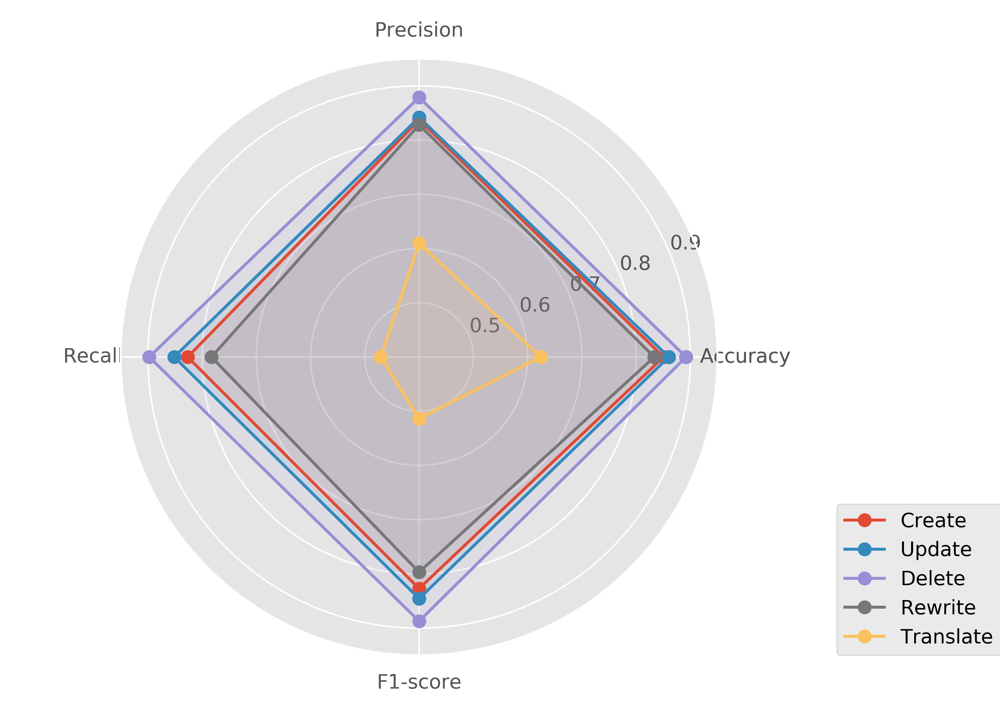
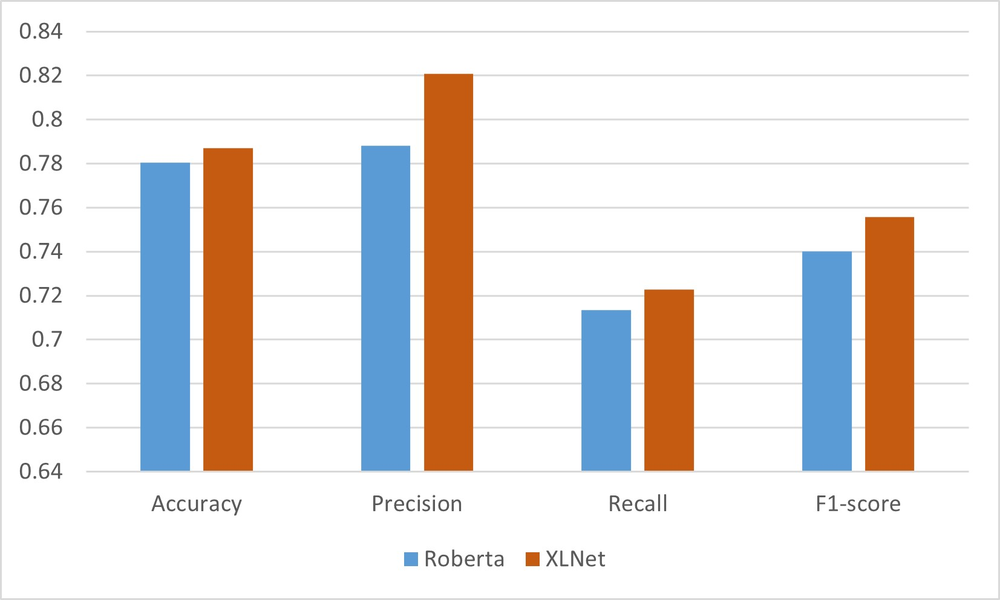

# CUDRT：评估人类与大型语言模型生成文本的鉴别基准

发布时间：2024年06月13日

`LLM应用

这篇论文主要关注大型语言模型（LLMs）在文本生成方面的应用，特别是在AI生成文本检测器的发展和评估上。论文提出了一套全面的双语基准，用于评估AI生成文本检测器的性能，并详细划分了文本生成的不同活动类别（创建、更新、删除、重写和翻译）。这些内容直接关联到LLMs的实际应用，即如何检测和区分AI生成的文本与人类作者的文本，因此属于LLM应用分类。` `文本检测` `语言处理`

> CUDRT: Benchmarking the Detection of Human vs. Large Language Models Generated Texts

# 摘要

> 大型语言模型（LLMs）的广泛应用极大地增强了各行各业的文本生成能力，但其生成类人文本的能力也带来了区分人类与AI作者的难题。尽管已有AI生成文本检测器表现不俗，但缺乏全面且公开的基准限制了其进一步发展。现有的基准多局限于特定场景，如问答和文本润色，且主要针对英语，未能全面反映LLMs的多样应用和语言细节。为此，本文提出了一套全面的双语基准，涵盖中文和英文，旨在评估主流AI生成文本检测器。我们将LLM的文本生成活动细分为创建、更新、删除、重写和翻译（CUDRT）五大类，并构建了一个强大的评估框架，支持可扩展和可重复的实验。针对每个CUDRT类别，我们精心设计了数据集，以全面检验检测器性能。利用最新的主流LLMs，我们的数据集为检测器提供了一个全面的测试平台。实验结果不仅为优化检测器提供了关键信息，也为未来研究指明了方向，以提升检测精度和在多场景下的通用性。

> The proliferation of large language models (LLMs) has significantly enhanced text generation capabilities across various industries. However, these models' ability to generate human-like text poses substantial challenges in discerning between human and AI authorship. Despite the effectiveness of existing AI-generated text detectors, their development is hindered by the lack of comprehensive, publicly available benchmarks. Current benchmarks are limited to specific scenarios, such as question answering and text polishing, and predominantly focus on English texts, failing to capture the diverse applications and linguistic nuances of LLMs. To address these limitations, this paper constructs a comprehensive bilingual benchmark in both Chinese and English to evaluate mainstream AI-generated text detectors. We categorize LLM text generation into five distinct operations: Create, Update, Delete, Rewrite, and Translate (CUDRT), encompassing all current LLMs activities. We also establish a robust benchmark evaluation framework to support scalable and reproducible experiments. For each CUDRT category, we have developed extensive datasets to thoroughly assess detector performance. By employing the latest mainstream LLMs specific to each language, our datasets provide a thorough evaluation environment. Extensive experimental results offer critical insights for optimizing AI-generated text detectors and suggest future research directions to improve detection accuracy and generalizability across various scenarios.

[Arxiv](https://arxiv.org/abs/2406.09056)