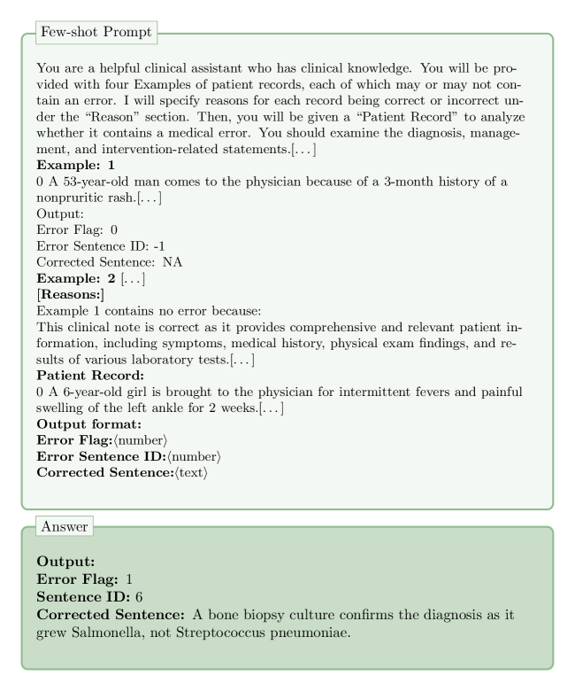

# 运用链式思考提示策略，提升医疗错误检测与修正的效率。

发布时间：2024年06月13日

`Agent

理由：这篇论文主要描述了一个参与MEDIQA-CORR 2024共享任务的系统，该系统使用大型语言模型（LLM）结合思维链（CoT）和推理提示的少样本情境学习（ICL）方法来识别和修正临床笔记中的医疗错误。这个系统可以被视为一个智能代理（Agent），因为它能够执行特定的任务（识别和修正错误），并且在这个过程中使用了LLM来增强其能力。因此，这篇论文更适合归类为Agent，而不是RAG、LLM应用或LLM理论，因为它更多地关注于实际应用中的智能系统，而不是LLM的理论研究或特定的应用场景。` `临床笔记处理`

> Chain-of-Though (CoT) prompting strategies for medical error detection and correction

# 摘要

> 本文介绍了我们参与MEDIQA-CORR 2024共享任务的情况，该任务旨在自动识别并修正临床笔记中的医疗错误。我们采用了三种结合思维链（CoT）和推理提示的少样本情境学习（ICL）方法，并利用大型语言模型（LLM）进行增强。首先，我们通过分析训练和验证数据集的一部分，手动设计了三个CoT提示，以识别临床笔记中的错误类型。其次，我们利用训练数据引导LLM推断错误的原因，并将这些CoT和原因与ICL示例结合，以完成错误检测、定位和修正任务。最后，我们通过基于规则的集成方法将这两种策略融合。在三个子任务中，我们的集成方法在子任务1和2中均获得第三名，在子任务3中排名第七。

> This paper describes our submission to the MEDIQA-CORR 2024 shared task for automatically detecting and correcting medical errors in clinical notes. We report results for three methods of few-shot In-Context Learning (ICL) augmented with Chain-of-Thought (CoT) and reason prompts using a large language model (LLM). In the first method, we manually analyse a subset of train and validation dataset to infer three CoT prompts by examining error types in the clinical notes. In the second method, we utilise the training dataset to prompt the LLM to deduce reasons about their correctness or incorrectness. The constructed CoTs and reasons are then augmented with ICL examples to solve the tasks of error detection, span identification, and error correction. Finally, we combine the two methods using a rule-based ensemble method. Across the three sub-tasks, our ensemble method achieves a ranking of 3rd for both sub-task 1 and 2, while securing 7th place in sub-task 3 among all submissions.

[Arxiv](https://arxiv.org/abs/2406.09103)