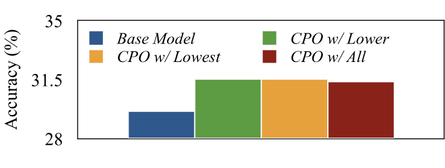

# 优化偏好链：增强大型语言模型中的思维链推理能力

发布时间：2024年06月13日

`LLM理论

理由：这篇论文主要探讨了思维链（CoT）和思维树（ToT）方法在大型语言模型（LLMs）中的应用，以及如何通过偏好链优化（CPO）技术来改进这些方法。论文的核心在于理论层面的探讨，即如何通过微调LLMs来优化推理路径，以及如何利用ToT构建的搜索树来提升CoT的性能。这些内容更多地涉及LLMs的理论改进和优化，而不是具体的应用实例或Agent的设计，因此归类为LLM理论。` `问答系统` `人工智能`

> Chain of Preference Optimization: Improving Chain-of-Thought Reasoning in LLMs

# 摘要

> 思维链（CoT）解码技术的最新进展使大型语言模型（LLMs）能够生成复杂问题解决的明确逻辑推理路径。但研究发现，这些路径并非总是最优选择。思维树（ToT）方法通过树搜索深入探索推理空间，发现CoT可能遗漏的更优路径。然而，这种深入探索带来了推理复杂性的显著增加。本研究通过偏好链优化（CPO）展示了如何通过微调LLMs，利用ToT构建的搜索树，使CoT达到或超越原有性能，同时避免沉重的推理负担。CPO通过微调LLMs，将CoT推理路径的每一步与ToT对齐，利用树搜索过程中的内在偏好信息。实验结果广泛证明，CPO在问答、事实验证和算术推理等多种复杂问题上显著提升了LLMs的性能，有效性得到验证。相关代码已公开于https://github.com/sail-sg/CPO。

> The recent development of chain-of-thought (CoT) decoding has enabled large language models (LLMs) to generate explicit logical reasoning paths for complex problem-solving. However, research indicates that these paths are not always deliberate and optimal. The tree-of-thought (ToT) method employs tree-searching to extensively explore the reasoning space and find better reasoning paths that CoT decoding might overlook. This deliberation, however, comes at the cost of significantly increased inference complexity. In this work, we demonstrate that fine-tuning LLMs leveraging the search tree constructed by ToT allows CoT to achieve similar or better performance, thereby avoiding the substantial inference burden. This is achieved through Chain of Preference Optimization (CPO), where LLMs are fine-tuned to align each step of the CoT reasoning paths with those of ToT using the inherent preference information in the tree-search process. Extensive experimental results show that CPO significantly improves LLM performance in solving a variety of complex problems, including question answering, fact verification, and arithmetic reasoning, demonstrating its effectiveness. Our code is available at https://github.com/sail-sg/CPO.

[Arxiv](https://arxiv.org/abs/2406.09136)