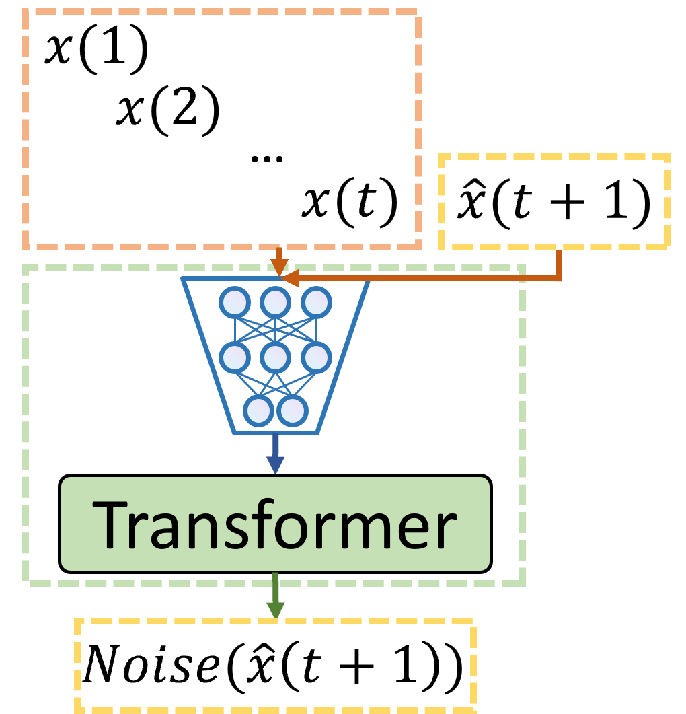
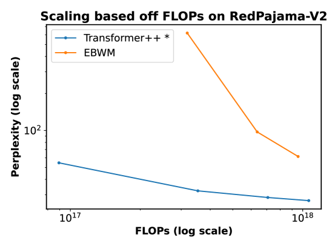

# 基于认知启发的能量驱动世界模型

发布时间：2024年06月13日

`LLM理论

理由：这篇论文探讨了大型语言模型（LLM）的理论改进，特别是通过引入基于能量的世界模型（EBWM）和基于能量的变压器（EBT）来模拟人类认知过程，从而改进模型的预测能力。这种方法是对现有自回归预测模型的理论上的深化和扩展，旨在使模型更接近人类的认知和推理方式。因此，它属于LLM理论分类。` `计算机视觉`

> Cognitively Inspired Energy-Based World Models

# 摘要

> 自回归预测是训练世界模型的主流方法，它让大型语言模型预测下一个词，或在计算机视觉中预测下一帧。但这种方法与人类认知有所不同：人类预测未来时，会主动影响认知过程，并自然评估预测的合理性，动态调整预测时间，这与心理学中的系统2思维相似。为了克服传统自回归模型的局限，我们提出了基于能量的世界模型（EBWM），它通过训练基于能量的模型（EBM）来评估上下文与未来状态的兼容性，从而模拟人类的这些认知能力。我们还开发了专为基于能量的模型设计的变压器——基于能量的变压器（EBT）。实验表明，EBWM在CV和NLP任务中都展现出优于传统自回归模型的扩展性能，为未来模型训练开辟了新路径，使其能像人类一样进行高级推理和智能规划。

> One of the predominant methods for training world models is autoregressive prediction in the output space of the next element of a sequence. In Natural Language Processing (NLP), this takes the form of Large Language Models (LLMs) predicting the next token; in Computer Vision (CV), this takes the form of autoregressive models predicting the next frame/token/pixel. However, this approach differs from human cognition in several respects. First, human predictions about the future actively influence internal cognitive processes. Second, humans naturally evaluate the plausibility of predictions regarding future states. Based on this capability, and third, by assessing when predictions are sufficient, humans allocate a dynamic amount of time to make a prediction. This adaptive process is analogous to System 2 thinking in psychology. All these capabilities are fundamental to the success of humans at high-level reasoning and planning. Therefore, to address the limitations of traditional autoregressive models lacking these human-like capabilities, we introduce Energy-Based World Models (EBWM). EBWM involves training an Energy-Based Model (EBM) to predict the compatibility of a given context and a predicted future state. In doing so, EBWM enables models to achieve all three facets of human cognition described. Moreover, we developed a variant of the traditional autoregressive transformer tailored for Energy-Based models, termed the Energy-Based Transformer (EBT). Our results demonstrate that EBWM scales better with data and GPU Hours than traditional autoregressive transformers in CV, and that EBWM offers promising early scaling in NLP. Consequently, this approach offers an exciting path toward training future models capable of System 2 thinking and intelligently searching across state spaces.

[Arxiv](https://arxiv.org/abs/2406.08862)