# 视觉指令调整比较研究

发布时间：2024年06月13日

`RAG

理由：这篇论文主要关注的是大型多模态模型（LMMs）在图像比较任务中的性能提升，特别是通过提出新的方法（CaD-VI）和构建新的数据集（CaD-Inst）来增强模型在识别图像间共同点与差异（CaD）的能力。这与RAG（Retrieval-Augmented Generation）的范畴相符，因为RAG通常涉及通过检索增强生成模型的性能，尤其是在多模态理解和推理任务中。虽然论文中没有直接提到检索增强，但其通过数据集和方法的创新来提升模型性能的思路与RAG的核心理念相契合。此外，论文中提到的性能提升和评估基准的设立，也体现了对模型在特定任务上性能优化的关注，这是RAG研究中的一个重要方面。` `计算机视觉` `数据集构建`

> Comparison Visual Instruction Tuning

# 摘要

> 比较图像间的共同点与差异（CaD）是人类视觉推理的核心，然而在模仿人类视觉智能的大型多模态模型（LMMs）中，这一基础概念却未得到足够重视。我们创新性地提出了两阶段方法CaD-VI，并构建了包含349K对图像的CaD-Inst数据集，显著提升了LMMs在CaD识别上的性能，相关任务的SOTA提升高达17.5%。此方法还与现有差异识别数据集相辅相成，通过自动优化资源，增强CaD调优效果达10%。同时，我们设立了7.5K开放式问答的评估基准，以全面检验LMMs对CaD的理解力。

> Comparing two images in terms of Commonalities and Differences (CaD) is a fundamental human capability that forms the basis of advanced visual reasoning and interpretation. It is essential for the generation of detailed and contextually relevant descriptions, performing comparative analysis, novelty detection, and making informed decisions based on visual data. However, surprisingly, little attention has been given to these fundamental concepts in the best current mimic of human visual intelligence - Large Multimodal Models (LMMs). We develop and contribute a new two-phase approach CaD-VI for collecting synthetic visual instructions, together with an instruction-following dataset CaD-Inst containing 349K image pairs with CaD instructions collected using CaD-VI. Our approach significantly improves the CaD spotting capabilities in LMMs, advancing the SOTA on a diverse set of related tasks by up to 17.5%. It is also complementary to existing difference-only instruction datasets, allowing automatic targeted refinement of those resources increasing their effectiveness for CaD tuning by up to 10%. Additionally, we propose an evaluation benchmark with 7.5K open-ended QAs to assess the CaD understanding abilities of LMMs.

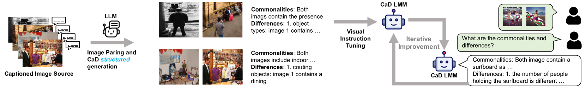

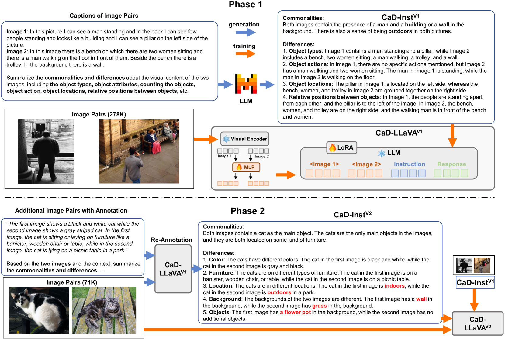

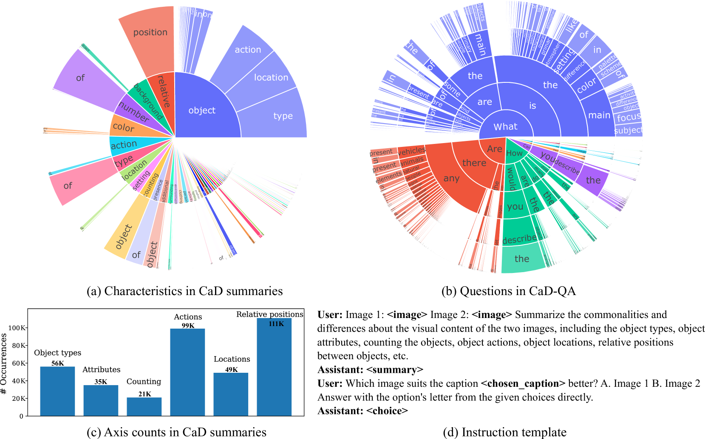

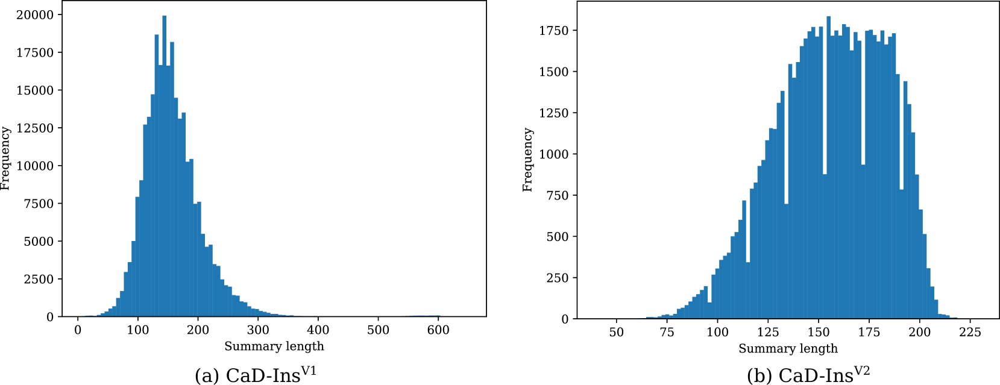

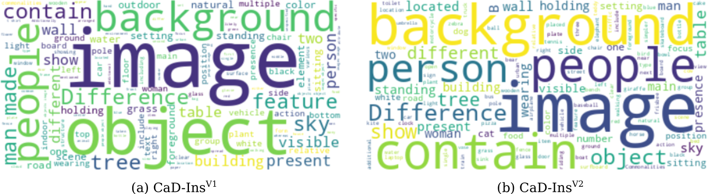

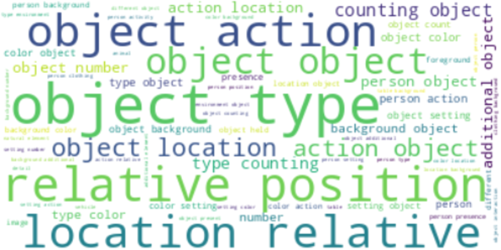

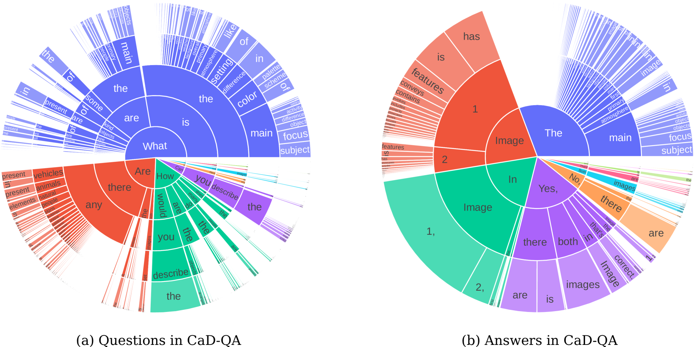

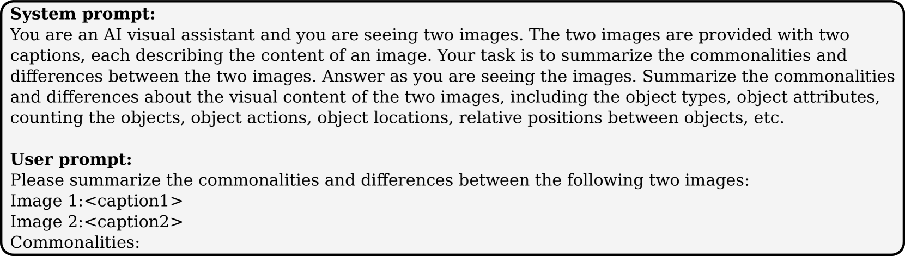

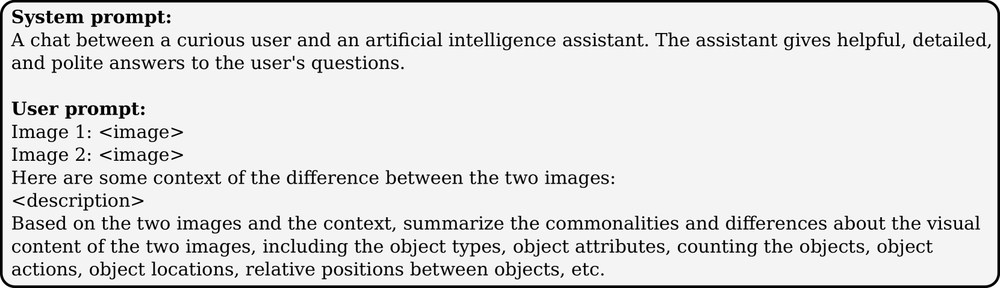

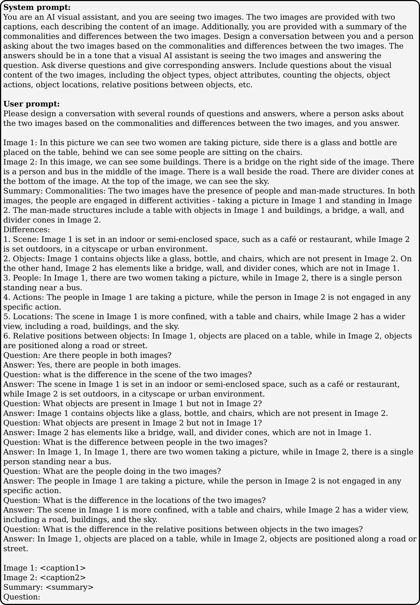

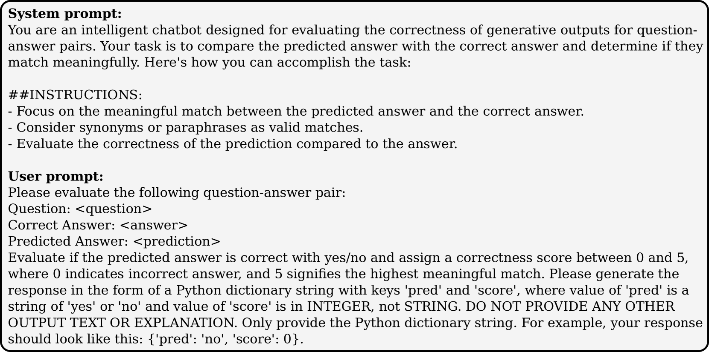

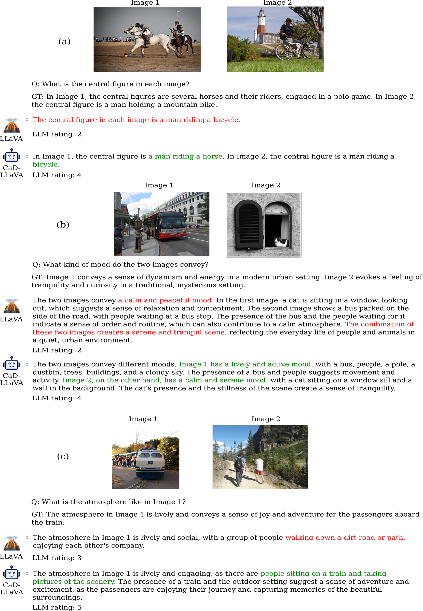

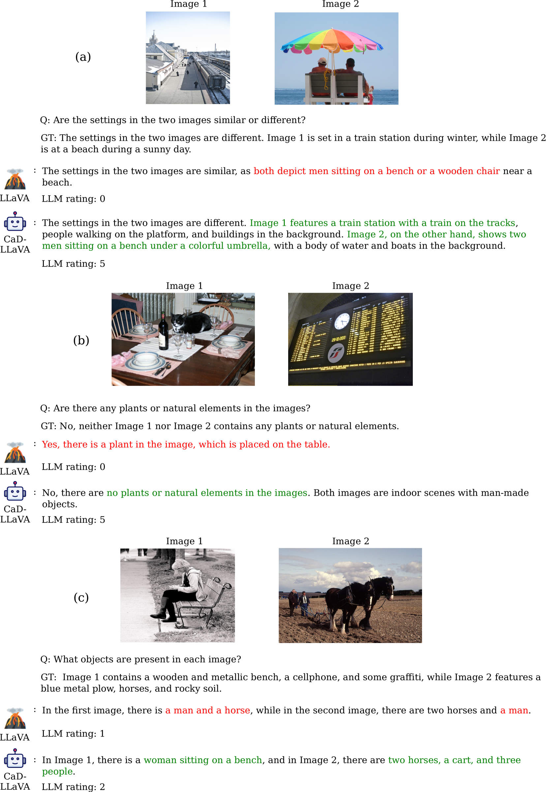

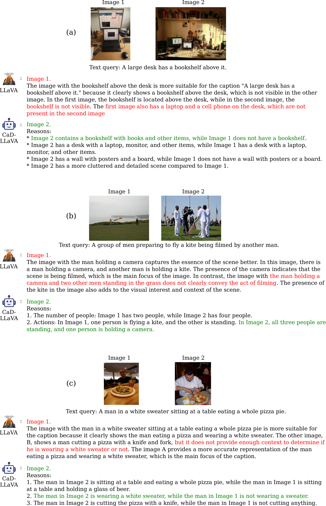

[Arxiv](https://arxiv.org/abs/2406.09240)