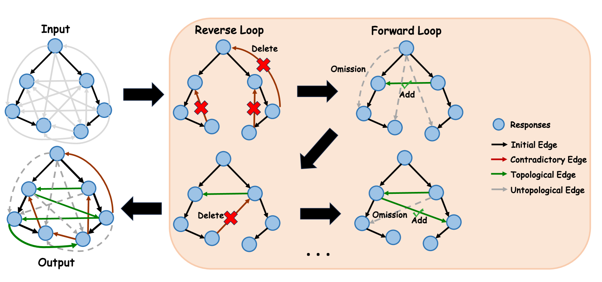
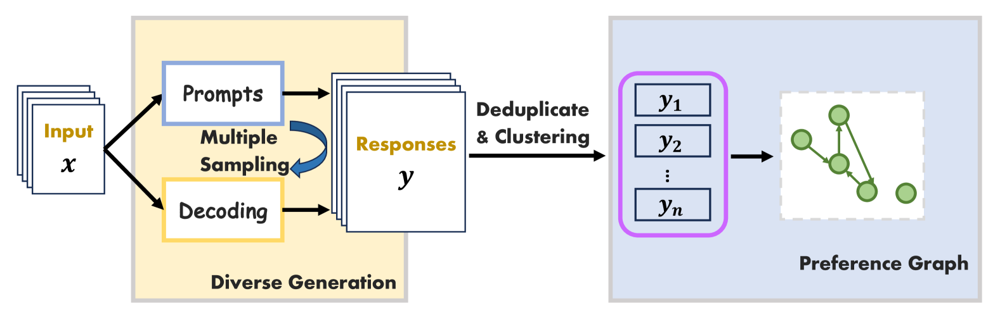
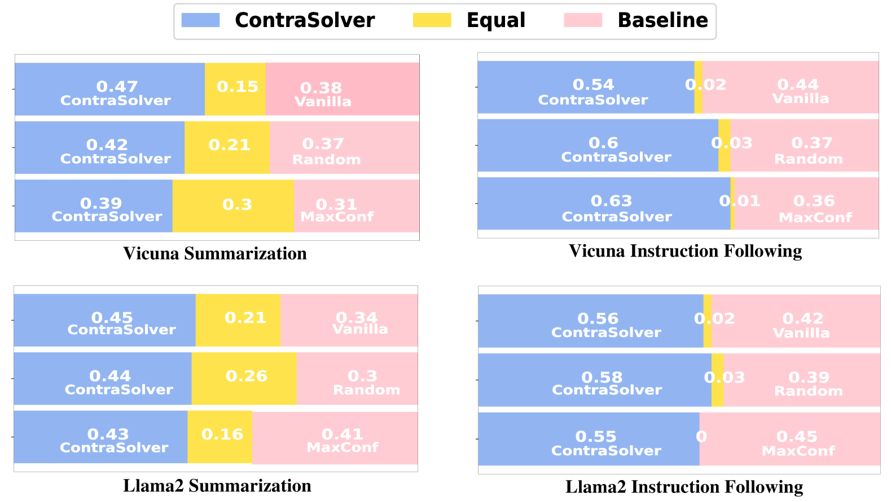

# ContraSolver：化解内部偏好矛盾，实现语言模型的自我对齐

发布时间：2024年06月13日

`LLM理论

理由：这篇论文主要探讨了大型语言模型（LLMs）中的偏好矛盾问题，并提出了一种名为ContraSolver的算法来解决这些矛盾。这种方法涉及到对LLMs内部行为的深入分析和理论上的优化，因此属于LLM理论的范畴。论文中提到的偏好关系图和无监督的自对齐方法，都是对LLMs理论层面的深入研究和改进，而不是直接的应用或Agent的设计，也不是关于检索增强生成（RAG）的具体应用。` `机器学习`

> ContraSolver: Self-Alignment of Language Models by Resolving Internal Preference Contradictions

# 摘要

> 尽管大型语言模型（LLMs）的开发取得了重大进展，但控制其行为仍具挑战。直接偏好优化（DPO）依赖于一个假设，即存在一个潜在的奖励函数来评估LLMs的响应，这暗示了对同一输入的不同响应有严格的偏好排序。然而，我们的实验观察揭示了LLMs中偏好矛盾的存在。为此，我们构建了一个偏好关系图，通过自我标注揭示这些矛盾。我们开发的ContraSolver算法，通过遍历偏好图上的边，精准识别并解决这些矛盾。该算法以最大生成树为基础，优先处理低置信度偏好，同时保持高置信度偏好的完整性。实验证明，通过这种完全无监督的自对齐方法，LLMs在四个生成任务上的性能得到了显著提升。进一步分析显示，通过ContraSolver自对齐，LLMs的偏好矛盾大幅减少，这表明解决这些矛盾对于提升对齐性能至关重要。

> While substantial advancements have been made in developing large language models (LLMs), achieving control over their behavior can be difficult. Direct preference optimization (DPO) assumes the existence of a latent reward function to evaluate the responses of LLMs. This assumption indicates a strict preference ordering of different responses to the same input. However, there always exist contradictions of preference in LLMs according to our experimental observations. In this paper, we construct a graph structure of the preference relationship among different responses with self-annotation to find contradictions in the preference order. We propose ContraSolver, an algorithm that traverses all edges on the preference graph to identify those that might cause contradictions. ContraSolver initializes the graph with a maximum spanning tree and identifies contradictory edges, prioritizing the resolution of low-confidence preferences while preserving high-confidence ones. Experimental results on four different generation tasks show that the performance of different LLMs can be largely improved through our completely unsupervised self-alignment. Furthermore, by analyzing the preference graphs of LLMs with and without self-alignment by ContraSolver, we quantify the reduction in contradictions, suggesting that resolving preference contradictions is crucial for achieving better alignment performance.

[Arxiv](https://arxiv.org/abs/2406.08842)