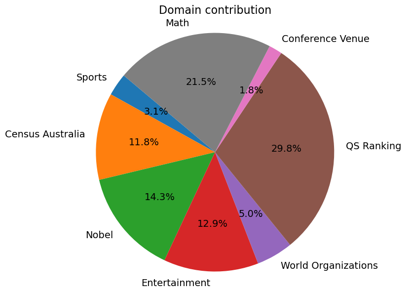

# DefAn：大型语言模型幻觉评估的确切答案数据集

发布时间：2024年06月13日

`LLM应用

理由：这篇论文主要关注大型语言模型（LLMs）在生成内容时可能出现的幻觉问题，并为此开发了一个全面的基准数据集来评估和改进这些模型的性能。论文的核心贡献在于提供了一个新的数据集，用于测试和基准测试LLMs，这直接关联到LLMs的应用层面，即如何通过数据集来评估和提升LLMs在实际应用中的表现。因此，这篇论文属于LLM应用分类。` `人工智能` `数据集`

> DefAn: Definitive Answer Dataset for LLMs Hallucination Evaluation

# 摘要

> 大型语言模型（LLMs）虽在AI日常应用中展现了革命性的能力，但它们易产生幻觉，如生成与事实相悖的声明，偏离提示，或在重复提示下给出不一致的回答。由于缺乏全面且易评估的基准数据集，这些问题难以解决。现有数据集多小且依赖多项选择题，不足以全面评估LLMs的生成能力。为此，本文推出一个包含75,000多个提示的全面基准数据集，覆盖八个领域，旨在引出明确、简洁且信息丰富的答案。数据集分为公开和隐藏两部分，分别用于测试和基准测试LLMs。实验涉及六种LLMs，显示公共数据集上的事实幻觉率为59%至82%，隐藏数据集上为57%至76%。提示错位幻觉率分别为6%至95%和17%至94%。平均一致性分别为21%至61%和22%至63%。领域分析表明，LLMs在处理具体数字信息时性能下降，而在人物、地点和日期查询上表现尚可。该数据集有效，为LLM性能评估提供了全面基准。数据集及LLMs响应可于\href{https://github.com/ashikiut/DefAn}{https://github.com/ashikiut/DefAn}获取。

> Large Language Models (LLMs) have demonstrated remarkable capabilities, revolutionizing the integration of AI in daily life applications. However, they are prone to hallucinations, generating claims that contradict established facts, deviating from prompts, and producing inconsistent responses when the same prompt is presented multiple times. Addressing these issues is challenging due to the lack of comprehensive and easily assessable benchmark datasets. Most existing datasets are small and rely on multiple-choice questions, which are inadequate for evaluating the generative prowess of LLMs. To measure hallucination in LLMs, this paper introduces a comprehensive benchmark dataset comprising over 75,000 prompts across eight domains. These prompts are designed to elicit definitive, concise, and informative answers. The dataset is divided into two segments: one publicly available for testing and assessing LLM performance and a hidden segment for benchmarking various LLMs. In our experiments, we tested six LLMs-GPT-3.5, LLama 2, LLama 3, Gemini, Mixtral, and Zephyr-revealing that overall factual hallucination ranges from 59% to 82% on the public dataset and 57% to 76% in the hidden benchmark. Prompt misalignment hallucination ranges from 6% to 95% in the public dataset and 17% to 94% in the hidden counterpart. Average consistency ranges from 21% to 61% and 22% to 63%, respectively. Domain-wise analysis shows that LLM performance significantly deteriorates when asked for specific numeric information while performing moderately with person, location, and date queries. Our dataset demonstrates its efficacy and serves as a comprehensive benchmark for LLM performance evaluation. Our dataset and LLMs responses are available at \href{https://github.com/ashikiut/DefAn}{https://github.com/ashikiut/DefAn}.

[Arxiv](https://arxiv.org/abs/2406.09155)