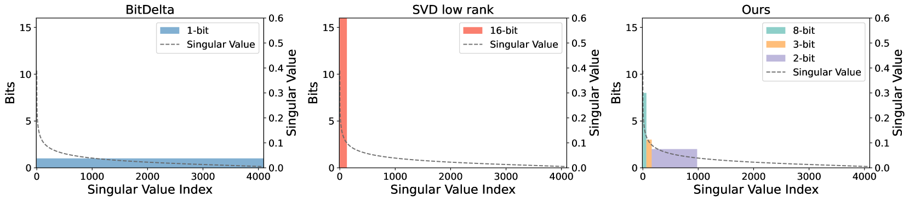
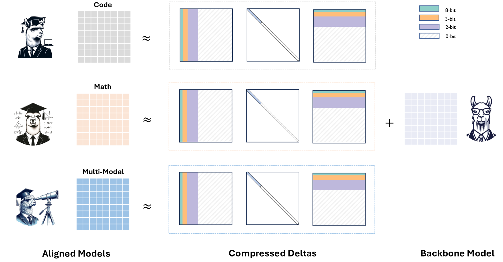
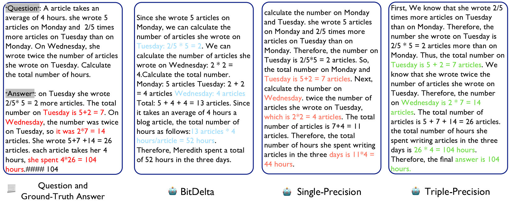

# Delta-CoMe：大型语言模型中的混合精度Delta压缩，无需额外训练

发布时间：2024年06月13日

`LLM应用

这篇论文主要探讨了微调大型语言模型（LLMs）以适应不同应用场景的技术，特别是在多租户服务等复杂需求下的应用。论文提出了一种混合精度增量量化方法，用于优化微调后的LLM的性能，并通过在多种微调LLMs上的实验验证了其有效性。这种方法不仅提高了性能，还与多种骨干LLMs兼容，显示了其广泛的适用性。因此，这篇论文更符合LLM应用分类，因为它关注的是LLM在实际应用中的优化和性能提升。` `人工智能` `云计算`

> Delta-CoMe: Training-Free Delta-Compression with Mixed-Precision for Large Language Models

# 摘要

> 微调大型语言模型（LLMs）以适应不同应用至关重要。在多租户服务等场景中，部署多个LLMs以应对复杂需求成为必需。近期研究提出将微调后的LLM分解为基础模型与增量权重，并采用低秩或低比特技术压缩以节约成本。然而，我们发现这些压缩技术对特定任务微调的LLMs（如解决数学问题的WizardMath）性能影响显著。基于增量权重中奇异值的长尾分布特性，我们开发了一种混合精度增量量化方法，对较大奇异值对应的奇异向量采用更高比特表示。我们在数学、代码、聊天乃至视觉语言模型等多种微调LLMs上验证了此方法，结果显示其性能与完全微调的LLMs相当，并大幅领先于低秩和低比特基线。此外，我们的方法与Llama-2、Llama-3和Mistral等多种骨干LLMs兼容，展现了其广泛的适用性。

> Fine-tuning is a crucial process for adapting large language models (LLMs) to diverse applications. In certain scenarios, such as multi-tenant serving, deploying multiple LLMs becomes necessary to meet complex demands. Recent studies suggest decomposing a fine-tuned LLM into a base model and corresponding delta weights, which are then compressed using low-rank or low-bit approaches to reduce costs. In this work, we observe that existing low-rank and low-bit compression methods can significantly harm the model performance for task-specific fine-tuned LLMs (e.g., WizardMath for math problems). Motivated by the long-tail distribution of singular values in the delta weights, we propose a delta quantization approach using mixed-precision. This method employs higher-bit representation for singular vectors corresponding to larger singular values. We evaluate our approach on various fine-tuned LLMs, including math LLMs, code LLMs, chat LLMs, and even VLMs. Experimental results demonstrate that our approach performs comparably to full fine-tuned LLMs, surpassing both low-rank and low-bit baselines by a considerable margin. Additionally, we show that our method is compatible with various backbone LLMs, such as Llama-2, Llama-3, and Mistral, highlighting its generalizability.

[Arxiv](https://arxiv.org/abs/2406.08903)