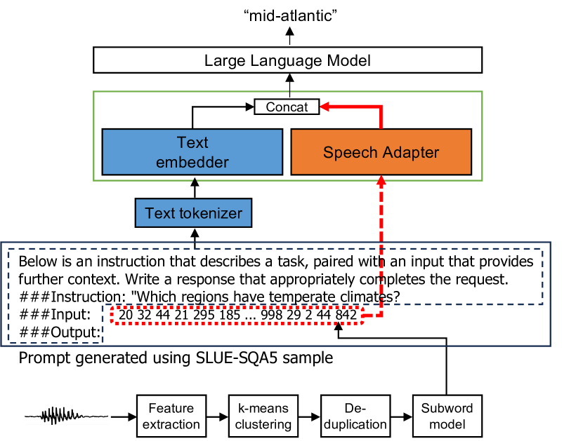

# DiscreteSLU：大型语言模型搭载自监督离散语音单元，助力口语理解

发布时间：2024年06月13日

`LLM应用

这篇论文探讨了如何将预训练的大型语言模型（LLM）与语音输入相结合，以增强语音任务的指令遵循能力。研究中涉及了语音编码器、语音适配器和LLM的集成，并特别关注了使用离散语音单元（DSU）和自监督语音编码器的方法。这种方法在多个语音任务上进行了测试，特别是在口语问答任务中展示了显著的性能。因此，这篇论文属于LLM应用类别，因为它展示了LLM在语音处理领域的实际应用和改进。` `语音识别` `问答系统`

> DiscreteSLU: A Large Language Model with Self-Supervised Discrete Speech Units for Spoken Language Understanding

# 摘要

> 通过将预训练的文本型大型语言模型（LLM）与语音输入融合，我们赋予了语音任务遵循指令的能力。这一集成涉及语音编码器、语音适配器和LLM的协同，它们均在多样的任务上受过训练。我们提出采用离散语音单元（DSU）而非连续值的语音编码器输出，并通过语音适配器将其映射至LLM的令牌嵌入空间。我们利用自监督语音编码器生成DSU，并采用k-means聚类。该模型在不同领域的语音输入上表现稳健，并在口语问答中展现出卓越的指令遵循能力。此外，我们还研究了从自监督语音编码器不同层提取的不同类型的DSU以及梅尔频率倒谱系数（MFCC）。研究结果表明，在口语问答任务的指令调整中，自动语音识别（ASR）任务和数据集的重要性并不突出。

> The integration of pre-trained text-based large language models (LLM) with speech input has enabled instruction-following capabilities for diverse speech tasks. This integration requires the use of a speech encoder, a speech adapter, and an LLM, trained on diverse tasks. We propose the use of discrete speech units (DSU), rather than continuous-valued speech encoder outputs, that are converted to the LLM token embedding space using the speech adapter. We generate DSU using a self-supervised speech encoder followed by k-means clustering. The proposed model shows robust performance on speech inputs from seen/unseen domains and instruction-following capability in spoken question answering. We also explore various types of DSU extracted from different layers of the self-supervised speech encoder, as well as Mel frequency Cepstral Coefficients (MFCC). Our findings suggest that the ASR task and datasets are not crucial in instruction-tuning for spoken question answering tasks.

[Arxiv](https://arxiv.org/abs/2406.09345)