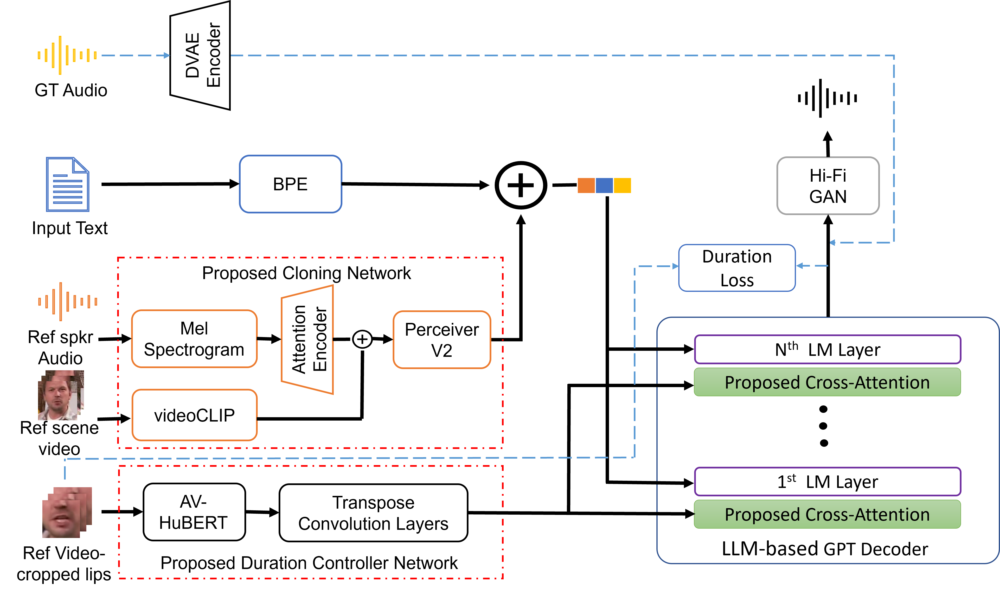
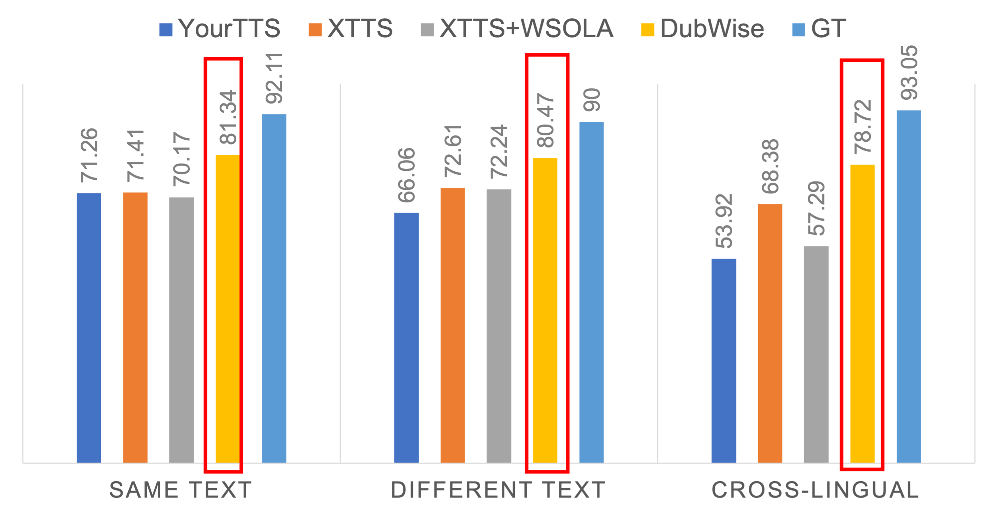

# DubWise：多模态LLM文本转语音配音中的视频引导语音时长调控

发布时间：2024年06月13日

`LLM应用

这篇论文介绍了一种基于大型语言模型（LLM）的多模态技术，名为DubWise，用于解决配音后的视听同步问题。该技术通过精准控制合成语音的时长，使其与视频中说话者的唇部动作同步，即使在文本或语言不同的情况下也能实现。论文中提到的技术涉及跨模态注意力机制，结合了文本语义、声音克隆的说话者特征以及视频时长控制，这些都是在LLM框架下的应用。因此，这篇论文属于LLM应用分类。` `视听同步` `语音合成`

> DubWise: Video-Guided Speech Duration Control in Multimodal LLM-based Text-to-Speech for Dubbing

# 摘要

> 配音后的视听同步问题颇具挑战，我们提出的DubWise多模态LLM基础TTS技术，能精准控制合成语音时长，使其与视频中说话者的唇部动作完美同步，即便文本或语言不同。我们运用跨模态注意力技术于GPT基础TTS，融合文本语义、声音克隆的说话者特征及视频时长控制，有效提升了Lip2Wav-Chemistry和LRS2数据集上的表现。与非平行及跨语言场景下的最先进技术相比，我们的方法在唇同步和语音自然度上均有显著提升。

> Audio-visual alignment after dubbing is a challenging research problem. To this end, we propose a novel method, DubWise Multi-modal Large Language Model (LLM)-based Text-to-Speech (TTS), which can control the speech duration of synthesized speech in such a way that it aligns well with the speakers lip movements given in the reference video even when the spoken text is different or in a different language. To accomplish this, we propose to utilize cross-modal attention techniques in a pre-trained GPT-based TTS. We combine linguistic tokens from text, speaker identity tokens via a voice cloning network, and video tokens via a proposed duration controller network. We demonstrate the effectiveness of our system on the Lip2Wav-Chemistry and LRS2 datasets. Also, the proposed method achieves improved lip sync and naturalness compared to the SOTAs for the same language but different text (i.e., non-parallel) and the different language, different text (i.e., cross-lingual) scenarios.

[Arxiv](https://arxiv.org/abs/2406.08802)